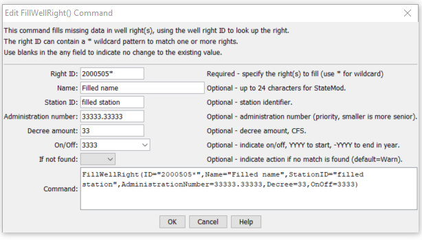

# StateDMI / Command / FillWellRight #

* [Overview](#overview)
* [Command Editor](#command-editor)
* [Command Syntax](#command-syntax)
* [Examples](#examples)
* [Troubleshooting](#troubleshooting)
* [See Also](#see-also)

-------------------------

## Overview ##

The `FillWellRight` command (for StateMod)
fills missing data in existing well rights.

## Command Editor ##

The following dialog is used to edit the command and illustrates the command syntax.

**<p style="text-align: center;">

</p>**

**<p style="text-align: center;">
`FillWellRight` Command Editor (<a href="../FillWellRight.png">see also the full-size image</a>)
</p>**

## Command Syntax ##

The command syntax is as follows:

```text
FillWellRight(Parameter="Value",...)
```
**<p style="text-align: center;">
Command Parameters
</p>**

| **Parameter**&nbsp;&nbsp;&nbsp;&nbsp;&nbsp;&nbsp;&nbsp;&nbsp;&nbsp;&nbsp;&nbsp;&nbsp;&nbsp;&nbsp;&nbsp;&nbsp;&nbsp;&nbsp;&nbsp;&nbsp;&nbsp;&nbsp;&nbsp;&nbsp;&nbsp;&nbsp; | **Description** | **Default**&nbsp;&nbsp;&nbsp;&nbsp;&nbsp;&nbsp;&nbsp;&nbsp;&nbsp;&nbsp;&nbsp;&nbsp;&nbsp;&nbsp;&nbsp;&nbsp;&nbsp;&nbsp;&nbsp;&nbsp; |
| --------------|-----------------|----------------- |
| `ID` | A single well right identifier to match or a pattern using wildcards (e.g., `20*`). | None – must be specified. |
| `Name` | The name to be assigned for all matching well right identifiers with missing name. | If not specified, the original value will remain. |
| `StationID` | The well station identifier to be assigned for all matching well right identifiers with missing well station identifier. | If not specified, the original value will remain. |
| `AdministrationNumber` | The administration number to be assigned for all matching well right identifiers with missing administration number. | If not specified, the original value will remain. |
| `Decree` | The water right decree to be assigned for all matching well right identifiers with missing administration decree. | If not specified, the original value will remain. |
| `OnOff` | The on/off switch to be assigned for all matching well right identifiers with missing on/off switch, either 1 for on or 0 for off, a positive 4-digit year to turn the right on starting in the year, or a negative 4-digit year to turn the right off starting in the year. | If not specified, the original value will remain. |
| `IfNotFound` | Used for error handling, one of the following:<ul><li>`Fail` – generate a failure message if the ID is not matched</li><li>`Ignore` – ignore (don’t generate a message) if the ID is not matched</li><li>`Warn` – generate a warning message if the ID is not matched</li></ul> | `Warn` |

## Examples ##

See the [automated tests](https://github.com/OpenCDSS/cdss-app-statedmi-test/tree/master/test/regression/commands/FillWellRight).

## Troubleshooting ##

[See the main troubleshooting documentation](../../troubleshooting/troubleshooting.md)

## See Also ##

* [`SetWellRight`](../SetWellRight/SetWellRight.md) command
