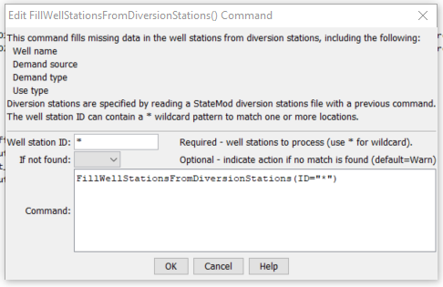

# StateDMI / Command / FillWellStationsFromDiversionStations #

* [Overview](#overview)
* [Command Editor](#command-editor)
* [Command Syntax](#command-syntax)
* [Examples](#examples)
* [Troubleshooting](#troubleshooting)
* [See Also](#see-also)

-------------------------

## Overview ##

The `FillWellStationsFromDiversionStations` command (for StateMod)
fills missing well station data for each location,
using the corresponding diversion station (only for D&W model nodes).
The diversion stations must have been read or assigned with previous commands.
The following data are filled:  name, demand source, demand type, use type.

## Command Editor ##

The following dialog is used to edit the command and illustrates the command syntax.

**<p style="text-align: center;">

</p>**

**<p style="text-align: center;">
`FillWellStationsFromDiversionStations` Command Editor (<a href="../FillWellStationsFromDiversionStations.png">see also the full-size image</a>)
</p>**

## Command Syntax ##

The command syntax is as follows:

```text
FillWellStationsFromDiversionStations(Parameter="Value",...)
```
**<p style="text-align: center;">
Command Parameters
</p>**

| **Parameter**&nbsp;&nbsp;&nbsp;&nbsp;&nbsp;&nbsp;&nbsp;&nbsp;&nbsp;&nbsp;&nbsp;&nbsp; | **Description** | **Default**&nbsp;&nbsp;&nbsp;&nbsp;&nbsp;&nbsp;&nbsp;&nbsp;&nbsp;&nbsp; |
| --------------|-----------------|----------------- |
| `ID` | A single well station identifier to match or a pattern using wildcards (e.g., `20*`). | None – must be specified. |
| `IfNotFound` | Used for error handling, one of the following:<ul><li>`Fail` – generate a failure message if the ID is not matched</li><li>`Ignore` – ignore (don’t add and don’t generate a message) if the ID is not matched</li><li>`Warn` – generate a warning message if the ID is not matched</li></ul> | `Warn` |

## Examples ##

See the [automated tests](https://github.com/OpenCDSS/cdss-app-statedmi-test/tree/master/test/regression/commands/FillWellStationsFromDiversionStations).

## Troubleshooting ##

[See the main troubleshooting documentation](../../troubleshooting/troubleshooting.md)

## See Also ##

* [`FillWellStation`](../FillWellStation/FillWellStation.md) command
* [`FillWellStationsFromNetwork`](../FillWellStationsFromNetwork/FillWellStationsFromNetwork.md) command
* [`SetWellStation`](../SetWellStation/SetWellStation.md) command
* [`SetWellStationAreaToCropPatternTS`](../SetWellStationAreaToCropPatternTS/SetWellStationAreaToCropPatternTS.md) command
* [`SetWellStationCapacitiesFromTS`](../SetWellStationCapacitiesFromTS/SetWellStationCapacitiesFromTS.md) command
* [`SetWellStationCapacityToWellRights`](../SetWellStationCapacityToWellRights/SetWellStationCapacityToWellRights.md) command
* [`SetWellStationDelayTablesFromNetwork`](../SetWellStationDelayTablesFromNetwork/SetWellStationDelayTablesFromNetwork.md) command
* [`SetWellStationDelayTablesFromRTN`](../SetWellStationDelayTablesFromRTN/SetWellStationDelayTablesFromRTN.md) command
* [`SetWellStationDepletionTablesFromRTN`](../SetWellStationDepletionTablesFromRTN/SetWellStationDepletionTablesFromRTN.md) command
* [`SetWellStationsFromList`](../SetWellStationsFromList/SetWellStationsFromList.md) command
