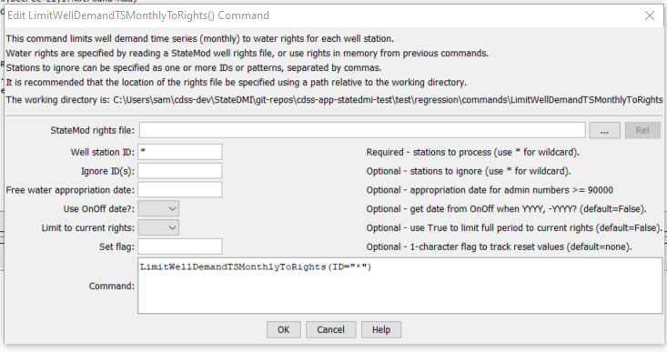

# StateDMI / Command / LimitWellDemandTSMonthlyToRights #

* [Overview](#overview)
* [Command Editor](#command-editor)
* [Command Syntax](#command-syntax)
* [Examples](#examples)
* [Troubleshooting](#troubleshooting)
* [See Also](#see-also)

-------------------------

## Overview ##

The `LimitWellDemandTSMonthlyToRights` command (for StateMod)
limits well demand time series (monthly) values to the water rights that
were in effect at the time of the well pumping,
based on the appropriation date corresponding to water right administration numbers.
The functionality of this command is nearly the same as the
[`LimitDiversionDemandTSMonthlyToRights`](../LimitDiversionDemandTSMonthlyToRights/LimitDiversionDemandTSMonthlyToRights.md).
For each well station being processed,
the cumulative rights are determined at each point in time, creating a step-function in CFS units.
Very junior water rights with administration numbers greater than or equal to `90000.00000` can be assigned an appropriate date,
which is then used to compute an administration number for the check.
The water rights must be supplied from a StateMod well rights file – they are not taken from rights
that may be in memory and the rights used by this command cannot be further modified and written.
For boundary purposes during the check,
a zero flow condition is imposed at 1800-01-01 and carried forward until a right is found.
A summary of the rights is printed to the log file.

If necessary, place set commands after the `LimitWellDemandTSMonthlyToRights`
command so that the set commands will not be impacted by the `LimitWellDemandTSMonthlyToRights` command.

The water rights switch in the StateMod rights file is handled as follows:

* If the switch is zero, the water right is ignored in processing (it is not used to limit the data).
* If the switch is 1, no adjustments are done to the appropriation date for the water right.
* If the switch is `+YYYY` (indicating that the right should turn on in the given year):
	+ If the `UseOnOffDate` parameter is True, the appropriation date for
	the water right is set to `YYYY-01-01` during the limit process.
	+ If the `UseOnOffDate` parameter is False, the appropriation date from the administration number is used.
* If the switch is `-YYYY` (indicating that the right should turn off after the given year):
	+ If the `UseOnOffDate` parameter is True, the appropriation date for the
	water right is set to `(YYYY+1)-01-01` and the decree is set to negative during the limit process.
	+ If the `UseOnOffDate` parameter is False, the appropriation date from the administration number is used.

If the administration number cannot be converted to an appropriation date,
then the water right `OnOff` switch can be set to a year for each water right and `UseOnOffDate=True` should be specified.

If the sum of the water rights decrees is less than zero, it is reset to zero.

A summary of the logic is as follows:

For each well station (ignored stations are skipped):

1. Determine the water rights for the well station.  If no rights are available, skip the remaining steps.
2. Determine the well demand time series (monthly).  If no time series is available, skip the remaining steps.
3. Process the water rights for the well station.
	1. Convert the administration number to appropriation date.
	Use the same code as the ***Tools / Administration Number Calculator*** tool in StateDMI.
	The prior adjudication date associated with the administration number is ignored.
	See the explanation above for how the water rights switch is handled.
	2. Sort the rights according to the Julian day value for the appropriation date.
	3. If the well station has a free water right (those with administration
	numbers greater than or equal to `90000.00000`):  If the well station has a senior water right,
	convert the free water right appropriation date to that of the senior water right
	(therefore the free water right is in effect since the time of the senior right).
	If the well station has no senior water right (it has only free water right[s]),
	use the appropriation date corresponding to the `FreeWaterAppropriationDate` parameter described below.
	4. Add a bounding zero decree for 1800-01-01 for the early period of the step function.
	5. Generate a step function of sorted dates and decrees using the information described above.
	These values will be in CFS.  Because appropriation dates are used,
	the sort order may be different from that of the numerical administration number.
	6. If the LimitToCurrent parameter value is True, discard all but the last value in the step function.
	7. Because the decrees are in CFS, convert to ACFT, considering the number of days in each month.
4. Constrain the monthly time series to the step function, where the step function is
defined by a list of dates and decrees, determined from the previous step.
If a value in the time series is greater than the step function, set the value to the step function.
Because of the conversion from CFS to ACFT, monthly values in the step function will vary.

## Command Editor ##

The following dialog is used to edit the command and illustrates the command syntax.

**<p style="text-align: center;">

</p>**

**<p style="text-align: center;">
`LimitWellDemandTSMonthlyToRights` Command Editor (<a href="../LimitWellDemandTSMonthlyToRights.png">see also the full-size image</a>)
</p>**

## Command Syntax ##

The command syntax is as follows:

```text
LimitWellDemandTSMonthlyToRights(Parameter="Value",...)
```
**<p style="text-align: center;">
Command Parameters
</p>**

| **Parameter**&nbsp;&nbsp;&nbsp;&nbsp;&nbsp;&nbsp;&nbsp;&nbsp;&nbsp;&nbsp;&nbsp;&nbsp;&nbsp;&nbsp;&nbsp;&nbsp;&nbsp;&nbsp;&nbsp;&nbsp;&nbsp;&nbsp;&nbsp;&nbsp;&nbsp;&nbsp;&nbsp;&nbsp;&nbsp;&nbsp;&nbsp;&nbsp;&nbsp;&nbsp;&nbsp;&nbsp;&nbsp;&nbsp; | **Description** | **Default**&nbsp;&nbsp;&nbsp;&nbsp;&nbsp;&nbsp;&nbsp;&nbsp;&nbsp;&nbsp; |
| --------------|-----------------|----------------- |
| `InputFile` | The name of the StateMod well rights file, surrounded by double quotes.  The rights in the file are read and are used to constrain the well demand time series. | None – must be specified. |
| `ID` | A single well station identifier to match or a pattern using wildcards (e.g., `20*`). | None – must be specified. |
| `IgnoreID` | A list of well stations to ignore when processing this command.  A list of comma-separated values can be specified, where each value is a single identifier, or a pattern using wildcards (similar to ID). | Do not ignore any well stations. |
|` FreeWaterAppropriationDate` | A date to be used for the free water rights found in the rights file.  Free water rights are typically inserted to represent very junior rights.  Rights having an administration number greater than or equal to `90000.00000` are assumed to be free water rights and will use the specified free water appropriation date when constraining the time series. | The date corresponding to an administration number of `0`, which is Dec 31, 1849. |
|` UseOnOffDate` | If `False`, the appropriation date is always computed from the administration number.  If True and the value of the `OnOff` switch is `YYYY` or `–YYYY`, assign the appropriation date using the switch value (see notes earlier in the command description). | `False` |
|` LimitToCurrent` | Indicate whether only the most recent sum of rights should be used when limiting the rights.  This is appropriate when generating the demands for a baseline data set representing current conditions. | `False` |
|` SetFlag` | If specified as a single character, data flags will be enabled for the time series and each set value will be tagged with the specified character.  The flag can then be used later to label graphs, etc.  The flag will be appended to existing flags if necessary. | No flag is assigned. |

## Examples ##

See the [automated tests](https://github.com/OpenCDSS/cdss-app-statedmi-test/tree/master/test/regression/commands/LimitWellDemandTSMonthlyToRights).

## Troubleshooting ##

[See the main troubleshooting documentation](../../troubleshooting/troubleshooting.md)

## See Also ##

* [`LimitDiversionDemandTSMonthlyToRights`](../LimitDiversionDemandTSMonthlyToRights/LimitDiversionDemandTSMonthlyToRights.md) command
