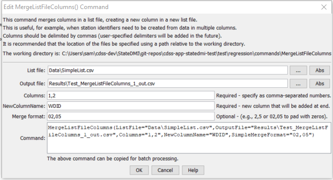

# StateDMI / Command / MergeListFileColumns #

* [Overview](#overview)
* [Command Editor](#command-editor)
* [Command Syntax](#command-syntax)
* [Examples](#examples)
* [Troubleshooting](#troubleshooting)
* [See Also](#see-also)

-------------------------

## Overview ##

The `MergeListFileColumns` command
reads a comma-delimited list file, uses information from existing columns to create a new column, and writes the new list file.
As currently implemented, whitespace will be trimmed from the original data.
This command is useful for example, if the WD and ID columns in a file need to be merged into a WDID column.

See also table commands.

## Command Editor ##

The following dialog is used to edit the command and illustrates the command syntax.

**<p style="text-align: center;">

</p>**

**<p style="text-align: center;">
`MergeListFileColumns` Command Editor (<a href="../MergeListFileColumns.png">see also the full-size image</a>)
</p>**

## Command Syntax ##

The command syntax is as follows:

```text
MergeListFileColumns(Parameter="Value",...)
```
**<p style="text-align: center;">
Command Parameters
</p>**

| **Parameter**&nbsp;&nbsp;&nbsp;&nbsp;&nbsp;&nbsp;&nbsp;&nbsp;&nbsp;&nbsp;&nbsp;&nbsp;&nbsp;&nbsp;&nbsp;&nbsp;&nbsp;&nbsp; | **Description** | **Default**&nbsp;&nbsp;&nbsp;&nbsp;&nbsp;&nbsp;&nbsp;&nbsp;&nbsp;&nbsp; |
| --------------|-----------------|----------------- |
| `ListFile` | The name of the list file to read. | None – must be specified. |
| `OutputFile` | The name of the output list file to create.  This file will have the same contents as the original file, with the new column at the end. | None – must be specified. |
| `Columns` | A comma-separated list of columns to merge.  Column numbers have a value ≥ 1. | None – must be specified. |
| `NewColumnName` | Name of the column to be created, which will be added at the end of the original columns. | None – must be specified. |
| `SimpleMergeFormat` | Comma-separated list of formats indicating how to format the merged column, one of the following:<ul><li>Blank – concatenate the values.</li><li>`NN,NN` (e.g., `2,5`) – indicate the widths for each part and merge as strings where each part is right justified and padded with spaces.</li><li>`0N,0N` (e.g., `02,05`) – indicate the widths for each part and merge as integers where each part is right justified and padded with zeros.</li></ul><br>A more flexible formatting capability may be added in the future.` | Concatenate values. |

## Examples ##

See the [automated tests](https://github.com/OpenCDSS/cdss-app-statedmi-test/tree/master/test/regression/commands/MergeListFileColumns).

## Troubleshooting ##

[See the main troubleshooting documentation](../../troubleshooting/troubleshooting.md)

## See Also ##

There are no additional related commands.