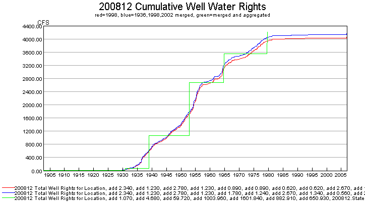
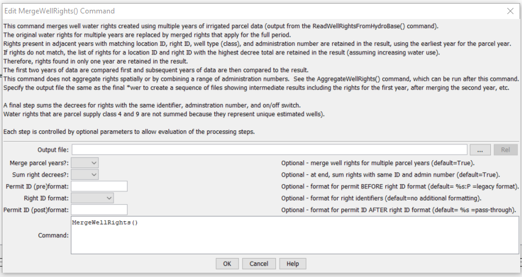

# StateDMI / Command / MergeWellRights #

* [Overview](#overview)
* [Command Editor](#command-editor)
* [Command Syntax](#command-syntax)
* [Examples](#examples)
* [Troubleshooting](#troubleshooting)
* [See Also](#see-also)

-------------------------

## Overview ##

The `MergeWellRights` command (for StateCU and StateMod) merges well rights from multiple years of irrigated lands
parcel data as read with the
[`ReadWellRightsFromHydroBase`](../ReadWellRightsFromHydroBase/ReadWellRightsFromHydroBase.md) command.
Well rights initially are generated for each parcel year by using well to parcel matching relationships.
Because the parcel identifiers change each year and new wells are added over time,
the mix of well rights associated with parcels changes.
Well rights are generated from HydroBase for each independent year and then need to be
merged in order to NOT double count the well rights for modeling.
The [`ReadWellRightsFromHydroBase`](../ReadWellRightsFromHydroBase/ReadWellRightsFromHydroBase.md) and
[`WriteWellRightsToStateMod(...,WriteDataComments=True,...`](../WriteWellRightsToStateMod/WriteWellRightsToStateMod.md)
commands are used to generate a well rights file that contain the parcel data, typically with a file name similar to `rg2007_NotMerged.wer`.

The following figure illustrates the difference between raw rights data for one year,
merged rights for multiple years, and aggregated rights created from the merged rights.
Merged rights will typically be higher than the raw rights because a few
rights appear in some years but not in others (they are additive).
Aggregating rights reduces the number of rights in the data set by grouping rights
into administration number classes (see the
[`AggregateWellRights`](../AggregateWellRights/AggregateWellRights.md) command) – this reduced the
time needed to run the model but limits the ability to refer to individual rights (e.g., in augmentation plans).

**<p style="text-align: center;">

</p>**

**<p style="text-align: center;">
Graph Showing Cumulative Well Rights (<a href="../MergeWellRights_Graph.png">see also the full-size image</a>)
</p>**

An excerpt from a well rights file with data comments is shown below.
The parcel year, well/parcel matching class,
and parcel ID are shown on the far right and are not part of the standard StateMod well right file.
See CDSS technical memoranda for a description of well classes
(SPDSS Task Memorandum “SPDSS, Spatial System Integration Component, Well Class Adjustments”, March 15th, 2007).

```
#>   ID               Name             Struct          Admin #   Decree  On/Off  PYr--Cls--PID
#>---------eb----------------------eb----------eb--------------eb------eb------exb--exb--exb----e
2005001     W0006 WELL NO 01        200812           31592.00000    2.34    1936 1936    1   3107
2005001     W0006 WELL NO 01        200812           38836.00000    1.23    1956 1936    1   3107
2005001     W0006 WELL NO 01        200812           31592.00000    2.34    1936 1998    2  11016
2005001     W0006 WELL NO 01        200812           38836.00000    1.23    1956 1998    2  11016
2005001     W0006 WELL NO 01        200812           31592.00000    1.19    1936 2002    2  20901
2005001     W0006 WELL NO 01        200812           38836.00000    0.62    1956 2002    2  20901
2005001     W0006 WELL NO 01        200812           31592.00000    1.15    1936 2002    5  20902
2005001     W0006 WELL NO 01        200812           38836.00000    0.61    1956 2002    5  20902
```

For the example shown, the well rights are the same for the 1936 and 1998 irrigated lands parcel data.
However, in 2002 there is a change.  This may be due to several reasons, including:

* The results for each irrigated lands assessment were created with the HydroBase and other data available at that time.
HydroBase subsequently changed and original parcel/well matching work was not redone.
* The parcel configuration changes in different years, resulting in different well match classes (note class 5 wells above).
For example a parcel may be whole in one year and split in another year,
due to changes in physical configuration or data processing procedures.
If a parcel is split between ditch service areas, a factor is applied to split the well among the ditches.

In order to generate a merged file that represents rights for the full period
(and all active parcels and wells in that period),
it is necessary to compare the rights from each year and remove duplicates.
The logic that is implemented in this command for merging rights is as follows:

1. Extract any records that have a parcel year of `-999`
(indicative of explicit well rights not associated with parcels that need to apply to the entire period)
and do not process with the following steps – these rights are added to the list at the end.
2. Determine the unique list of locations from the well rights, and the unique list of parcel years.
3. Merge the first and second years of data, then merge the results with the third year of data, etc.
Repeat step 3 for each year of data, comparing the next year with the results from the previous merge.
In many cases the rights will simply be carried forward during the comparison,
but in some years a block of rights will be replaced.
	1. For each location ID, get the list of rights for each parcel year
	(or from the previous results and the next parcel year being merged).
	2. For the above list, get the list of water rights identifiers for the first year (or previous merge).
	This divides the long list of water rights for a location into a more manageable list.
	The administration number and well/permit match class are not considered.
	3. Compare the two lists.
	Repeat step c for each well right identifier for a location, for the years of data that are being compared.
		1. If the lists are exactly the same (same number and rights exactly match),
		then include the rights from the first year (or previous merge).
		The parcel year is retained for further comparisons.
		2. If the rights are not exactly the same,
		determine the sum of the decrees from each year and include the rights for the year with the highest decree total.
		In some cases, a new set of rights will be added, which were not present in the previous results.
		**This assumes that well use increases over time – currently the case where wells are turned off is not handled.**
	4. If any rights were not considered above, add them to the list.
	For example, a year may include right identifiers that did not exist in another year.
	In this case it is not possible to compare the sum of rights – the sum in one year will be zero.
4. Add to the final list the well rights that had a parcel ID of `-999`.
5. If an output file was specified with the `OutputFile` parameter,
write the intermediate results to a file (see the `OutputFile` parameter description in the table below).
6. If `SumDecrees=True`, further process the rights to sum decrees where the right identifier,
administration number, and on/off switch are equal.
This reduces the number of rights, but the overall decree will be the same.
Water rights that are associated with estimated wells (class 4 or 9) are passed through
without change in order to retain the original information for these relationships.
For example the same original well may be copied multiple times for an estimated well
and this information is evident when the original rights are retained.
A more complete evaluation of estimated wells could be performed if the merge process considered well locations.

After merging the rights, the file is typically written using
[`WriteWellRightsToStateMod`](../WriteWellRightsToStateMod/WriteWellRightsToStateMod.md) with a name similar to `rg2007.wer`.
This file can be used to set irrigation practice time series pumping maximum and can be used for StateMod modeling.
It cannot be used to fill crop pattern and irrigation practice acreage time series
because a specific parcel year is needed (use the original non-merged rights file with all years for filling acreage).
If the well rights will be aggregated, as has been done in the Río Grande modeling,
then use the [`AggregateWellRights`](../AggregateWellRights/AggregateWellRights.md)
command and create a third rights file for use with StateMod.
For the initial example above, the merged results are as follows:

```
#>   ID               Name             Struct          Admin #   Decree  On/Off  PYr--Cls--PID
#>---------eb----------------------eb----------eb--------------eb------eb------exb--exb--exb----e
2005001     W0006 WELL NO 01        200812           31592.00000    2.34    1936
2005001     W0006 WELL NO 01        200812           38836.00000    1.23    1956
```

## Command Editor ##

The following dialog is used to edit the command and illustrates the command syntax.

**<p style="text-align: center;">

</p>**

**<p style="text-align: center;">
`MergeWellRights` Command Editor (<a href="../MergeWellRights.png">see also the full-size image</a>)
</p>**

## Command Syntax ##

The command syntax is as follows:

```text
MergeWellRights(Parameter="Value",...)
```
**<p style="text-align: center;">
Command Parameters
</p>**

| **Parameter**&nbsp;&nbsp;&nbsp;&nbsp;&nbsp;&nbsp;&nbsp;&nbsp;&nbsp;&nbsp;&nbsp;&nbsp;&nbsp;&nbsp;&nbsp;&nbsp;&nbsp;&nbsp; | **Description** | **Default**&nbsp;&nbsp;&nbsp;&nbsp;&nbsp;&nbsp;&nbsp;&nbsp;&nbsp;&nbsp; |
| --------------|-----------------|----------------- |
| `OutputFile` | If specified, the output file typically is the same as the output file for the [`WriteWellRightsToStateMod`](../WriteWellRightsToStateMod/WriteWellRightsToStateMod.md) command.  The filename will be pre-pended with `wer-merged-YYYY-` to indicate the results of the merge after considering the parcel year indicated by `YYYY`. | No file is created to indicate results of intermediate processing. |
| `MergeParcelYears` | If `True`, merge the water rights for multiple parcel years as indicated by this documentation.  If `False`, do not merge (but can still sum decrees).  This parameter allows evaluation of combinations of the processing steps. | `True` |
| `SumDecrees` | If `True`, process the rights after the main merge logic to combine rights where the identifier, administration number, and on/off switch are the same, increasing the decree to the combined value.  Water rights that are class 4 or 9 parcel matches (indicating estimated wells) are not changed, to better understand the impact of estimated wells. | `True` |

## Examples ##

See the [automated tests](https://github.com/OpenCDSS/cdss-app-statedmi-test/tree/master/test/regression/commands/MergeWellRights).

The following example command file illustrates how well rights can be defined,
sorted, merged, checked, and written to a StateMod file:

```
# Well Rights File (*.wer)
#
StartLog(LogFile="Sp2008L_WER.log")
# _________________________________________________________
# Step 1 - Read all structures
#
ReadWellStationsFromNetwork(InputFile="..\Network\Sp2008L.net")
SortWellStations()
# _________________________________________________________
# Step 2 - define diversion and d&w aggregates and demand systems
SetWellAggregateFromList(ListFile="..\Sp2008L_SWAgg.csv",PartType=Ditch,IDCol=1,
  NameCol=2,PartIDsCol=3,PartsListedHow=InColumn,IfNotFound=Warn)
SetWellSystemFromList(ListFile="..\Sp2008L_DivSys_DDH.csv",PartType=Ditch,IDCol=1,
  NameCol=2,PartIDsCol=3,PartsListedHow=InRow,IfNotFound=Warn)
#
SetWellAggregateFromList(ListFile="Sp2008L_AugRchWell_Aggregates.csv",PartType=Well,
  IDCol=1,PartIDsCol=2,PartsListedHow=InRow)
# _________________________________________________________
# Step 3- Set Well aggregates (GW Only lands)
# rrb Same as provided by LRE as Sp_GWAgg_xxxx.csv except non WD 01 and 64 removed
SetWellSystemFromList(ListFile="..\Sp2008L_GWAgg_1956.csv",Year=1956,Div=1,
  PartType=Parcel,IDCol=1,PartIDsCol=2,PartsListedHow=InColumn)
SetWellSystemFromList(ListFile="..\Sp2008L_GWAgg_1976.csv",Year=1976,Div=1,
  PartType=Parcel,IDCol=1,PartIDsCol=2,PartsListedHow=InColumn)
SetWellSystemFromList(ListFile="..\Sp2008L_GWAgg_1987.csv",Year=1987,Div=1,
  PartType=Parcel,IDCol=1,PartIDsCol=2,PartsListedHow=InColumn)
SetWellSystemFromList(ListFile="..\Sp2008L_GWAgg_2001.csv",Year=2001,Div=1,
  PartType=Parcel,IDCol=1,PartIDsCol=2,PartsListedHow=InColumn)
SetWellSystemFromList(ListFile="..\Sp2008L_GWAgg_2005.csv",Year=2005,Div=1,
  PartType=Parcel,IDCol=1,PartIDsCol=2,PartsListedHow=InColumn)
# _________________________________________________________
# Step 4 - Read Augmentation and Recharge Well Aggregate Parts
SetWellAggregateFromList(ListFile="Sp2008L_AugRchWell_Aggregates.csv",PartType=Well,
  IDCol=1,PartIDsCol=2,PartsListedHow=InRow,PartIDsColMax=25,IfNotFound=Ignore)
SetWellAggregateFromList(ListFile="Sp2008L_AlternatePoint_Aggregates.csv",PartType=Well,
  IDCol=1,PartIDsCol=2,PartsListedHow=InRow,PartIDsColMax=1,IfNotFound=Ignore)
# _________________________________________________________
# Step 5 - Read rights from HydroBase
ReadWellRightsFromHydroBase(ID="*",IDFormat="HydroBaseID",Year="1956,1976,1987,2001,2005",
  Div="1",DefaultAppropriationDate="1950-01-01",DefineRightHow=RightIfAvailable,
  ReadWellRights=True,UseApex=True,OnOffDefault=AppropriationDate)
# _________________________________________________________
# Step 6 - Sort and Write
#  Write Data Comments="True" provides output used for subsequent cds & ipy acreage filling
#  Write Data Comments="False" provides merged file used for seting ipy max pumping
SortWellRights(Order=LocationIDAscending,Order2=IDAscending)
# _________________________________________________________
WriteWellRightsToStateMod(OutputFile="Sp2008L_NotMerged.wer",WriteDataComments=True)
MergeWellRights(OutputFile="..\StateMod\Historic\Sp2008L.wer")
SortWellRights(Order=LocationIDAscending,Order2=IDAscending)
# _________________________________________________________
WriteWellRightsToStateMod(OutputFile="Sp2008L.wer",
  WriteDataComments=False,WriteHow=OverwriteFile)
# Check the well rights
CheckWellRights(ID="*")
WriteCheckFile(OutputFile="Sp2008L.wer.check.html",Title="Well Rights Check File")
```

The following TSTool command file illustrates how various StateMod well right files
can be processed to generate time series of decrees, similar to the graph shown above.
The command will automatically generate a data set total time series.
This visual check provides an understanding of the decrees in a basin over time.

```
# Read the unmerged and merged StateDMI *wer files to compare
SetOutputPeriod(OutputStart="1900-01",OutputEnd="2008-12")
ReadStateMod(InputFile="Sp2008L_Unmerged.wer",Alias="%L-Unmerged",Interval="Month")
ReadStateMod(InputFile="Sp2008L.wer",Alias="%L",Interval="Month")
```

## Troubleshooting ##

## See Also ##

* [`AggregateWellRights`](../AggregateWellRights/AggregateWellRights.md) command
* [`ReadWellRightsFromHydroBase`](../ReadWellRightsFromHydroBase/ReadWellRightsFromHydroBase.md) command
* [`WriteWellRightsToStateMod`](../WriteWellRightsToStateMod/WriteWellRightsToStateMod.md) command
