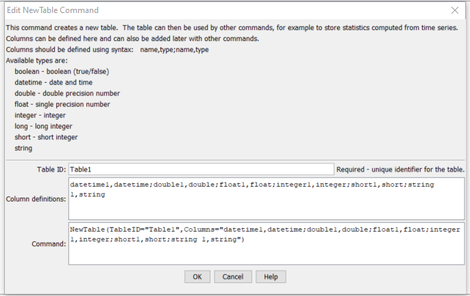

# StateDMI / Command / NewTable #

* [Overview](#overview)
* [Command Editor](#command-editor)
* [Command Syntax](#command-syntax)
* [Examples](#examples)
* [Troubleshooting](#troubleshooting)
* [See Also](#see-also)

-------------------------

## Overview ##

The `NewTable` command creates a table with named columns, each of which is a specified data type.
Tables are used to hold information about data objects.
Tables can be written as final data products or artifacts of processing.  Characteristics of the table are as follows:

* Each column can only contain a single data type
* The default precision for numbers for display and output is 2 digits after the
decimal – additional formatting features may be available in write commands and may be added later
* Tables are referenced using the `TableID` parameter
* Cells in tables are referenced using the column name and cell values that identify rows (such as time series identifiers)

## Command Editor ##

The following dialog is used to edit the command and illustrates the command syntax.
<a href="../NewTable.png">See also the full-size image.</a>

**<p style="text-align: center;">

</p>**

**<p style="text-align: center;">
`NewTable` Command Editor
</p>**

## Command Syntax ##

The command syntax is as follows:

```text
NewTable(Parameter="Value",...)
```
**<p style="text-align: center;">
Command Parameters
</p>**

| **Parameter**&nbsp;&nbsp;&nbsp;&nbsp;&nbsp;&nbsp;&nbsp;&nbsp;&nbsp;&nbsp;&nbsp;&nbsp; | **Description** | **Default**&nbsp;&nbsp;&nbsp;&nbsp;&nbsp;&nbsp;&nbsp;&nbsp;&nbsp;&nbsp; |
| --------------|-----------------|----------------- |
|`TableID`<br>**required**|Identifier for the table – should be unique among tables that are defined.  Can be specified using processor `${Property}`.|None – must be specified.|
|`Columns`|The column names and data types are defined using the format `ColumnName,DataType; ColumnName,DataType`.  Column names can contain spaces; however, simple short names are generally handled better by display features and minimize errors in referencing the columns.  Data types are specified using the following strings:<ul><li>`datetime` – date and time</li><li>`double` – double precision number</li><li>`float` – single precision number</li><li>`integer` – integer (`-2147483648` to `2147483647`)</li><li>`short` – short integer (`-32768` to `32767`)</li><li>`string` – Unicode string</li></ul>|No columns will be defined.|

## Examples ##

See the [automated tests](https://github.com/OpenCDSS/cdss-app-statedmi-test/tree/master/test/regression/commands/NewTable).

## Troubleshooting ##

[See the main troubleshooting documentation](../../troubleshooting/troubleshooting.md)

## See Also ##

* [`FreeTable`](../FreeTable/FreeTable) command
