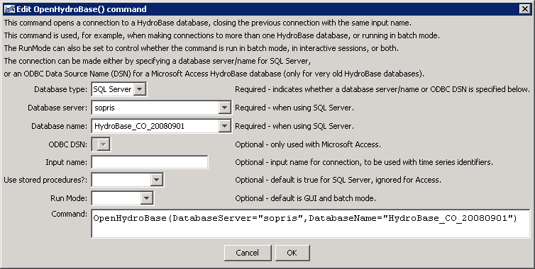

# StateDMI / Command / OpenHydroBase #

* [Overview](#overview)
* [Command Editor](#command-editor)
* [Command Syntax](#command-syntax)
* [Examples](#examples)
* [Troubleshooting](#troubleshooting)
* [See Also](#see-also)

-------------------------

## Overview ##

The `OpenHydroBase`
opens a connection to a HydroBase database, allowing data to be read from the database.
This command is not typically used for interactive sessions but may be inserted to run
in batch only mode to allow a specific database and commands files to be distributed.

## Command Editor ##

The following dialog is used to edit the command and illustrates the command syntax.
The ***Database type*** is used to control settings for parameters and is not itself a parameter.

**<p style="text-align: center;">

</p>**

**<p style="text-align: center;">
`OpenHydroBase` Command Editor (<a href="../OpenHydroBase.png">see also the full-size image</a>)
</p>**

## Command Syntax ##

The command syntax is as follows:

```text
OpenHydroBase(Parameter="Value",...)
```
**<p style="text-align: center;">
Command Parameters
</p>**

| **Parameter**&nbsp;&nbsp;&nbsp;&nbsp;&nbsp;&nbsp;&nbsp;&nbsp;&nbsp;&nbsp;&nbsp;&nbsp;&nbsp;&nbsp;&nbsp;&nbsp;&nbsp;&nbsp;&nbsp;&nbsp;&nbsp;&nbsp; | **Description** | **Default**&nbsp;&nbsp;&nbsp;&nbsp;&nbsp;&nbsp;&nbsp;&nbsp;&nbsp;&nbsp; |
| --------------|-----------------|----------------- |
| `DatabaseServer` | Used with a SQL Server HydroBase.  Specify the SQL Server database machine name.  A list of choices will be shown, corresponding to properties in the `CDSS.cfg` configuration file. | Required if a SQL Server database is used, and accepts the generic value `DatabaseServer=local`, which will automatically be translated to the name of the local computer. |
| `DatabaseName` | Used with a SQL Server HydroBase.  The name of the database typically follows a pattern similar to: `HydroBase_CO_YYYYMMDD`.  A list of choices will be shown, corresponding to properties in the `CDSS.cfg` configuration file. | HydroBase |
| `OdbcDsn` | The ODBC DSN to use for the connection, used only when working with a Microsoft Access database. | Required if a Microsoft Access database is used. |
| `InputName` | The input name corresponding to the `~InputType~InputName` information in time series identifiers.  This is used when more than one HydroBase connection is used in the same command file. | Blank (no input name). |
| `UseStoredProcedures` | Used with SQL Server, indicating whether stored procedures are used.  Stored procedures are the default and should be used except when testing software. | `True` (used stored procedures). |
| `RunMode` | Indicates when the command should be run, one of:<ul><li>`BatchOnly` – run the command only in batch mode.</li><li>`GUIOnly` – run the command only in GUI mode.</li><li>`GUIAndBatch` – run the command in batch and GUI mode.</li></ul> | `GUIAndBatch` |

## Examples ##

See the [automated tests](https://github.com/OpenCDSS/cdss-app-statedmi-test/tree/master/test/regression/commands/OpenHydroBase).

The following example command file illustrates how to connect to a SQL Server database running on a machine named “sopris”:

```
StartLog(LogFile="Results/Example_OpenHydroBase_DatabaseName.StateDMI.log")
OpenHydroBase(DatabaseServer="sopris",DatabaseName="HydroBase_CO_20060816")
```

## Troubleshooting ##

## See Also ##

