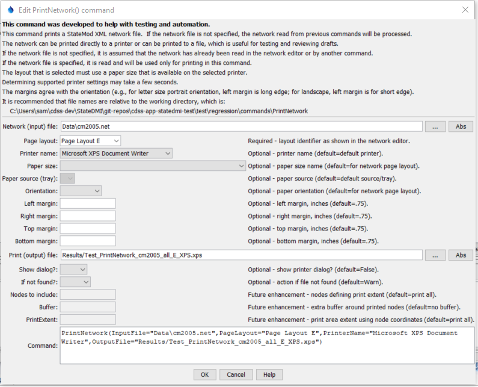
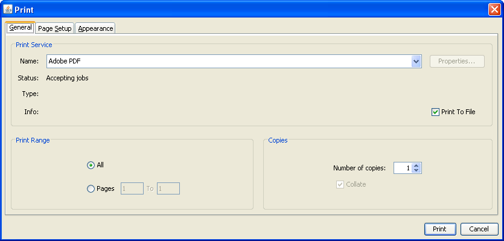
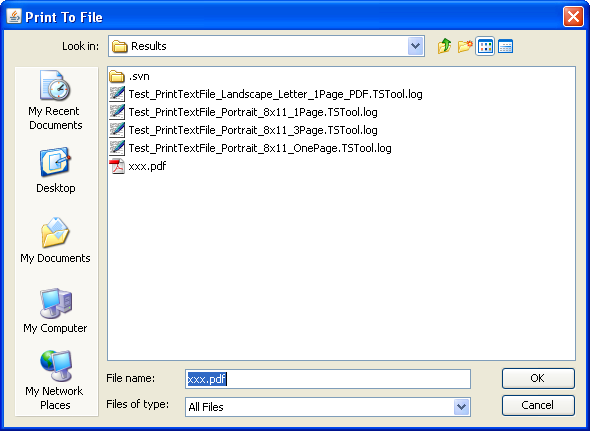
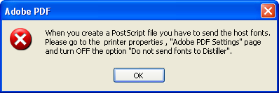

# StateDMI / Command / PrintNetwork #

* [Overview](#overview)
* [Command Editor](#command-editor)
* [Command Syntax](#command-syntax)
* [Examples](#examples)
* [Troubleshooting](#troubleshooting)
* [See Also](#see-also)

-------------------------

## Overview ##

The `PrintNetwork` command prints a StateMod XML network to a physical or virtual (e.g., PDF file) printer.
This command is used in testing to verify print features and also can be used in production to automate printing.
Printing is highly dependent on the features available from a printer.
The command attempts to list printer options to configure command parameters.
However, some options are listed based on what a printer can do,
but this may require physically changing/selecting paper trays, using manual feed, etc.
The command will be enhanced in the future to specify features including tray
selection but currently it is intended for use with common printer settings.
If advanced settings are needed beyond the properties available in the command,
use `ShowDialog=True` (displaying the dialog will pause command execution).
The overall sequence of printing a network is described below:

1. Specify a network file and page layout, for full-scale printing
	a. Sets the page size and orientation from the network layout
	b. Sets the node and font size from the network layout
2. Specify a page size for printing, using the command parameters and optionally the printer dialog
	a. If the page size matches the layout and the full network is being printed,
	then full-scale printing occurs
	b. If the page size does not match the layout and the full network is being printed,
	the output is scaled to fit the page by matching the printable area – this is not recommended
	c. If the page size does not match the layout and a subset of the network is being printed,
	the output is scaled to fit the page by matching the requested area to the
	printable area – this allows subsets of the network to be printed (or saved as images)
	
The command has been tested printing the full network.
Printing part of the network by specifying a paper size different than the network page layout paper size may yield unexpected results. 

## Command Editor ##

The following dialog is used to edit the command and illustrates the command syntax.

**<p style="text-align: center;">

</p>**

**<p style="text-align: center;">
`PrintNetwork` Command Editor (<a href="../PrintNetwork.png">see also the full-size image</a>)
</p>**

## Command Syntax ##

The command syntax is as follows:

```text
PrintNetwork(Parameter="Value",...)
```
**<p style="text-align: center;">
Command Parameters
</p>**

| **Parameter**&nbsp;&nbsp;&nbsp;&nbsp;&nbsp;&nbsp;&nbsp;&nbsp;&nbsp;&nbsp;&nbsp;&nbsp; | **Description** | **Default**&nbsp;&nbsp;&nbsp;&nbsp;&nbsp;&nbsp;&nbsp;&nbsp;&nbsp;&nbsp; |
| --------------|-----------------|----------------- |
| `InputFile` | The name of the network (`*.net`) file to print.  If no filename is provided, the in-memory network read with a previous command will be used. | In-memory network. |
| `PageLayout` | The page layout from the network, which indicates layout properties that correspond with a page size. | None – must be specified. |
| `PrinterName` | The name of the printer to use (e.g., `\\MyComputer\MyPrinter` or Adobe PDF) | The default printer will be used. |
| `PaperSize` | The paper size to print.  Because there are a number of standards for paper, the size is specified as standard-sizename (e.g., na-letter for North American Letter).    For information on paper sizes, see: [http://en.wikipedia.org/wiki/Paper_size](http://en.wikipedia.org/wiki/Paper_size). | The size for the `PageLayout`. |
| `PaperSource` | The tray for the paper – currently not enabled.  Use `ShowDialog=True` to select. | The `PaperSize` is used. |
| `Orientation` | The paper orientation. | The size for the `PageLayout`. |
| `MarginLeft` | The left margin for the orientation, inches. | .75 in |
| `MarginRight` | The right margin for the orientation, inches. | .75 in |
| `MarginTop` | The top margin for the orientation, inches. | .75 in |
| `MarginBottom` | The bottom margin for the orientation, inches. | .75 in |
| `OutputFile` | Specify an output file, in cases where the printer name corresponds to a file formatter (such as Adobe PDF). | Content is sent to printer device, not a file. |
| `ShowDialog` | Indicate whether to show the printer dialog, which allows review and editing of printer parameters.  This is useful for testing and for selecting advanced printer features not handled in batch mode by this command. | `False` |
| `IfNotFound` | Indicate action if the file is not found, one of:<ul><li>Ignore – ignore the missing file (do not warn).</li><li>Warn – generate a warning (use this if the file truly is expected and a missing file is a cause for concern).</li><li>`Fail` – generate a failure (use this if the file truly is expected and a missing file is a cause for concern).</li></ul> | Ignore |
| `IncludeNodes` | Future enhancement.  Specify a list of nodes to define the printing area.  The list should include nodes at the corners of the area to be printed. | The full network is printed. |
| `Buffer` | Future enhancement.  When specifying `IncludeNodes`, the buffer % Left,Right,Top,Bottom to indicate extra space around the nodes, to allow for printing of labels, etc. | The print area is that defined by `IncludeNodes`. |
| `PrintExtent` | Future enhancement.   Specify the print area using the node coordinates `Xmin,Ymin,Xmax,Ymax`. | The full network is printed. |

This command can be used to test print features.
For example, use a printer that outputs to a PDF, XPS, or other format file rather than a physical printer.
If `ShowDialog=True` and printing to a file is indicated by specifying the
`OutputFile` parameter (such as with Adobe PDF),
the ***General*** tab on the print dialog will be similar to the following:

**<p style="text-align: center;">

</p>**

**<p style="text-align: center;">
Print Job Dialog General Properties (<a href="../PrintNetwork_DialogGeneral.png">see also the full-size image</a>)
</p>**

Note that ***Print to File*** is checked; however, the name of the file may not be displayed.
Instead, the output file is specified by pressing Print, which displays the following dialog,
with the initial choice matching the value of the `OutputFile` parameter:

**<p style="text-align: center;">

</p>**

**<p style="text-align: center;">
Print To File Dialog (<a href="../PrintNetwork_PrintToFile.png">see also the full-size image</a>)
</p>**

If running a command to write a PDF file, the following may be displayed:

**<p style="text-align: center;">

</p>**

**<p style="text-align: center;">
Adobe PDF Error (<a href="../PrintNetwork_DistillerFontError.png">see also the full-size image</a>)
</p>**

Unfortunately, there does not seem to be any way to change the printer setting
from the print dialog and consequently PDF cannot be used.
An alternate approach such as iText may be implemented for PDF.

If a Microsoft XPS file is printed, the following software may need to be installed,
in particular for Windows XP:
[http://www.microsoft.com/download/en/details.aspx?displaylang=en&id=11816](http://www.microsoft.com/download/en/details.aspx?displaylang=en&id=11816])

## Examples ##

See the [automated tests](https://github.com/OpenCDSS/cdss-app-statedmi-test/tree/master/test/regression/commands/PrintNetwork).

## Troubleshooting ##

## See Also ##

