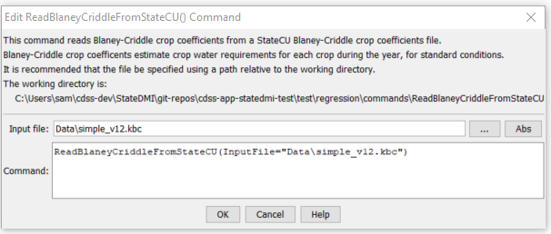

# StateDMI / Command / ReadBlaneyCriddleFromStateCU #

* [Overview](#overview)
* [Command Editor](#command-editor)
* [Command Syntax](#command-syntax)
* [Examples](#examples)
* [Troubleshooting](#troubleshooting)
* [See Also](#see-also)

-------------------------

## Overview ##

The `ReadBlaneyCriddleFromStateCU` command (for StateCU)
reads Blaney-Criddle crop coefficients from a StateCU Blaney-Criddle
crop coefficients file and defines crop coefficients in memory.
The crop coefficients can then be manipulated and output with other commands.
This command can be used to adjust an existing crop coefficients file.

## Command Editor ##

The following dialog is used to edit the command and illustrates the command syntax.

**<p style="text-align: center;">

</p>**

**<p style="text-align: center;">
`ReadBlaneyCriddleFromStateCU` Command Editor (<a href="../ReadBlaneyCriddleFromStateCU.png">see also the full-size image</a>)
</p>**

## Command Syntax ##

The command syntax is as follows:

```text
ReadBlaneyCriddleFromStateCU(Parameter="Value",...)
```
**<p style="text-align: center;">
Command Parameters
</p>**

| **Parameter**&nbsp;&nbsp;&nbsp;&nbsp;&nbsp;&nbsp;&nbsp;&nbsp;&nbsp;&nbsp;&nbsp;&nbsp; | **Description** | **Default**&nbsp;&nbsp;&nbsp;&nbsp;&nbsp;&nbsp;&nbsp;&nbsp;&nbsp;&nbsp; |
| --------------|-----------------|----------------- |
| `InputFile`<br>**required**| The name of the input file to read. | None – must be specified. |

## Examples ##

See the [automated tests](https://github.com/OpenCDSS/cdss-app-statedmi-test/tree/master/test/regression/commands/ReadBlaneyCriddleFromStateCU).

## Troubleshooting ##

[See the main troubleshooting documentation](../../troubleshooting/troubleshooting.md)

## See Also ##

* [`ReadBlaneyCriddleFromHydroBase`](../ReadBlaneyCriddleFromHydroBase/ReadBlaneyCriddleFromHydroBase.md) command
* [`WriteBlaneyCriddleToStateCU`](../WriteBlaneyCriddleToStateCU/WriteBlaneyCriddleToStateCU.md) command
