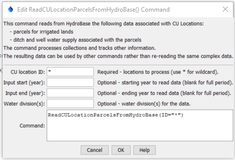

# StateDMI / Command / ReadCULocationParcelsFromHydroBase #

* [Overview](#overview)
	+ [Processing Logic](#processing-logic)
* [Command Editor](#command-editor)
* [Command Syntax](#command-syntax)
* [Examples](#examples)
* [Troubleshooting](#troubleshooting)
* [See Also](#see-also)

-------------------------

## Overview ##

The `ReadCULocationParcelsFromHydroBase` command (for StateCU) reads parcels and related supply data from HydroBase
and creates a data model that provides information for other commands.
This data model provides consistency, allows for data quality control,
and minimizes the need for redundant logic in other commands, specifically:

* [`ReadCropPatternTSFromParcels`](../ReadCropPatternTSFromParcels/ReadCropPatternTSFromParcels.md) - 
* [`ReadIrrigationPracticeTSFromParcels`](../ReadIrrigationPracticeTSFromParcels/ReadIrrigationPracticeTSFromParcels.md)
* [`ReadWellRightsFromHydroBase`](../ReadWellRightsFromHydroBase/ReadWellRightsFromHydroBase.md)

## Processing Logic ##

Processing logic ensures that the acreage for a parcel is only counted once for consumptive use calculations.
Because wells can provide supplemental supply to ditches (commingled supplies),
the acreage in this case is only assigned to the ditch.
There are three main steps to processing:

1. Assign parcels to CU Locations, and water supply to the parcels.
See the logic below.
2. Count how many wells are associated with each parcel.
This analysis is not performed for surface water relationships because the database
contains a "percent irrigated" to prorate area and is handled above.
3. Prorate well acreage to the wells that serve that parcel.
For example, if groundwater only parcel is irrigated by two wells,
half of the acreage is assigned to each well.

The following summarizes the processing logic for each CU Location that is processed.
Within each top-level step, processing is limited to years that have parcel data that
are also in the requested period.

1. If the CU Location is not a collection (is a single diversion or well structure),
for example corresponding to a StateMod `DIV` or `D&W` node:
	1.  The code first retrieves the structure view for structure WDID
	by querying the HydroBase `vw_CDSS_Structure` view in order to get the structure number.
	Then, read "parcel use" data for the single structure using the HydroBase
	`usp_CDSS_ParcelUseTSStructureToParcel_Sel_By_StructureNumCalYear` stored procedure.
	**Being able to call a stored procedure using WDID would be useful and
	being able to query a view would allow a bulk query and cache rather than querying individually.**
	This provides the following data:
		* calendar year
		* crop type
		* total acres for the crop type
		* irrigation method
		* structure information
	2. For parcels that are returned, add a parcel record to the data model for each unique year and parcel ID.
	3. For each structure associated with the parcel, add a surface water supply record to the data model.
	4. Note that **no check for associated wells occurs**.
	If this is needed, defined the structure in a collection with one part.
2. If the CU Location is a collection and the collection part type is `Ditch`,
for example corresponding to a StateMod `DIV` or `D&W` node that is an aggregate or system::
	1. For each structure in the collection,
	read "parcel use" data for the single structure using the HydroBase
	`usp_CDSS_ParcelUseTSStructureToParcel_Sel_By_StructureNumCalYear` stored procedure
	and process similar to explicit diversion structure (see above).
	2. Additionally, for each unique parcel, query associated wells using the
	HydroBase `vw_CDSS_WellsWellToParcel` view.
	Each well that is returned is added as a supply for the parcel in the data model.
3. If the CU Location is a collection and the collection part type is `Well`,
for example corresponding to a StateMod `WEL` node for groundwater only model node,
specified as an aggregate or system:
	1. For each well in the collection, read data from the HydroBase `vw_CDSS_WellsWellToParcel` view,
	which returns the list of parcels associated with the well and associated well.
	The well identifier can be either a structure WDID or well permit receipt
	and the data query is formatted accordingly.
	2. Because the above only contains parcel identifier but not crop type and irrigation method,
	query the HydroBase `vw_CDSS_ParcelUseTS` view using the parcel identifier from above.
	3. Add a parcel to the data model using parcel data from step (b).
	4. Add a groundwater water supply record to the data model for the well in the collection,
	using data from step (a).
4. If the CU Location is a collection and the collection part type is `Parcel`:
	1. This case is not currently handled but would be similar to the previous case
	except that parcel/well relationships would be queried using the parcel identifier.
5. Else, the input is not understood and a warning is generated.

Currently, additional data such as specified with
[`SetCropPatternTS`](../SetCropPatternTS/SetCropPatternTS.md) and
[`SetCropPatternTSFromList`](../SetCropPatternTSFromList/SetCropPatternTSFromList.md) are not handled.  
It may be necessary to add a command parameter to allow such information to be added as if read from HydroBase,
in which case the data source would be user-supplied.

## Command Editor ##

The following dialog is used to edit the command and illustrates the command syntax.

**<p style="text-align: center;">

</p>**

**<p style="text-align: center;">
`ReadCULocationParcelsFromHydroBase` Command Editor (<a href="../ReadCULocationParcelsFromHydroBase.png">see also the full-size image</a>)
</p>**

## Command Syntax ##

The command syntax is as follows:

```text
ReadCULocationParcelsFromHydroBase(Parameter="Value",...)
```
**<p style="text-align: center;">
Command Parameters
</p>**

| **Parameter**&nbsp;&nbsp;&nbsp;&nbsp;&nbsp;&nbsp;&nbsp;&nbsp;&nbsp;&nbsp;&nbsp;&nbsp; | **Description** | **Default**&nbsp;&nbsp;&nbsp;&nbsp;&nbsp;&nbsp;&nbsp;&nbsp;&nbsp;&nbsp; |
| --------------|-----------------|----------------- |
| `ID` <br>**required** | A single CU Location identifier to match or a pattern using wildcards (e.g., `20*`). | None – must be specified. |
| `InputStart` | Starting year to read data. | All available parcel data will be read. |
| `InputEnd` | Ending year to read data. | All available parcel data will be read. |
| `Div` | Water divisions to process, separated by commas.  Specifying this will increase performance slightly. | Determine divisions based on location identifiers that match the format of water district identifiers (WDIDs) . |

## Examples ##

See the [automated tests](https://github.com/OpenCDSS/cdss-app-statedmi-test/tree/master/test/regression/commands/ReadCULocationParcelsFromHydroBase).

## Troubleshooting ##

## See Also ##

* [`ReadCropPatternTSFromHydroBase`](../ReadCropPatternTSFromHydroBase/ReadCropPatternTSFromHydroBase.md) command
* [`ReadIrrigationPracticeTSFromHydroBase`](../ReadIrrigationPracticeTSFromHydroBase/ReadIrrigationPracticeTSFromHydroBase.md) command
* [`SetCropPatternTS`](../SetCropPatternTS/SetCropPatternTS.md) command
* [`SetCropPatternTSFromList`](../SetCropPatternTSFromList/SetCropPatternTSFromList.md) command
* [`WriteCULocationParcelsToFile`](../WriteCULocationParcelsToFile/WriteCULocationParcelsToFile.md) command
