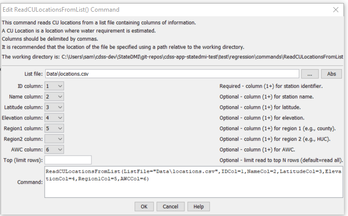

# StateDMI / Command / ReadCULocationsFromList

* [Overview](#overview)
* [Command Editor](#command-editor)
* [Command Syntax](#command-syntax)
* [Examples](#examples)
* [Troubleshooting](#troubleshooting)
* [See Also](#see-also)

-------------------------

## Overview ##

The `ReadCULocationsFromList` command 
reads a list of CU Locations from a delimited list file and defines CU Locations in memory.
The CU Locations can then be manipulated and output with other commands.  The identifier column is required.

## Command Editor ##

The following dialog is used to edit the command and illustrates the command syntax.

**<p style="text-align: center;">

</p>**

**<p style="text-align: center;">
`ReadCULocationsFromList` Command Editor (<a href="../ReadCULocationsFromList.png">see also the full-size image</a>)
</p>**

## Command Syntax ##

The command syntax is as follows:

```text
ReadCULocationsFromList(Parameter="Value",...)
```
**<p style="text-align: center;">
Command Parameters
</p>**

| **Parameter**&nbsp;&nbsp;&nbsp;&nbsp;&nbsp;&nbsp;&nbsp;&nbsp;&nbsp;&nbsp;&nbsp;&nbsp; | **Description** | **Default**&nbsp;&nbsp;&nbsp;&nbsp;&nbsp;&nbsp;&nbsp;&nbsp;&nbsp;&nbsp; |
| --------------|-----------------|----------------- |
| `ListFile`<br>**required** | The name of the list file to be read. | None – must be specified. |
| `IDCol`<br>**required** | The column number (1+) containing the CU Location identifiers. | None – must be specified. |
| `NameCol` | The column number (1+) containing the CU Location name. | The name will be initialized to blank. |
| `LatitudeCol` | The column number (1+) containing the CU Location latitude. | The latitude will be missing. |
| `ElevationCol` | The column number (1+) containing the CU Location elevation. | The elevation will be missing. |
| `Region1Col` | The column number (1+) containing the CU Location Region1. | The region1 will be initialized to blank. |
| `Region2Col` | The column number (1+) containing the CU Location Region2. | The region2 will be initialized to blank. |
| `AWCCol` | The column number (1+) containing the CU Location AWC. | The AWC will be missing. |
| `Top` | Specify a number of rows to read, useful during testing. | Read all rows. |

## Examples ##

See the [automated tests](https://github.com/OpenCDSS/cdss-app-statedmi-test/tree/master/test/regression/commands/ReadCULocationsFromList).

At a minimum, the list file must contain a column with CU Location identifiers.
Lines starting with the `#` character are treated as comments.
If the first line’s values are surrounded by double quotes, the line is assumed to indicate column headings.

A sample list file is shown below:

```
#wdid,lat,long,county,huc,name,ceff,fleff,speff,gmode,awc
360645,39.84,-106.35,SUMMIT,14010002,GUTHRIE THOMAS DITCH,1,0.6,0.8,2,0.08
360649,39.78,-106.18,SUMMIT,14010002,HAMILTON DAVIDSON DITCH,1,0.6,0.8,2,0.08
360660,39.8,-106.16,SUMMIT,14010002,HIGH MILLER DITCH,1,0.6,0.8,2,0.12
360662,39.97,-106.38,SUMMIT,14010002,HOAGLAND CANAL,1,0.6,0.8,2,0.12
360671,39.74,-106.13,SUMMIT,14010002,INDEPENDENT BLUE DITCH,1,0.6,0.8,2,0.13
360687,39.77,-106.18,SUMMIT,14010002,KIRKWOOD DITCH,1,0.6,0.8,2,0.08
360709,40.01,-106.38,GRAND,14010002,LOBACK DITCH,1,0.6,0.8,2,0.09
360725,39.82,-106.25,SUMMIT,14010002,MARY DITCH,1,0.6,0.8,2,0.08
360728,39.83,-106.25,SUMMIT,14010002,MAT NO 1 DITCH,1,0.6,0.8,2,0.08
```

## Troubleshooting ##

[See the main troubleshooting documentation](../../troubleshooting/troubleshooting.md)

## See Also ##

* [`ReadCULocationsFromStateCU`](../ReadCULocationsFromStateCU/ReadCULocationsFromStateCU.md) command
* [`ReadCULocationsFromStateMod`](../ReadCULocationsFromStateMod/ReadCULocationsFromStateMod.md) command
* [`WriteCULocationsToStateCU`](../WriteCULocationsToStateCU/WriteCULocationsToStateCU.md) command
