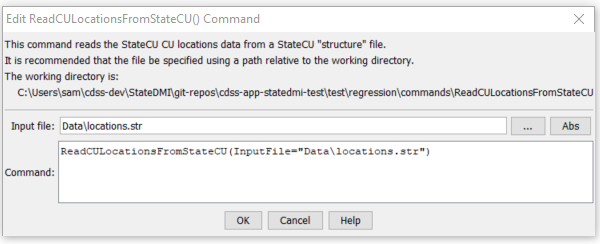

# StateDMI / Command / ReadCULocationsFromStateCU #

* [Overview](#overview)
* [Command Editor](#command-editor)
* [Command Syntax](#command-syntax)
* [Examples](#examples)
* [Troubleshooting](#troubleshooting)
* [See Also](#see-also)

-------------------------

## Overview ##

The `ReadCULocationsFromStateCU` command (for StateCU)
command reads a list of CU Locations from a StateCU structure file and defines CU Locations in memory.
The CU Locations can then be manipulated and output with other commands.
This command can be used to adjust an existing CU Locations file.

## Command Editor ##

The following dialog is used to edit the command and illustrates the command syntax.

**<p style="text-align: center;">

</p>**

**<p style="text-align: center;">
`ReadCULocationsFromStateCU` Command Editor (<a href="../ReadCULocationsFromStateCU.png">see also the full-size image</a>)
</p>**

## Command Syntax ##

The command syntax is as follows:

```text
ReadCULocationsFromStateCU(Parameter="Value",...)
```
**<p style="text-align: center;">
Command Parameters
</p>**

| **Parameter**&nbsp;&nbsp;&nbsp;&nbsp;&nbsp;&nbsp;&nbsp;&nbsp;&nbsp;&nbsp;&nbsp;&nbsp; | **Description** | **Default**&nbsp;&nbsp;&nbsp;&nbsp;&nbsp;&nbsp;&nbsp;&nbsp;&nbsp;&nbsp; |
| --------------|-----------------|----------------- |
| `InputFile` | The name of the input file to read, surrounded by double quotes. | None – must be specified. |

## Examples ##

See the [automated tests](https://github.com/OpenCDSS/cdss-app-statedmi-test/tree/master/test/regression/commands/ReadCULocationsFromStateCU).

## Troubleshooting ##

## See Also ##

* [`ReadCULocationsFromList`](../ReadCULocationsFromList/ReadCULocationsFromList.md) command
* [`ReadCULocationsFromStateMod`](../ReadCULocationsFromStateMod/ReadCULocationsFromStateMod.md) command
* [`WriteCULocationsToStateCU`](../WriteCULocationsToStateCU/WriteCULocationsToStateCU.md) command
