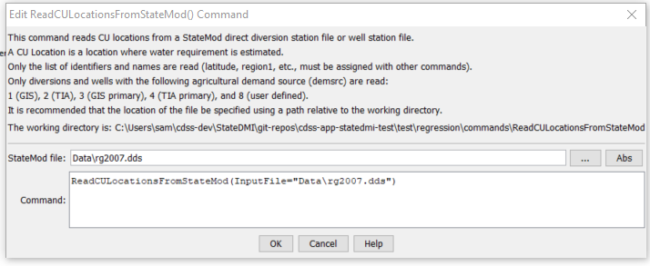

# StateDMI / Command / ReadCULocationsFromStateMod #

* [Overview](#overview)
* [Command Editor](#command-editor)
* [Command Syntax](#command-syntax)
* [Examples](#examples)
* [Troubleshooting](#troubleshooting)
* [See Also](#see-also)

-------------------------

## Overview ##

The `ReadCULocationsFromStateMod` command (for StateCU)
command reads a list of CU Locations from a StateMod diversion
or well stations file and defines CU Locations in memory.
The CU Locations can then be manipulated and output with other commands.

## Command Editor ##

The following dialog is used to edit the command and illustrates the command syntax.

**<p style="text-align: center;">

</p>**

**<p style="text-align: center;">
`ReadCULocationsFromStateMod` Command Editor (<a href="../ReadCULocationsFromStateMod.png">see also the full-size image</a>)
</p>**

## Command Syntax ##

The command syntax is as follows:

```text
ReadCULocationsFromStateMod(Parameter="Value",...)
```
**<p style="text-align: center;">
Command Parameters
</p>**

| **Parameter**&nbsp;&nbsp;&nbsp;&nbsp;&nbsp;&nbsp;&nbsp;&nbsp;&nbsp;&nbsp;&nbsp;&nbsp; | **Description** | **Default**&nbsp;&nbsp;&nbsp;&nbsp;&nbsp;&nbsp;&nbsp;&nbsp;&nbsp;&nbsp; |
| -- | -- | -- |
| `InputFile`<br>**required** | The name of the input file to read, surrounded by double quotes. | None – must be specified. |

## Examples ##

See the [automated tests](https://github.com/OpenCDSS/cdss-app-statedmi-test/tree/master/test/regression/commands/ReadCULocationsFromStateMod).

## Troubleshooting ##

[See the main troubleshooting documentation](../../troubleshooting/troubleshooting.md)

## See Also ##

* [`ReadCULocationsFromList`](../ReadCULocationsFromList/ReadCULocationsFromList.md) command
* [`ReadCULocationsFromStateCU`](../ReadCULocationsFromStateCU/ReadCULocationsFromStateCU.md) command
* [`WriteCULocationsToStateCU`](../WriteCULocationsToStateCU/WriteCULocationsToStateCU.md) command
