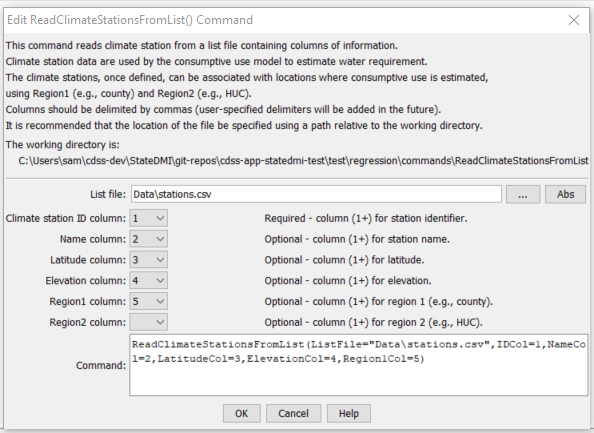

# StateDMI / Command / ReadClimateStationsFromList #

* [Overview](#overview)
* [Command Editor](#command-editor)
* [Command Syntax](#command-syntax)
* [Examples](#examples)
* [Troubleshooting](#troubleshooting)
* [See Also](#see-also)

-------------------------

## Overview ##

The `ReadClimateStationsFromList` command reads a list of climate stations
from a delimited list file and defines climate stations in memory.
The climate stations can then be manipulated and output with other commands.

## Command Editor ##

The following dialog is used to edit the command and illustrates the command syntax.

**<p style="text-align: center;">

</p>**

**<p style="text-align: center;">
`ReadClimateStationsFromList` Command Editor (<a href="../ReadClimateStationsFromList.png">see also the full-size image</a>)
</p>**

## Command Syntax ##

The command syntax is as follows:

```text
ReadClimateStationsFromList(Parameter="Value",...)
```
**<p style="text-align: center;">
Command Parameters
</p>**

| **Parameter**&nbsp;&nbsp;&nbsp;&nbsp;&nbsp;&nbsp;&nbsp;&nbsp;&nbsp;&nbsp;&nbsp;&nbsp; | **Description** | **Default**&nbsp;&nbsp;&nbsp;&nbsp;&nbsp;&nbsp;&nbsp;&nbsp;&nbsp;&nbsp; |
| --------------|-----------------|----------------- |
| `ListFile` | The name of the list file to be read. | None – must be specified. |
| `IDCol` | The column number (1+) containing the climate station identifiers. | None – must be specified. |
| `NameCol` | The column number (1+) containing the climate station name. | None – optional (name will be initialized to blank). |
| `LatitudeCol` | The column number (1+) containing the climate station latitude. | None – optional (latitude will be initialized to missing data). |
| `ElevationCol` | The column number (1+) containing the climate station elevation. | None – optional (elevation will be initialized to missing data). |
| `Region1Col` | The column number (1+) containing the climate station `Region1`. | None – optional (`Region1` will be initialized to blank). |
| `Region2Col` | The column number (1+) containing the climate station `Region2`. | None – optional (`Region2` will be initialized to blank). |

## Examples ##

See the [automated tests](https://github.com/OpenCDSS/cdss-app-statedmi-test/tree/master/test/regression/commands/ReadClimateStationsFromList).

At a minimum, the list file must contain a column with station identifiers.
Lines starting with the `#` character are treated as comments.
Column names can be specified in the first non-comment line by enclosing each column name in quotes.

An example list file is shown below, for example created from CDSS TSTool software:

```
# Climate stations
“ID”,”Name”
0130,” ALAMOSA SAN LUIS VALLEY RGNL”
0776,”BLANCA”
1458,” CENTER 4 SSW”
2184,” DEL NORTE 2 E”
3541,” GREAT SAND DUNES N M”
3951,” HERMIT 7 ESE”
5322,” MANASSA”
5706,” MONTE VISTA 2 W”
7337,” SAGUACHE”
```

The following example command file illustrates how climate stations can be defined from a list and written to a StateCU file:

```
ReadClimateStationsFromList(ListFile="climsta.lst",IDCol=1)
FillClimateStationsFromHydroBase(ID="*")
SetClimateStation(ID="3016",Region2="14080106",IfNotFound=Warn)
SetClimateStation(ID="1018",Region2="14040106",IfNotFound=Warn)
SetClimateStation(ID="1928",Elevation=6440,IfNotFound=Warn)
SetClimateStation(ID="0484",Region1="MOFFAT",IfNotFound=Add)
WriteClimateStationsToStateCU(OutputFile="COclim2006.cli")
```

## Troubleshooting ##

## See Also ##

* [`ReadClimateStationsFromStateCU`](../ReadClimateStationsFromStateCU/ReadClimateStationsFromStateCU.md) command
* [`WriteClimateStationsToStateCU`](../WriteClimateStationsToStateCU/WriteClimateStationsToStateCU.md) command
