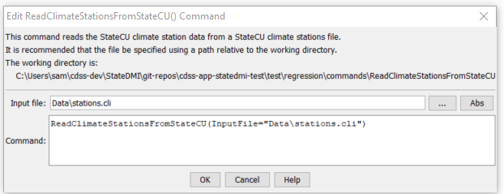

# StateDMI / Command / ReadClimateStationsFromStateCU #

* [Overview](#overview)
* [Command Editor](#command-editor)
* [Command Syntax](#command-syntax)
* [Examples](#examples)
* [Troubleshooting](#troubleshooting)
* [See Also](#see-also)

-------------------------

## Overview ##

The `ReadClimateStationsFromStateCU` command (for StateCU)
reads a list of climate stations from a StateCU climate stations file and defines climate stations in memory.
The climate stations can then be manipulated and output with other commands.
This command can be used to adjust an existing climate stations file.

## Command Editor ##

The following dialog is used to edit the command and illustrates the command syntax.

**<p style="text-align: center;">

</p>**

**<p style="text-align: center;">
`ReadClimateStationsFromStateCU` Command Editor (<a href="../ReadClimateStationsFromStateCU.png">see also the full-size image</a>)
</p>**

## Command Syntax ##

The command syntax is as follows:

```text
ReadClimateStationsFromStateCU(Parameter="Value",...)
```
**<p style="text-align: center;">
Command Parameters
</p>**

| **Parameter**&nbsp;&nbsp;&nbsp;&nbsp;&nbsp;&nbsp;&nbsp;&nbsp;&nbsp;&nbsp;&nbsp;&nbsp; | **Description** | **Default**&nbsp;&nbsp;&nbsp;&nbsp;&nbsp;&nbsp;&nbsp;&nbsp;&nbsp;&nbsp; |
| --------------|-----------------|----------------- |
| `InputFile`<br>**required** | The name of the input file to read. | None – must be specified. |

## Examples ##

See the [automated tests](https://github.com/OpenCDSS/cdss-app-statedmi-test/tree/master/test/regression/commands/ReadClimateStationsFromStateCU).

## Troubleshooting ##

## See Also ##

* [`ReadClimateStationsFromList`](../ReadClimateStationsFromList/ReadClimateStationsFromList) command
* [`WriteClimateStationsToStateCU`](../WriteClimateStationsToStateCU/WriteClimateStationsToStateCU) command
