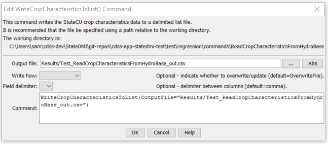

# StateDMI / Command / ReadCropCharacteristicsFromHydroBase #

* [Overview](#overview)
* [Command Editor](#command-editor)
* [Command Syntax](#command-syntax)
* [Examples](#examples)
* [Troubleshooting](#troubleshooting)
* [See Also](#see-also)

-------------------------

## Overview ##

The `ReadCropCharacteristicsFromHydroBase` command (for StateCU)
reads a list of crops and their characteristics from a HydroBase database.
The crop characteristics can then be manipulated and output with other commands.

## Command Editor ##

The following dialog is used to edit the command and illustrates the command syntax.

**<p style="text-align: center;">

</p>**

**<p style="text-align: center;">
`ReadCropCharacteristicsFromHydroBase` Command Editor (<a href="../ReadCropCharacteristicsFromHydroBase.png">see also the full-size image</a>)
</p>**

## Command Syntax ##

The command syntax is as follows:

```text
ReadCropCharacteristicsFromHydroBase(Parameter="Value",...)
```
**<p style="text-align: center;">
Command Parameters
</p>**

| **Parameter**&nbsp;&nbsp;&nbsp;&nbsp;&nbsp;&nbsp;&nbsp;&nbsp;&nbsp;&nbsp;&nbsp;&nbsp; | **Description** | **Default**&nbsp;&nbsp;&nbsp;&nbsp;&nbsp;&nbsp;&nbsp;&nbsp;&nbsp;&nbsp; |
| --------------|-----------------|----------------- |
|`CUMethod`<br>**required** | The CU method that is defined in HydroBase for the crop type and its characteristics. | None – must be specified. |

The crop type (e.g., `ALFALFA`) is used as the unique identifier.
Any previous crop characteristics objects will be added to (or replaced if identifiers match).
The crop types in HydroBase may actually include some land use types that are not
appropriate for StateCU (e.g., Water, `NO_DATA`).
Currently these crop types are still queried from HydroBase.

To allow for some flexibility in defining crop characteristics,
a CU Method is used in HydroBase and can be used to adjust crop characteristics for regional differences.
For example, read the Soil Conservation Service Irrigation Water Requirements Technical Release No. 21 (TR-21)
characteristics first and then reset the characteristics for a crop due to local conditions.

## Examples ##

See the [automated tests](https://github.com/OpenCDSS/cdss-app-statedmi-test/tree/master/test/regression/commands/ReadCropCharacteristicsFromHydroBase).

The following example illustrates how to create a StateCU crop characteristics file with data from HydroBase:

```
StartLog(LogFile="Crops_CCH.StateDMI.log")
#
# StateDMI commands to create the Rio Grande Crop Characteristics File
#
# History:
#
# 2004-03-16 Steven A. Malers, RTi  Initial version using StateDMI.
# 2007-04-22 SAM, RTi               Use new directory structure, current
#                                   software and HydroBase.
#
# Step 1 - read data from HydroBase
#
# Read the general TR-21 characteristics first and then override with Rio Grande
# data.
ReadCropCharacteristicsFromHydroBase(CUMethod="BLANEY-CRIDDLE_TR-21")
ReadCropCharacteristicsFromHydroBase(CUMethod="BLANEY-CRIDDLE_RIO_GRANDE")
#
# Step 2 - adjust crop characteristics if needed
#    No resets are needed.
#
# Step 3 - write the file
#
WriteCropCharacteristicsToStateCU(OutputFile="rg2007.cch")
#
# Check the results
#
CheckCropCharacteristics(ID="*")
WriteCheckFile(OutputFile="rg2007.cch.check.html")
```

## Troubleshooting ##

[See the main troubleshooting documentation](../../troubleshooting/troubleshooting.md)

## See Also ##

* [`ReadCropCharacteristicsFromStateCU`](../ReadCropCharacteristicsFromStateCU/ReadCropCharacteristicsFromStateCU.md) command
* [`WriteCropCharacteristicsToStateCU`](../WriteCropCharacteristicsToStateCU/WriteCropCharacteristicsToStateCU.md) command
