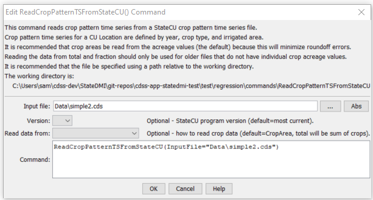

# StateDMI / Command / ReadCropCharacteristicsFromStateCU #

* [Overview](#overview)
* [Command Editor](#command-editor)
* [Command Syntax](#command-syntax)
* [Examples](#examples)
* [Troubleshooting](#troubleshooting)
* [See Also](#see-also)

-------------------------

## Overview ##

The `ReadCropCharacteristicsFromStateCU` command (for StateCU)
reads a list of crops and their characteristics from a StateCU
crop characteristics file and defines crop characteristics in memory.
The crop characteristics can then be manipulated and output with other commands.
This command can be used to adjust an existing crop characteristics file.

## Command Editor ##

The following dialog is used to edit the command and illustrates the command syntax.

**<p style="text-align: center;">

</p>**

**<p style="text-align: center;">
`ReadCropCharacteristicsFromStateCU` Command Editor (<a href="../ReadCropCharacteristicsFromStateCU.png">see also the full-size image</a>)
</p>**

## Command Syntax ##

The command syntax is as follows:

```text
ReadCropCharacteristicsFromStateCU(Parameter="Value",...)
```
**<p style="text-align: center;">
Command Parameters
</p>**

| **Parameter**&nbsp;&nbsp;&nbsp;&nbsp;&nbsp;&nbsp;&nbsp;&nbsp;&nbsp;&nbsp;&nbsp;&nbsp; | **Description** | **Default**&nbsp;&nbsp;&nbsp;&nbsp;&nbsp;&nbsp;&nbsp;&nbsp;&nbsp;&nbsp; |
| --------------|-----------------|----------------- |
|` InputFile`<br>**required** | The name of the input file to read. | None – must be specified. |

## Examples ##

See the [automated tests](https://github.com/OpenCDSS/cdss-app-statedmi-test/tree/master/test/regression/commands/ReadCropCharacteristicsFromStateCU).

## Troubleshooting ##

## See Also ##

* [`ReadClimateStationsFromHydroBase`](../ReadClimateStationsFromHydroBase/ReadClimateStationsFromHydroBase) command
* [`WriteClimateStationsToStateCU`](../WriteClimateStationsToStateCU/WriteClimateStationsToStateCU) command
