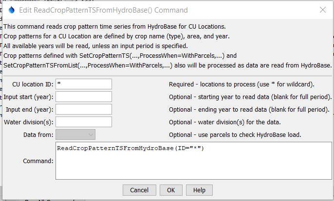

# StateDMI / Command / ReadCropPatternTSFromHydroBase #

* [Overview](#overview)
	+ [Processing Logic](#processing-logic)
* [Command Editor](#command-editor)
* [Command Syntax](#command-syntax)
* [Examples](#examples)
* [Troubleshooting](#troubleshooting)
* [See Also](#see-also)

-------------------------

## Overview ##

**This documentation is being updated.  The command may be updated to use output from the
[`ReadCULocationParcelsFromHydroBase`](../ReadCULocationParcelsFromHydroBase/ReadCULocationParcelsFromHydroBase.md) command.**

The `ReadCropPatternTSFromHydroBase` command (for StateCU) reads crop pattern
time series from HydroBase and defines crop pattern time series in memory.
Crop pattern time series indicate the consumptive use location (CU Location) acreage for each crop for each year, for example:

```
2016 67AWA021                         246.532         9
     NO_CROP                            0.000     0.000
     WHEAT_FALL                         0.000     0.000
     GRASS_PASTURE                      0.000     0.000
     WHEAT_SPRING                       0.000     0.000
     SORGHUM_GRAIN                      0.250    61.750
     ALFALFA                            0.314    77.383
     CORN_GRAIN                         0.436   107.399
     VEGETABLES                         0.000     0.000
     CORN_SILAGE                        0.000     0.000
```

In the above example, `2016` is the year, `67AWA021` is the CU Location identifier
(in this case a collection), `246.532` is the total acreage, and `9` is the number of crop types.
The remaining lines indicate the crop type, fraction of total acreage for the crop, and the acreage for the crop.
Note that HydroBase data do not have zeros for crops without acreage in a year - zeros are supplied
by fill commands that are used after reading the data.

StateDMI ensures that each crop for a CU Location has a time series that spans the entire modeling period. 
The crop pattern time series can then be manipulated and output with other commands.
For a year, irrigated parcels each have a single crop, irrigation method, and one or more surface water (ditch) or groundwater (well) water supplies.
The related [`ReadIrrigationPracticeTSFromHydroBase`](../ReadIrrigationPracticeTSFromHydroBase/ReadIrrigationPracticeTSFromHydroBase.md)
command is used to create irrigation practice time series,
which indicate how much annual irrigation supply comes from surface water and groundwater sources.

The acreage is assigned to model CU Locations as follows for model node types:

* "DIV" (surface water only diversion CU Location) and "D&W" (surface water supplemented by groundwater CU Location):
	+ If the CU Location is a diversion (or collection of diversions),
	the crop pattern data are read from HydroBase tables that contain irrigated acres for the ditch service area(s),
	and the total acreage for each crop type is assigned to the diversion location.
	+ Any association of wells to parcels is ignored because the acreage assignment occurs using
	the diversion to parcel relationships.
* "WEL" (groundwater only supply, often modeled as a collection of wells associated with groundwater unit response zone):
	* Specify collections using list of well identifiers:
		- **This approach is being phased in as the default approach for CDSS.**
		- If the CU Location is a well (or collection of wells) specified with WDID or well permit receipt,
		the crop pattern data are read from HydroBase tables that contain irrigated
		acres for the parcels associated with the well WDIDs and receipts, as specified in aggregate/system data.
		- The benefit of this approach is that modelers need only specify which wells are included in collection.
		The relationship of wells to parcels is determined based on HydroBase data loaded from spatial data.
	* Specify collections using a list of parcel identifiers:
		- **This older approach is being phased out of CDSS and currently is used for the Rio Grande basin.**
		- If the CU Location is an aggregate of groundwater-only parcels, the area is determined from a list of parcel identifiers.
		- The downside of this approach is that it required modelers to specify well collections using lists of parcel identifiers,
		which is confusing and prone to error.

The following examples illustrate how acreage are assigned.

**<p style="text-align: center;">

</p>**

**<p style="text-align: center;">
Example Acreage Assignment for a Parcel with One Well (<a href="../acreage-assignment-one-well.png">see also the full-size image</a>)
</p>**

**<p style="text-align: center;">

</p>**

**<p style="text-align: center;">
Example Acreage Assignment for a Parcel with Two Wells (<a href="../acreage-assignment-two-wells.png">see also the full-size image</a>)
</p>**

If crop pattern time series are not available in HydroBase (e.g., because the acreage was not considered in CDSS data analysis),
then additional data can be specified
with commands before reading from HydroBase, and will supplement the HydroBase data.
A single location or location that is part of an aggregate/system can have its
data specified with a
[`SetCropPatternTS(...,ProcessWhen=WithParcels,...)`](../SetCropPatternTS/SetCropPatternTS.md) or
[`SetCropPatternTSFromList(...,ProcessWhen=WithParcels,...)`](../SetCropPatternTSFromList/SetCropPatternTSFromList.md) command.
In this case, it is expected that the acreage will not be found in HydroBase.
Use set commands before the `ReadCropPatternTSFromHydroBase` command.
It is recommended that a [`SetCropPatternTSFromList(…,ProcessWhen=WithParcels,...)`](../SetCropPatternTSFromList/SetCropPatternTSFromList.md)
command be used for each year of HydroBase data that is processed.

## Processing Logic ##

Processing logic ensurses that the acreage for a parcel is only counted once.
Because wells can provide supplemental supply to ditches (comingled supplies),
the acreage in this case is only associated with the ditch.
There are three main steps to processing:

1. Assign parcels to structures.  Loop through the list of CU Locations twice to associate parcels with locations:
	1. The first iteration processes explicit structures and collections of ditches.
	This associates parels associated with surface water and explicit wells (a case that is not currently supported).
	A list of parcel identifiers and year is kept with each structure to allow for later checks.
	**Note that StateCU data files do not indicate whether a location is `DIV` or `D&W` and
	therefore it is difficult to determine whether an explicit WDID is a ditch or well.**
	2. The second iteration processes all structures that are collections of wells
	(WDIDs and receipts, the current CDSS approach)
	and collections of parcels (the old, RGDSS approach).
	The list of parcels associated with structures in the first step is checked to ensure that
	comingled supply parcel is not added to the well.
2. Prorate well acreage.  The previous step will have associated parcels with structures.
	* For surface water parcels no additional processing is necessary.
	* For 

The following summarizes the processing logic for each CU Location that is being processed,
as specified by the `ID` command parameter.

1. If the CU Location is not a collection (is a single diversion or well structure),
for example corresponding to a StateMod `DIV` or `D&W` node:
	1. Read "irrigation summary" data from the HydroBase `vw_CDSS_StructureIrrigSummaryTS` view.
	This provides of the following data:
		* calendar year (used for crop pattern time series)
		* crop type (used for crop pattern time series)
		* total acres for the crop type (used for crop pattern time series)
		* acres by specific irrigation methods (**not** used for crop pattern time series)
		* acres associated with surface water supplies (ditches) (**not** used for crop pattern time series)
		* acres associated with groundwater supplies (wells) (**not** used for crop pattern time series)
	2. If data were provided with [`SetCropPatternTS`](../SetCropPatternTS/SetCropPatternTS.md) or
	[`SetCropPatternTSFromList`](../SetCropPatternTSFromList/SetCropPatternTSFromList.md) commands,
	the data are applied to the results of the previous step.  This will reset HydroBase values from the previous step.
	**If the single well or other CU Location identiifer is not found in the HydroBase
	`vw_CDSS_StructureIrrigSummary` view (such as if not a WDID), data may need to be provided with set commands.**
	3. If no data are found for the requested period from the HydroBase or additional data,
	a warning message is generated.
2. If the CU Location is a collection and the collection part type is `Ditch`,
for example corresponding to a StateMod `DIV` or `D&W` node:
	1. For each structure in the collection, read "irrigation summary" data from
	HydroBase `vw_CDSS_StructureIrrigSummaryTS` view similar to single structure.
	2. If data were provided with [`SetCropPatternTS`](../SetCropPatternTS/SetCropPatternTS.md) or
	[`SetCropPatternTSFromList`](../SetCropPatternTSFromList/SetCropPatternTSFromList.md) commands,
	the data are applied to the results from the previous step.  This will reset HydroBase values from the previous step.
	3. If no data are found for the requested period from the HydroBase or additional data,
	a warning message is generated.
3. If the CU Location is a collection and the collection part type is `Well`,
for example corresponding to a StateMod `WEL` node:
	1. For each part in the collection, read "well to parcel" data from the HydroBase `vw_CDSS_WellsWellToParcel` view,
	which returns the list of parcels associated with the well.
	The well identifier can be either a structure WDID or well permit receipt.
	2. For each 
4. If the CU Location is a collection and the collection part type is `Parcel`:
for example corresponding to a StateMod `WEL` node that uses older (Rio Grande) well aggregation approach:
	1. For each collection and year, determine the parcels in the collection.
	* This documentation section needs to be updated.
5. Else, the input is not understood and a warning is generated.

## Command Editor ##

The following dialog is used to edit the command and illustrates the command syntax.

**<p style="text-align: center;">

</p>**

**<p style="text-align: center;">
`ReadCropPatternTSFromHydroBase` Command Editor (<a href="../ReadCropPatternTSFromHydroBase.png">see also the full-size image</a>)
</p>**

## Command Syntax ##

The command syntax is as follows:

```text
ReadCropPatternTSFromHydroBase(Parameter="Value",...)
```
**<p style="text-align: center;">
Command Parameters
</p>**

| **Parameter**&nbsp;&nbsp;&nbsp;&nbsp;&nbsp;&nbsp;&nbsp;&nbsp;&nbsp;&nbsp;&nbsp;&nbsp; | **Description** | **Default**&nbsp;&nbsp;&nbsp;&nbsp;&nbsp;&nbsp;&nbsp;&nbsp;&nbsp;&nbsp; |
| --------------|-----------------|----------------- |
| `ID` <br>**required** | A single CU Location identifier to match or a pattern using wildcards (e.g., `20*`). | None – must be specified. |
| `InputStart` | Starting year to read data. | All available data will be read. |
| `InputEnd` | Ending year to read data. | All available data will be read. |
| `Div` | Water divisions to process, separated by commas.  Specifying this will increase performance slightly. | Determine divisions based on location identifiers that are water district identifiers (WDIDs) . |
| `DataFrom`<br>**automatic**| Indicate the HydroBase data source:  <ul><li>`Parcels` - process detailed parcel data from HydroBase `vw_CDSS_WellsWellToParcel` and related data</li><li>`Summary` - process summary data from HydroBase `vw_CDSS_StructureIrrigSummary` view</li></ul>| This parameter is currently disabled and the command behavior is automatically selected as follows: <ul><li>Explicit (single) structures - `Summary`(**processing single wells is unsupported - add to a collection if necessary**) </li><li>Ditch collections (are always specified as collections of WDIDs) - `Summary`</li><li>Well collections specified with WDID and receipt list - `Parcels`</li><li>Well collections specified with parcels - `Parcels`</ul> |

## Examples ##

See the [automated tests](https://github.com/OpenCDSS/cdss-app-statedmi-test/tree/master/test/regression/commands/ReadCropPatternTSFromHydroBase).

The following command file illustrates how to create a crop pattern time series file:

```
# Step 1 - Set output period and read CU locations
SetOutputPeriod(OutputStart="1950",OutputEnd="2006")
ReadCULocationsFromStateCU(InputFile="..\StateCU\cm2006.str")
# Step 2 - Read SW aggregates
SetDiversionSystemFromList(ListFile="colorado_divsys.csv",IDCol=1,
  NameCol=2,PartIDsCol=3,PartsListedHow=InRow)
SetDiversionAggregateFromList(ListFile="colorado_agg.csv",IDCol=1,
  NameCol=2,PartIDsCol=3,PartsListedHow=InRow)
# Step 3 - Create *.cds file form and read acreage/crops from HydroBase
CreateCropPatternTSForCULocations(ID="*",Units="ACRE")
ReadCropPatternTSFromHydroBase(ID="*")
# Step 4 - Need to translate crops out of HB to include TR21 suffix
# Translate all crops from HB to include .TR21 suffix
TranslateCropPatternTS(ID="*",OldCropType="GRASS_PASTURE",NewCropType="GRASS_PASTURE.TR21")
TranslateCropPatternTS(ID="*",OldCropType="CORN_GRAIN",NewCropType="CORN_GRAIN.TR21")
TranslateCropPatternTS(ID="*",OldCropType="ALFALFA",NewCropType="ALFALFA.TR21")
TranslateCropPatternTS(ID="*",OldCropType="SMALL_GRAINS",NewCropType="SPRING_GRAIN.TR21")
TranslateCropPatternTS(ID="*",OldCropType="VEGETABLES",NewCropType="VEGETABLES.TR21")
TranslateCropPatternTS(ID="*",OldCropType="ORCHARD_WO_COVER",NewCropType="ORCHARD_WO_COVER.TR21")
TranslateCropPatternTS(ID="*",OldCropType="ORCHARD_WITH_COVER",NewCropType="ORCHARD_WITH_COVER.TR21")
TranslateCropPatternTS(ID="*",OldCropType="DRY_BEANS",NewCropType="DRY_BEANS.TR21")
TranslateCropPatternTS(ID="*",OldCropType="GRAPES",NewCropType="GRAPES.TR21")
TranslateCropPatternTS(ID="*",OldCropType="WHEAT",NewCropType="SPRING_GRAIN.TR21")
TranslateCropPatternTS(ID="*",OldCropType="SUNFLOWER",NewCropType="SPRING_GRAIN.TR21")
TranslateCropPatternTS(ID="*",OldCropType="SOD_FARM",NewCropType="GRASS_PASTURE.TR21")
# Step 5 - Translate crop names
# use high-altitude coefficients for structures with more than 50% of
# irrigated acreage above 6500 feet
TranslateCropPatternTS(ListFile="cm2005_HA.lst",IDCol=1,
  OldCropType="GRASS_PASTURE.TR21",NewCropType="GRASS_PASTURE.DWHA")
# Step 6 - Fill Acreage
#      Fill SW structure acreage backword from 1999 to 1950
#      Fill acreage forward for all structures from 2000 to 2006
FillCropPatternTSRepeat(ID="*",CropType="*",FillStart=1950,FillEnd=1993,FillDirection=Backward)
FillCropPatternTSRepeat(ID="*",CropType="*",FillStart=1993,FillEnd=1999,FillDirection=Forward)
FillCropPatternTSRepeat(ID="*",CropType="*",FillStart=2000,FillEnd=2006,FillDirection=Forward)
# Step 7 - Write final *.cds file
WriteCropPatternTSToStateCU(OutputFile="..\StateCU\cm2006.cds",
  WriteCropArea=True,WriteHow=OverwriteFile)
# Check the results
CheckCropPatternTS(ID="*")
WriteCheckFile(OutputFile="cm2006.cds.StateDMI.check.html")
```

## Troubleshooting ##

## See Also ##

* [`FillCropPatternTSInterpolate`](../FillCropPatternTSInterpolate/FillCropPatternTSInterpolate.md) command
* [`FillCropPatternTSRepeat`](../FillCropPatternTSRepeat/FillCropPatternTSRepeat.md) command
* [`SetCropPatternTS`](../SetCropPatternTS/SetCropPatternTS.md) command
* [`SetCropPatternTSFromList`](../SetCropPatternTSFromList/SetCropPatternTSFromList.md) command
