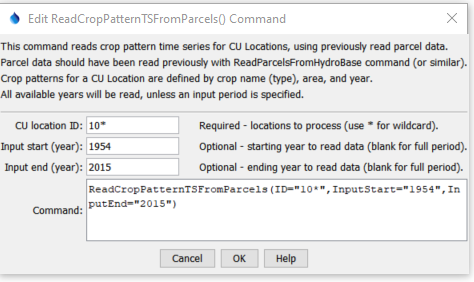

# StateDMI / Command / ReadCropPatternTSFromParcels #

* [Overview](#overview)
	+ [Processing Logic](#processing-logic)
* [Command Editor](#command-editor)
* [Command Syntax](#command-syntax)
* [Examples](#examples)
* [Troubleshooting](#troubleshooting)
* [See Also](#see-also)

-------------------------

## Overview ##

**This command is being phased in as of StateDMI 5.x and replaces the
[`ReadCropPatternTSFromHydroBase`](../ReadCropPatternTSFromHydroBase/ReadCropPatternTSFromHydroBase.md) command.**

The `ReadCropPatternTSFromParcels` command (for StateCU) reads crop pattern
time series from parcels that were previously read with
[`ReadParcelsFromHydroBase`](../ReadParcelsFromHydroBase/ReadParcelsFromHydroBase.md)
command and defines crop pattern time series in memory.
Crop pattern time series indicate the consumptive use location (CU Location) acreage for each crop for each year, for example:

```
2016 67AWA021                         246.532         9
     ALFALFA                            0.314    77.383
     CORN_GRAIN                         0.436   107.399
     CORN_SILAGE                        0.000     0.000
     GRASS_PASTURE                      0.000     0.000
     SORGHUM_GRAIN                      0.250    61.750
     VEGETABLES                         0.000     0.000
     WHEAT_FALL                         0.000     0.000
     WHEAT_SPRING                       0.000     0.000
```

In the above example, `2016` is the year, `67AWA021` is the CU Location identifier
(in this case a collection), `246.532` is the total acreage, and `9` is the number of crop types.
The remaining lines indicate the crop type, fraction of total acreage for the crop, and the acreage for the crop.
Note that HydroBase data do not have zeros for crops without acreage in a year - zeros are supplied
by fill commands that are used after reading the data.

StateDMI ensures that each crop for a CU Location has a time series that spans the entire modeling period. 
The crop pattern time series can then be manipulated and output with other commands.
For a year, irrigated parcels each have a single crop, irrigation method, and one or more surface water (ditch) or groundwater (well) water supplies.
The related [`ReadIrrigationPracticeTSFromParcels`](../ReadIrrigationPracticeTSFromParcels/ReadIrrigationPracticeTSFromParcels.md)
command is used to create irrigation practice time series,
which indicate how much annual irrigation supply comes from surface water and groundwater sources.

The area for each parcel associated with a CU Location is assigned to the CU Location as follows:

* if the model node is a DIV or D&W and if the parcel has one or more surface water supplies,
the parcel acreage is assigned to the CU Location:
	+ if a single surface supply is used, the full parcel area is assigned 
	+ if more than one surface supply is used, the parcel area divided by number of surface supplies is assigned
	+ if the surface supply is also used with another parcel, that parcel will also be assigned the fractional area
	+ the surface water supply WDID must match the single DIV ID, or match an ID in a DIV collection,
	in order for the acreage to be assigned to the model node
	(ditch WDIDs that don't match any model nodes are considered to not be in the dataset,
	although they are considered in the supply count and consequently impact the area fraction calculation)
* if the model node is a WEL (groundwater only), the parcel does not have surface water supplies,
and has one or more groundwater supplies,
	the parcel acreage is assigned to the CU Location:
	+ if a single groundwater supply is used, the full parcel area is assigned 
	+ if more than one groundwater supply is used,
	the parcel area divided by number of well supplies is assigned
	+ the groundwater supply well WDID or receipt must match an ID in a well collection list
	in order for the acreage to be assigned to the model node
	(well WDID/receipts that don't match any model nodes are considered to not be in the dataset,
	although they are considered in the supply count and consequently impact the area fraction calculation)

The following examples illustrate how acreage is assigned,
using excerpts from the parcel report file output by the
[`WriteParcelsToFile`](../WriteParcelsToFile/WriteParcelsToFile.md) command.

The following example illustrates a parcel with commingled supply with one ditch.
The full parcel area is assigned to the CU Location `1000568`.
The acreage associated with groundwater supplies are not assigned to the CU Location.
Note that `CDS:NO` indicates that the parcel acreage is not assigned to the CU Location.

```
#>-------- Model Id ---------|------------------------------- Parcel Data -----------------------------||----------- Data Source/Use ------------- ||            Collections use WDID Parts              |          WEL Collection Part ID is the same as GW Supply ID       |
#>                           |                                                                         || Include                    CDS     LocId || SW     |-------------- SW Supply Data -------------|----------- GW Collection Data ---------|----- GW Supply Data -----|
#>           Loc  Collection |       Parcel                                    Parcel          Irrig   || in               CDS       LocId   has   || Collect|#     Ditch  Irrig Irrig   Irrig           |   GWPart    GWPart    Well     Well    |#    Irrig D&W     Irrig  |
#>  LocId    Type Type       |Year   ID        Div Dist        Crop            Area     Units  Method  || CDS?    DataSrc  LocId     Type    Set   || WDID   |Dit   WDID   Frac  FracHB  Area     HBError|    Type     IdType    WDID     Receipt |Well Frac  Frac    Area   |
#>b--------exb--exb---------exb--exb--------exb--exb--exb------------------exb--------exb--exb--------exb------exb------exb----------exb--exb------exb------exb-exb------exb---exb---exb--------exb-----exb----------exb-----exb------exb--------exb--exb---exb---exb-------ex
1000568      D&W  Single      1988 21012706      2   10 GRASS_PASTURE            44.165 acre FLOOD
                                                                                                        CDS:YES  HB-PUTS  1000568      D&W                      1 1000568  1.000 1.000     44.165
                                                                                                        CDS:NO   HB-WTP                                                                                   WellInDitch          1005175  9079322       2 0.500 1.000    22.083
                                                                                                        CDS:NO   HB-WTP                                                                                   WellInDitch          1005176  9078571       2 0.500 1.000    22.083
```

The following example illustrates a parcel with two surface supplies,
in this case from two CU Locations.
Half the parcel acreage is assigned to each CU Location (`1000568` and `1000649`).
The `Data Source/Use` columns indicate which CU Locations receive the acreage.

```
#>-------- Model Id ---------|-------------------------- Parcel Data ------------------------||-------- Data Source/Use --------- ||---- SW Collection Data ----|------------ SW Suppply Data -----------|------------- GW Collection Data ----------| GW Supply Data |
#>           Loc  Collection |       Parcel                          Parcel          Irrig   ||                    CDS        Loc ||  SWPart   SWPartId         |#     Irrig   Irrig    Irrig            |   GWPart      GWPart                      |#     GW        |
#>  LocId    Type Type       |Year   ID                Crop          Area     Units  Method  || CDS?     DataSrc   LocId      Type||  Type     Type       WDID  |Ditch Frac    FracHB   Area      HBError|    Type       IdType     WDID     Receipt |Well  IrrigArea |
#>b--------exb--exb---------exb--exb--------exb------------------exb--------exb--exb--------exb------exb--------exb----------exb--exb--------exb------exb------exb--exb------exb------exb--------eb-----exb----------exb--------exb------exb--------exb--exb---------ex
1000568      D&W  Single      1998 21012942   GRASS_PASTURE            62.840 acre FLOOD     
                                                                                              CDS:YES  HB-PUTS    1000568      D&W  Ditch      WDID     1000568     2    0.500    0.500     31.420        
                                                                                              CDS:YES  HB-PUTS    1000649      DIV  Ditch      WDID     1000649     2    0.500    0.500     31.420        
```

The following example illustrates two parcels, each with one groundwater supply.
Each parcel's acreage is assigned completely to the appropriate CU Location.

```
#>-------- Model Id ---------|-------------------------- Parcel Data ------------------------||-------- Data Source/Use --------- ||---- SW Collection Data ----|------------ SW Suppply Data -----------|------------- GW Collection Data ----------| GW Supply Data |
#>           Loc  Collection |       Parcel                          Parcel          Irrig   ||                    CDS        Loc ||  SWPart   SWPartId         |#     Irrig   Irrig    Irrig            |   GWPart      GWPart                      |#     GW        |
#>  LocId    Type Type       |Year   ID                Crop          Area     Units  Method  || CDS?     DataSrc   LocId      Type||  Type     Type       WDID  |Ditch Frac    FracHB   Area      HBError|    Type       IdType     WDID     Receipt |Well  IrrigArea |
#>b--------exb--exb---------exb--exb--------exb------------------exb--------exb--exb--------exb------exb--------exb----------exb--exb--------exb------exb------exb--exb------exb------exb--------eb-----exb----------exb--------exb------exb--------exb--exb---------ex
66_GW662     WEL  Aggregate   1998 26617683   ALFALFA                 274.550 acre FLOOD     
                                                                                              CDS:YES  HB-WTP     66_GW662     WEL                                                                        Well         Receipt             9072522       1     274.550
66_GW662     WEL  Aggregate   1998 26617684   CORN_GRAIN              118.214 acre SPRINKLER 
                                                                                              CDS:YES  HB-WTP     66_GW662     WEL                                                                        Well         Receipt             9072750       1     118.214
```

The following example illustrates a parcel with multiple groundwater-only supplies.
Each parcel/supply fractional acreage is assigned to the CU Location,
which sums to the parcel's full area.

```
#>-------- Model Id ---------|------------------------------- Parcel Data -----------------------------||----------- Data Source/Use ------------- ||            Collections use WDID Parts              |          WEL Collection Part ID is the same as GW Supply ID       |
#>                           |                                                                         || Include                    CDS     LocId || SW     |-------------- SW Supply Data -------------|----------- GW Collection Data ---------|----- GW Supply Data -----|
#>           Loc  Collection |       Parcel                                    Parcel          Irrig   || in               CDS       LocId   has   || Collect|#     Ditch  Irrig Irrig   Irrig           |   GWPart    GWPart    Well     Well    |#    Irrig D&W     Irrig  |
#>  LocId    Type Type       |Year   ID        Div Dist        Crop            Area     Units  Method  || CDS?    DataSrc  LocId     Type    Set   || WDID   |Dit   WDID   Frac  FracHB  Area     HBError|    Type     IdType    WDID     Receipt |Well Frac  Frac    Area   |
#>b--------exb--exb---------exb--exb--------exb--exb--exb------------------exb--------exb--exb--------exb------exb------exb----------exb--exb------exb------exb-exb------exb---exb---exb--------exb-----exb----------exb-----exb------exb--------exb--exb---exb---exb-------ex
67_GW679     WEL  Aggregate   2015 26724103      2   67 SORGHUM_GRAIN            95.447 acre SPRINKLER                                              
                                                                                                        CDS:YES  HB-WTP   67_GW679     WEL                                                                Well         Receipt          0456751G      2 0.500          47.724
                                                                                                        CDS:YES  HB-WTP   67_GW679     WEL                                                                Well         Receipt          9072324       2 0.500          47.724
```

The following example illustrates a parcel with multiple groundwater-only supplies (no surface water supplies).
Each parcel/supply fractional acreage is assigned to the CU Location based on four supply wells.
However, only 3 of the 4 fractional areas are assigned to the model node.
The reason is that well WDID `1706312` is associated with the parcel as a supply but is not included
in any groundwater-only model node aggregate/sysetm.
The supply is therefore not considered part of the dataset.

```
#>-------- Model Id ---------|------------------------------- Parcel Data -----------------------------||----------- Data Source/Use ------------- ||            Collections use WDID Parts              |          WEL Collection Part ID is the same as GW Supply ID       |
#>                           |                                                                         || Include                    CDS     LocId || SW     |-------------- SW Supply Data -------------|----------- GW Collection Data ---------|----- GW Supply Data -----|
#>           Loc  Collection |       Parcel                                    Parcel          Irrig   || in               CDS       LocId   has   || Collect|#     Ditch  Irrig Irrig   Irrig           |   GWPart    GWPart    Well     Well    |#    Irrig D&W     Irrig  |
#>  LocId    Type Type       |Year   ID        Div Dist        Crop            Area     Units  Method  || CDS?    DataSrc  LocId     Type    Set   || WDID   |Dit   WDID   Frac  FracHB  Area     HBError|    Type     IdType    WDID     Receipt |Well Frac  Frac    Area   |
#>b--------exb--exb---------exb--exb--------exb--exb--exb------------------exb--------exb--exb--------exb------exb------exb----------exb--exb------exb------exb-exb------exb---exb---exb--------exb-----exb----------exb-----exb------exb--------exb--exb---exb---exb-------ex
17_GW172     WEL  Aggregate   1954 21716195      2   17 GRASS_PASTURE            11.850 acre FLOOD                                                  
                                                                                                        CDS:YES  HB-WTP   17_GW172     WEL                                                                Well         WDID    1706315                4 0.250           2.963
                                                                                                        CDS:YES  HB-WTP   17_GW172     WEL                                                                Well         WDID    1706316                4 0.250           2.963
                                                                                                        CDS:YES  HB-WTP   17_GW172     WEL                                                                Well         WDID    1706317                4 0.250           2.963
                                                                                                        CDS:NA   HB-WTP                                                                                   Well                 1706312                4 0.250           2.963
```

## Processing Logic ##

The following summarizes the processing logic for each CU Location that is being processed,
as specified by the `ID` command parameter.
All parcels for a CU Location are processed.

1. If the parcel has surface water supply, the fractional area irrigated by the surface supply
is added for the CU Location:
	1. If the supply WDID matches a diversion WDID for the CU Location (single WDID
	or a part in a collection), add the fractional parcel area for the supply.
	2. Set the supply to `CDS:YES` and the CU Location for the parcel, for use in report files.
2. Else if the parcel has groundwater supply, the fractional area irrigated by the groundwater supply
is added for the CU Location:
	1. If the supply WDID matches a well WDID or receipt for the CU Location
	(part in a collection), add the fractional parcel area for the supply.
	2. Set the supply to `CDS:YES` and the CU Location for the parcel, for use in report files.
3. For each year for which data are available (based on the locations being processed for all commands),
set missing crop data for the year to zero.
If irrigated lands from multiple water divisions are processed and the snapshot years for the
divisions is different, unintended years may be set to zero.
The [`CheckParcels`](../CheckParcels/CheckParcels.md) command will check that only one
division is found in parcel data.
If HydroBase includes erroneous parcel data such as incomplete irrigated year data loads,
use the `ReadParcelsFromHydroBase(ExcludeYears)` parameter
to exclude those years to avoid erroneous zero values.

## Command Editor ##

The following dialog is used to edit the command and illustrates the command syntax.

**<p style="text-align: center;">

</p>**

**<p style="text-align: center;">
`ReadCropPatternTSFromParcels` Command Editor (<a href="../ReadCropPatternTSFromParcels.png">see also the full-size image</a>)
</p>**

## Command Syntax ##

The command syntax is as follows:

```text
ReadCropPatternTSFromParcels(Parameter="Value",...)
```
**<p style="text-align: center;">
Command Parameters
</p>**

| **Parameter**&nbsp;&nbsp;&nbsp;&nbsp;&nbsp;&nbsp;&nbsp;&nbsp;&nbsp;&nbsp;&nbsp;&nbsp; | **Description** | **Default**&nbsp;&nbsp;&nbsp;&nbsp;&nbsp;&nbsp;&nbsp;&nbsp;&nbsp;&nbsp; |
| --------------|-----------------|----------------- |
| `ID`<br>**required** | A single CU Location identifier to match or a pattern using wildcards (e.g., `20*`). | None – must be specified. |
| `InputStart` | Starting year to read data. | All available data will be read. |
| `InputEnd` | Ending year to read data. | All available data will be read. |

## Examples ##

See the [automated tests](https://github.com/OpenCDSS/cdss-app-statedmi-test/tree/master/test/regression/commands/ReadCropPatternTSFromParcels).

The following command file illustrates how to create a crop pattern time series file:

```
StartLog(LogFile="Ark2020_CDS.STATEDMI.log")
# Crop Distribution File (*.cds) for the ArkDSS Consumptive Use Model
# March 2020
#
# Must be used with Hydrobase 2020########################
#
# Step 1 - Set output period and read CU locations
SetOutputPeriod(OutputStart="1950",OutputEnd="2018")
ReadCULocationsFromStateCU(InputFile="..\StateCU\Ark2020_CROP.str")
#
#
# Step 2 - Read DivSys and MultiSys
SetDiversionSystemFromList(ListFile="2020_08_18_Ark2020_DivSys_Acres.txt",IDCol="1",NameCol="2",PartIDsCol="3",PartsListedHow=InRow,PartIDsColMax="12",IfNotFound=Warn)
SetDiversionSystemFromList(ListFile="2020_08_18_Ark2020_MultiStr_DDM.txt",IDCol="1",NameCol="2",PartIDsCol="3",PartsListedHow=InRow,PartIDsColMax="7",IfNotFound=Warn)
# The following was added by Steve Malers
SetWellAggregateFromList(ListFile="2020_04_06_Ark2020_GWAgg_StateCU.txt",PartType=Well,IDCol="1",PartIDsCol="2",PartIDTypeColumn="3",PartsListedHow=InColumn,WellReceiptWaterDistrictMap="0457406:1,3648199:65,0429583:2")
#
# Step 2.1 - Read parcel data, which is used by following commands
ReadParcelsFromHydroBase(ID="*")
# Check the parcel data for issues.
CheckParcels(ID="*",AreaPrecision=1)
WriteParcelsToFile(OutputFile="Ark2020_CDS.StateDMI.model-parcel-supply-before-cds.txt")
WriteParcelsToFile(OutputFile="Ark2020_CDS.StateDMI.parcel-supply.txt",FileFormat=ParcelSupply)
#
# Step 3 - Create *.cds file form and read acreage/crops from HydroBase
CreateCropPatternTSForCULocations(ID="*",Units="ACRE")
ReadCropPatternTSFromParcels(ID="10*",InputStart="1954",InputEnd="2015")
#
# Then use set, fill, and Write commands.
```

## Troubleshooting ##

Use the following commands to troubleshoot crop pattern time series data:

* [`CheckParcels`](../CheckParcels/CheckParcels.md)
* [`WriteParcelsToFile`](../WriteParcelsToFile/WriteParcelsToFile.md)

## See Also ##

* [`FillCropPatternTSInterpolate`](../FillCropPatternTSInterpolate/FillCropPatternTSInterpolate.md) command
* [`FillCropPatternTSRepeat`](../FillCropPatternTSRepeat/FillCropPatternTSRepeat.md) command
* [`ReadCropPatternTSFromParcels`](../ReadCropPatternTSFromParcels/ReadCropPatternTSFromParcels.md) command
* [`SetCropPatternTS`](../SetCropPatternTS/SetCropPatternTS.md) command
* [`SetCropPatternTSFromList`](../SetCropPatternTSFromList/SetCropPatternTSFromList.md) command
