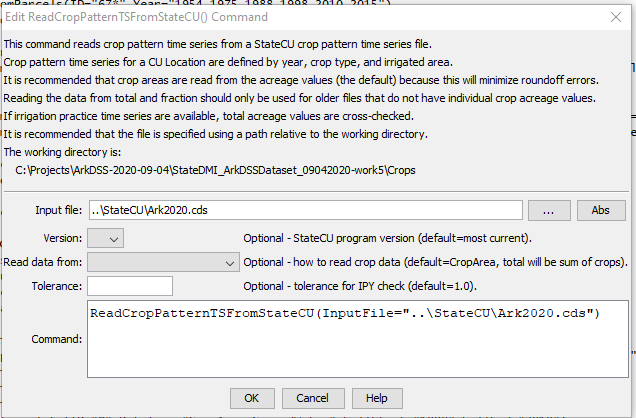

# StateDMI / Command / ReadCropPatternTSFromStateCU #

* [Overview](#overview)
* [Command Editor](#command-editor)
* [Command Syntax](#command-syntax)
* [Examples](#examples)
* [Troubleshooting](#troubleshooting)
* [See Also](#see-also)

-------------------------

## Overview ##

The `ReadCropPatternTSFromStateCU` command (for StateCU)
reads crop pattern time series data from a StateCU crop pattern
time series file and defines crop patterns in memory.
The crop pattern time series can then be manipulated and output with other commands.
This command can be used to:

* read an existing crop pattern time series file to manipulate the data
* read a crop pattern time series file to set the total
acreage in the irrigation practice time series file (see the
[`SetIrrigationPracticeTSTotalAcreageToCropPatternTSTotalAcreage`](../SetIrrigationPracticeTSTotalAcreageToCropPatternTSTotalAcreage/SetIrrigationPracticeTSTotalAcreageToCropPatternTSTotalAcreage.md) command).

**Warning:  when writing the crop pattern time series,
the total acreage and the fractions corresponding to each crop (three digits) are written.
The acreage for each crop is also now written but was not included in older versions of files.
When reading the file with this command, the default is to read the individual crop acreages
and the total and fractions are computed based on the individual crop acreages.
Because the fraction is only three digits, crop areas computed from the total
and fraction may differ from the raw crop acreages.
Consequently, comparing old and new files may result in differences.**

## Command Editor ##

The following dialog is used to edit the command and illustrates the command syntax.

**<p style="text-align: center;">

</p>**

**<p style="text-align: center;">
`ReadCropPatternTSFromStateCU` Command Editor (<a href="../ReadCropPatternTSFromStateCU.png">see also the full-size image</a>)
</p>**

## Command Syntax ##

The command syntax is as follows:

```text
ReadCropPatternTSFromStateCU(Parameter="Value",...)
```
**<p style="text-align: center;">
Command Parameters
</p>**

| **Parameter**&nbsp;&nbsp;&nbsp;&nbsp;&nbsp;&nbsp;&nbsp;&nbsp;&nbsp;&nbsp;&nbsp;&nbsp; | **Description** | **Default**&nbsp;&nbsp;&nbsp;&nbsp;&nbsp;&nbsp;&nbsp;&nbsp;&nbsp;&nbsp; |
| --------------|-----------------|----------------- |
| `InputFile` | The name of the input file to read. | None – must be specified. |
| `Version` | A StateCU version, to allow backward compatibility with files from an older software version.  Refer to StateCU documentation for a description of older file formats. | Use the file format for the most current StateCU version. |
| `ReadDataFrom` | Indicate how to read crop values, one of:<ul><li>`CropArea` – read the detailed crop acreage values from the file (may not be available in very old files)</li><li>`TotalAreaAndCropFraction` – read the total area and crop fractions and compute the crop area from this information.  Because fractions are only 3 digits, the crop areas will only be accurate to three digits (and may therefore not agree with HydroBase or other input data).</li></ul> | `CropArea` |
| `Tolerance` | The tolerance used when comparing crop pattern time series and irrigation practice time series total area. | `1.0` |

## Examples ##

See the [automated tests](https://github.com/OpenCDSS/cdss-app-statedmi-test/tree/master/test/regression/commands/ReadCropPatternTSFromStateCU).

## Troubleshooting ##

## See Also ##

* [`ReadCropPatternTSFromHydroBase`](../ReadCropPatternTSFromHydroBase/ReadCropPatternTSFromHydroBase.md) command
* [`SetIrrigationPracticeTSTotalAcreageToCropPatternTSTotalAcreage`](../SetIrrigationPracticeTSTotalAcreageToCropPatternTSTotalAcreage/SetIrrigationPracticeTSTotalAcreageToCropPatternTSTotalAcreage.md) command
* [`WriteCropPatternTSToStateCU`](../WriteCropPatternTSToStateCU/WriteCropPatternTSToStateCU.md) command
