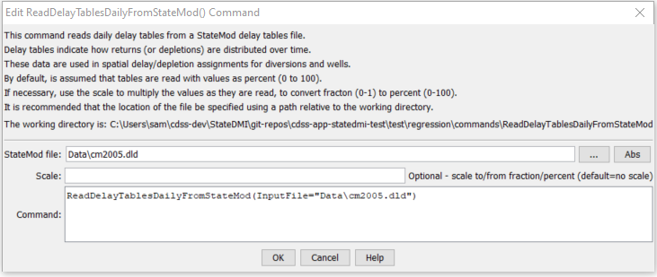

# StateDMI / Command / ReadDelayTablesDailyFromStateMod #

* [Overview](#overview)
* [Command Editor](#command-editor)
* [Command Syntax](#command-syntax)
* [Examples](#examples)
* [Troubleshooting](#troubleshooting)
* [See Also](#see-also)

-------------------------

## Overview ##

The `ReadDelayTablesDailyFromStateMod` command (for StateMod)
reads delay tables (daily) from a StateMod delay tables file.
For example, this command may be used to convert a delay table file between fraction and percent.

## Command Editor ##

The following dialog is used to edit the command and illustrates the command syntax.

**<p style="text-align: center;">

</p>**

**<p style="text-align: center;">
`ReadDelayTablesDailyFromStateMod` Command Editor (<a href="../ReadDelayTablesDailyFromStateMod.png">see also the full-size image</a>)
</p>**

## Command Syntax ##

The command syntax is as follows:

```text
ReadDelayTablesDailyFromStateMod(Parameter="Value",...)
```
**<p style="text-align: center;">
Command Parameters
</p>**

| **Parameter**&nbsp;&nbsp;&nbsp;&nbsp;&nbsp;&nbsp;&nbsp;&nbsp;&nbsp;&nbsp;&nbsp;&nbsp; | **Description** | **Default**&nbsp;&nbsp;&nbsp;&nbsp;&nbsp;&nbsp;&nbsp;&nbsp;&nbsp;&nbsp; |
| --------------|-----------------|----------------- |
| `InputFile`<br>**required** | The name of the input file to read, surrounded by double quotes. | None – must be specified. |
| `Scale` | If the StateMod delay table values are specified as fractions rather than percent, a scale of `100` can be used to convert the StateMod delay tables to percent. | If not specified, no scale is applied to the delay values. |

## Examples ##

See the [automated tests](https://github.com/OpenCDSS/cdss-app-statedmi-test/tree/master/test/regression/commands/ReadDelayTablesDailyFromStateMod).

## Troubleshooting ##

[See the main troubleshooting documentation](../../troubleshooting/troubleshooting.md)

## See Also ##

* [`ReadDelayTablesMonthlyFromStateMod`](../ReadDelayTablesMonthlyFromStateMod/ReadDelayTablesMonthlyFromStateMod.md) command
* [`WriteDelayTablesDailyToStateMod`](../WriteDelayTablesDailyToStateMod/WriteDelayTablesDailyToStateMod.md) command
