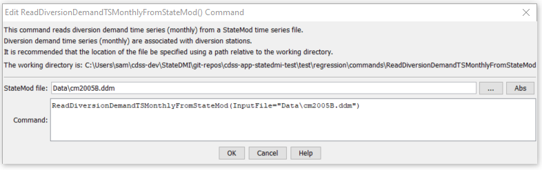

# StateDMI / Command / ReadDiversionDemandTSMonthlyFromStateMod #

* [Overview](#overview)
* [Command Editor](#command-editor)
* [Command Syntax](#command-syntax)
* [Examples](#examples)
* [Troubleshooting](#troubleshooting)
* [See Also](#see-also)

-------------------------

## Overview ##

The `ReadDiversionDemandTSMonthlyFromStateMod` command (for StateMod)
reads diversion demand time series (monthly).
All time series are read, whether or not they match the list of diversion stations.

## Command Editor ##

The following dialog is used to edit the command and illustrates the command syntax.

**<p style="text-align: center;">

</p>**

**<p style="text-align: center;">
`ReadDiversionDemandTSMonthlyFromStateMod` Command Editor (<a href="../ReadDiversionDemandTSMonthlyFromStateMod.png">see also the full-size image</a>)
</p>**

## Command Syntax ##

The command syntax is as follows:

```text
ReadDiversionDemandTSMonthlyFromStateMod(Parameter="Value",...)
```
**<p style="text-align: center;">
Command Parameters
</p>**

| **Parameter**&nbsp;&nbsp;&nbsp;&nbsp;&nbsp;&nbsp;&nbsp;&nbsp;&nbsp;&nbsp;&nbsp;&nbsp; | **Description** | **Default**&nbsp;&nbsp;&nbsp;&nbsp;&nbsp;&nbsp;&nbsp;&nbsp;&nbsp;&nbsp; |
| --------------|-----------------|----------------- |
| `InputFile`<br>**required** | The name of the StateMod diversion demand time series (monthly) file to read. | None – must be specified. |

## Examples ##

See the [automated tests](https://github.com/OpenCDSS/cdss-app-statedmi-test/tree/master/test/regression/commands/ReadDiversionDemandTSMonthlyFromStateMod).

## Troubleshooting ##

## See Also ##

* [`WriteDiversionDemandTSToStateMod`](../WriteDiversionDemandTSMonthlyToStateMod/WriteDiversionDemandTSMonthlyToStateMod.md) command
