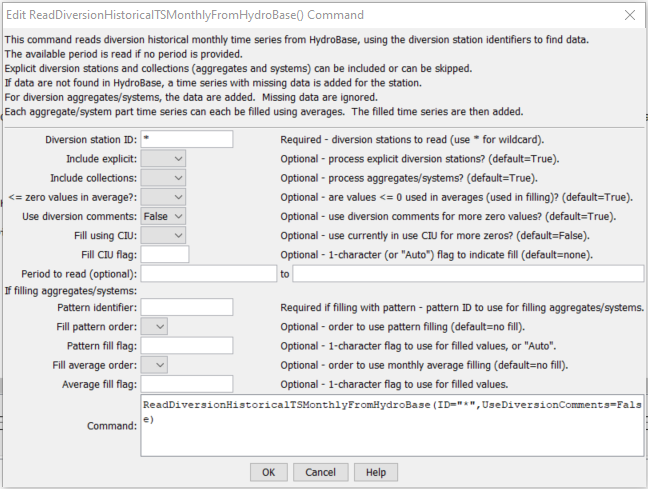
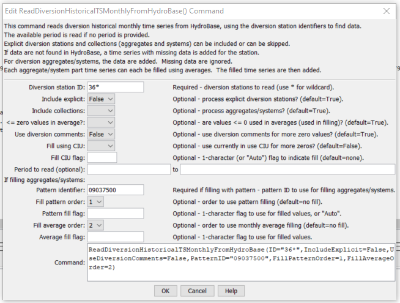

# StateDMI / Command / ReadDiversionHistoricalTSMonthlyFromHydroBase #

* [Overview](#overview)
* [Command Editor](#command-editor)
* [Command Syntax](#command-syntax)
* [Examples](#examples)
* [Troubleshooting](#troubleshooting)
* [See Also](#see-also)

-------------------------

## Overview ##

The `ReadDiversionHistoricalTSMonthlyFromHydroBase` command (for StateMod)
reads diversion historical time series (monthly) from HydroBase,
for each diversion station identifier that is specified.
Diversion comments and structure “currently in use” (CIU) can be checked for
each time series in order to set zero values that are not indicated in monthly data.
The period from the
[`SetOutputPeriod`](../SetOutputPeriod/SetOutputPeriod.md) command is used to request data from HydroBase.
After reading, the time series can be manipulated and output with other commands.

If the diversion station is an aggregate/system, the time series from HydroBase will be added together.
If filling is not done at read time, then later commands can be used to fill data, operating on the sum.
In most cases, it is more technically correct to fill the aggregate/system part time series before adding them together.
The summed time series can then also be filled with other commands after the initial read,
to account for still missing data (e.g., fill with a constant value of zero).
Attempts are made to fill the complete output period.

**Features are not currently enabled to fill the time series for explicit structures
during the read – use other fill commands after the read.**
Explicit structures and collections are typically processed with separate commands.
The `IncludeExplicit` and `IncludeCollections` parameters can
be used to indicate which diversion stations should be processed.
For example, if pattern filling is done while reading data for aggregate/systems,
separate read commands will be needed to specify the pattern identifier for each fill.
A single read command can then be used to read the time series for explicit structures.

### Diversion Comment “Not Used” Flag ###

HydroBase contains diversion comment data with a `not_used` field.
If the `not_used` value matches one of the values shown in the following table for an
irrigation year (November of the previous year to October of the irrigation year),
the diversion (or reservoir release) data for the specified irrigation year can be
interpreted as zero (see the State of Colorado’s Water Commissioner Manual for more information):

**<p style="text-align: center;">
Diversion Comment not_used Flag Resulting in Additional Zero Values
</p>**

| **`not_used`** | **Meaning (reason why diversion is zero)**
| -- | -- |
| `A` | Structure is not usable |
| `B` | No water is available |
| `C` | Water available, but not taken |
| `D` | Water taken in another structure |

### Structure “Currently in Use” Flag ###

The HydroBase structure data contains a “currently in use” (`CIU`) field.
Unlike diversion comments, this is a single value that is consistent with
the current status of a structure (it is not a time series).  The following `CIU` values are used.

**<p style="text-align: center;">
Structure CIU Flag Values and Meaning
</p>**

| **`CIU`** | **Meaning** |
| -- | -- |
| `A`| Active structure with contemporary diversion records |
| `B`| Structure abandoned by the court |
| `C`| Conditional structure |
| `D`| Duplicate; ID no longer used |
| `F`| Structure used as FROM number; located in another water district |
| `H`| Historical structure only-no longer exists or has records, but has historical data |
| `I`| Inactive structure which physically exists but no diversion records are kept |
| `N`| Non-existent structure with no contemporary or historical records |
| `U`| Active structure but diversion records are not maintained |

If `UseCIU=True` is specified for this command, the following logic will be used to fill missing time series values:

1. If the HydroBase `CIU` value is `H` or `I` for the structure associated with the time series:
	1. Fill using the diversion comments (see above for interpretation of comments).
	2. The limits of the time series are recomputed based on diversion data and comments,
	and missing data at the end of the period are filled with zeros.
	3. Missing data values at the end of the period will be filled with zeros,
	reflecting the fact that the structure is off-line.
	These values are not included in historical averages because
	they do not occur in the active life of the structure.
	4. Missing data within the data period remain missing,
	and can be filled with other commands such as
	[`FillDiversionHistoricalTSMonthlyAverage`](../FillDiversionHistoricalTSMonthlyAverage/FillDiversionHistoricalTSMonthlyAverage.md).
	5. Missing data prior to the first diversion values or comments remain missing,
	and can be filled with other commands as appropriate, perhaps specific to each location.
2. If in HydroBase `CIU=N`:
	1. Fill using the diversion comments (see above for interpretation of comments).
	2. The limits of the time series are recomputed based on diversion data and comments,
	and missing data at the beginning of the period are filled with zeros.
	3. The remaining missing data in the active data period or at the end
	of the period remain missing and can be filled with using other parameters or commands.

The specific logic for the command is as follows:

Loop through the diversion stations that have been read with previous commands.

1. If the diversion station identifier does not match the given ID pattern,
do not complete the following steps.
2. If explicit stations are being processed and the station is not an explicit station,
do not complete the following steps.
3. If collection stations (aggregates and systems) are being processed and the
station is not a collection, do not complete the following steps.
4. Process the time series for the station:
If a collection (aggregate or system), perform the following by looping
through each part (this guarantees that a time series will result, possibly only with missing data):
	1. If a part identifier is not a WDID, generate an error
	(only WDIDs should be specified as parts).
	This type of error should not be ignored and should be corrected.
	2. Read the monthly diversion records for the part.
	If an error occurs (no data), create an empty time series for the part with all missing data.
	Important – parts must be read from HydroBase.
	There is no way to substitute another time series for a part.
	3. If requested (UseDiversionComments=True),
	read the diversion comments and fill missing values with additional
	zeros for irrigation years where diversion comments are available.
	4. If requested (FillUsingCIU=True) also fill with CIU as per the logic described above.
	5. If the first part of an aggregate is being processed,
	initialize the total time series to the first part.
	Also initialize the backup copy that contains only observations.
	6. If the second or greater part, add the observations to the backup copy total time series.
	7. If filling has been requested using pattern and/or average,
	fill the part’s time series.
	8. Add the part’s time series to the total.
	This represents the total of filled data, whereas the backup copy contains only the observed values.
	9. If all parts have been processed,
	calculate the monthly average limits of the backup copy (observations only),
	which can be used in later fill commands.
	**This may be a problem with CIU since some zeros should not be in the average.**
<br><br>If an explicit station, perform the following:
	1. If the station ID is not a WDID, generate a warning.
	Otherwise, read the time series diversion records from HydroBase.
	2. If the station ID is a WDID and diversion comments were requested (`UseDiversionComments=True`),
	read the diversion comments from HydroBase and fill additional values with
	zeros for irrigation years where diversion comments are available.
	3. If requested (`FillUsingCIU=True`) also fill with `CIU` as per the logic described above.
	4. If no time series was read, create an empty time series.
	5. Calculate the monthly average limits of the time series,
	which can be used in later fill commands.  **Need to evaluate `CIU` impact.**
5. Add the time series to the list of time series being maintained for output.
6. Add a copy of the time series to the backup, to be used to set observed values
when processing the
[`LimitDiversionHistoricalTSMonthlyToRights`](../LimitDiversionHistoricalTSMonthlyToRights/LimitDiversionHistoricalTSMonthlyToRights.md) command.
Since explicit stations’ time series are not filled, copy the time series as is.
For aggregate time series, use the backup copy of the time series.

The following command combinations will provide the same results:

* Process all diversion stations with one command (`ID=”*”`) with no filling.
* Process explicit diversion stations with one command (`ID=”*”,IncludeCollections=False`) and
collections with one or more commands (`ID=”X*”,IncludeExplicit=False`), with no filling.

If historical patterns are not used for filling, then a smaller number of commands can be used.

Note that a time series is automatically added only if the station ID is initially matched by the ID pattern.
A station that does not match any of the ID patterns in read commands will not automatically have a time series added.

If multiple read commands are used, it may be necessary to use a
[`SortDiversionHistoricalTSMonthly`](../SortDiversionHistoricalTSMonthly/SortDiversionHistoricalTSMonthly.md)
command to sort time series to match the diversion stations.

## Command Editor ##

The following dialog is used to edit the command and illustrates the command syntax when processing explicit structures (no aggregates or collections):

**<p style="text-align: center;">

</p>**

**<p style="text-align: center;">
`ReadDiversionHistoricalTSMonthlyFromHydroBase` Command Editor for Explicit Diversions (<a href="../ReadDiversionHistoricalTSMonthlyFromHydroBase_Explicit.png">see also the full-size image</a>)
</p>**

The following dialog is used to edit the command and illustrates the syntax of the command, when processing collections (aggregates or collections):

**<p style="text-align: center;">

</p>**

**<p style="text-align: center;">
`ReadDiversionHistoricalTSMonthlyFromHydroBase` Command Editor for Aggregates/Systems (<a href="../ReadDiversionHistoricalTSMonthlyFromHydroBase_Collection.png">see also the full-size image</a>)
</p>**

## Command Syntax ##

The command syntax is as follows:

```text
ReadDiversionHistoricalTSMonthlyFromHydroBase(Parameter="Value",...)
```
**<p style="text-align: center;">
Command Parameters
</p>**

| **Parameter**&nbsp;&nbsp;&nbsp;&nbsp;&nbsp;&nbsp;&nbsp;&nbsp;&nbsp;&nbsp;&nbsp;&nbsp;&nbsp;&nbsp;&nbsp;&nbsp;&nbsp;&nbsp;&nbsp;&nbsp;&nbsp;&nbsp;&nbsp;&nbsp;&nbsp;&nbsp; | **Description** | **Default**&nbsp;&nbsp;&nbsp;&nbsp;&nbsp;&nbsp;&nbsp;&nbsp;&nbsp;&nbsp;&nbsp;&nbsp;&nbsp;&nbsp;&nbsp;&nbsp;&nbsp;&nbsp; |
| --------------|-----------------|----------------- |
| `ID` | A single diversion station identifier to match or a pattern using wildcards (e.g., `20*`). | None – must be specified. |
| `IncludeExplicit` | Indicates whether explicit diversion stations (those that are not aggregates or systems) should be included in processing. | True |
| `IncludeCollections` | Indicates whether diversion stations that are collections (aggregates and systems) should be included in processing. | True |
| `LEZeroInAverage` | Indicate whether values ≤ 0 should be considered when computing historical averages. | True |
| `UseDiversionComments` | Indicate whether diversion comments should be checked when reading time series data.  Diversion comments may indicate additional zero values. | True |
| `FillUsingCIU` | Indicates whether the “currently in use” (CIU) information is used to fill missing data.  This will result in additional zeros at the beginning or end of the time series, depending on CIU value.   See the description of the logic above. | `False` (CIU information is not  used to fill missing data). |
| `FillUsingCIUFlag` | For each missing data value that is filled using the CIU information, tag the filled value as follows:<ul><li>`FillUsingCIUFlag` is specified as a single character, tag filled values with the specified character.</li><li>`If FillUsingCIUFlag=Auto` is specified, the `CIU` value (`H`, `I`, or `N`) from HydroBase is used for the flag.</li></ul><br>The flag can then be used later to label graphs, etc.  The flag will be appended to existing flags if necessary. | No flag is assigned. |
| `ReadStart` | A date, to monthly precision, indicating the start of the read. | Read all available data. |
| `ReadEnd` | A date, to monthly precision, indicating the end of the read. | Read all available data. |
| `PatternID` | The pattern identifier for data read with the [`ReadPatternFile`](../ReadPatternFile/ReadPatternFile.md) command. | None – filling with monthly average pattern is not done. |
| `FillPatternOrder` | If filling aggregates and systems during the read, specify the order that monthly average pattern filling should occur. | None – filling with monthly average pattern is not done. |
| `PatternFillFlag` | If specified as a single character, data flags will be enabled for the time series and each value filled using a pattern will be tagged with the specified character.  The flag can then be used later to label graphs, etc.  The flag will be appended to existing flags if necessary. | No flag is assigned. |
| `FillAverageOrder` | If filling aggregates and systems during the read, specify the order that monthly average filling should occur. | None – filling with monthly average is not done. |
| `AverageFillFlag` | If specified as a single character, data flags will be enabled for the time series and each value filled using the historical average will be tagged with the specified character.  The flag can then be used later to label graphs, etc.  The flag will be appended to existing flags if necessary. | No flag is assigned. |

## Examples ##

See the [automated tests](https://github.com/OpenCDSS/cdss-app-statedmi-test/tree/master/test/regression/commands/ReadDiversionHistoricalTSMonthlyFromHydroBase).

The following abbreviated command file illustrates how the StateMod diversion historical time series file can be produced.
Note that an initial diversion stations file is read and is then updated based on time series information.

```
StartLog(LogFile="ddh.commands.StateDMI.log")
# ddh.commands.StateDMI
#
#  StateDMI command file to create the historical diversion file
#           and the "step 2" direct diversion structure file, updated so structure
#           capacity = maximum historical diversion
#
#  Step 1 - set time-series period and year type
#
SetOutputPeriod(OutputStart="10/1908",OutputEnd="09/2005")
SetOutputYearType(OutputYearType=Water)
#
#  Step 2 - read structure list from preliminary direct diversion structure file
#
ReadDiversionStationsFromStateMod(InputFile="cm2005_dds.dds")
#
#  Step 3 - read aggregate and diversion system structure assignments.  Note that
#        want to combine historical diversions for aggs and diversion systems, but
#        historical diversions are separate for primary and secondary components
#        of multistructures
#
SetDiversionAggregateFromList(ListFile="cm_agg.csv",IDCol=1,NameCol=2,PartIDsCol=3,PartsListedHow=InRow)
SetDiversionSystemFromList(ListFile="cm_divsys.csv",IDCol=1,NameCol=2,PartIDsCol=3,PartsListedHow=InRow)
#
#  Step 4 - read historical diversions from HydroBase. Note that want individual structures
#           in aggregates and diversion systems to be filled first, then diversions combined.
#
ReadDiversionHistoricalTSMonthlyFromHydroBase(ID="*",IncludeCollections=False,UseDiversionComments=True)
#
#  Step 5 - read fill pattern file, and assign patterns to water districts
#
ReadPatternFile(InputFile="fill2005.pat")
ReadDiversionHistoricalTSMonthlyFromHydroBase(ID="36*",IncludeExplicit=False,UseDiversionComments=True,PatternID="09037500",FillPatternOrder=1,FillAverageOrder=2)
#
#  Step 6 - assign transbasin diversions from streamflow gages
#
SetDiversionHistoricalTSMonthly(ID="364626",TSID="09047300.DWR.Streamflow.Month~HydroBase")
...similar commands omitted...
# note that adams tunnel streamgage ID changed in 10/1996 from 09013000 to ADANETCO
SetDiversionHistoricalTSMonthly(ID="514634",TSID="514634...MONTH~StateMod~514634.stm")
#     Con-Hoosier System - Blue River Diversion, driven by operating rules to con-hoosier summary demand
SetDiversionHistoricalTSMonthly(ID="364683",TSID="364683...MONTH~StateMod~zero.stm")
SetDiversionHistoricalTSMonthly(ID="364699",TSID="364699...MONTH~StateMod~zero.stm")
#     Fryingpan-Arkansas Project
SetDiversionHistoricalTSMonthly(ID="381594",TSID="381594...MONTH~StateMod~381594.stm")
SetDiversionHistoricalTSMonthly(ID="384625",TSID="384625...MONTH~StateMod~384625.stm")
SetDiversionHistoricalTSMonthly(ID="954699",TSID="954699...MONTH~StateMod~zero.stm")
...similar commands omitted...
#
#  Step 7 - set diversions from external time-series files
#
# The following commands are added to access Task 11.2 replacement files
SetDiversionHistoricalTSMonthly(ID="380757",TSID="380757...MONTH~StateMod~380757.stm")
...similar commands omitted...
#
# The following structures are set for Municipal and Industrial Diversions
SetDiversionHistoricalTSMonthly(ID="360784",TSID="360784...MONTH~StateMod~360784.stm")
...similar commands omitted...
#
# Set transbasin diversions to "0" prior to construction
#
#      Wurtz Ditch
SetDiversionHistoricalTSMonthlyConstant(ID="374648",Constant=0,SetEnd="01/1929")
...similar commands omitted...
#
#  Step 8 - fill historical diversion using pattern approach
#
FillDiversionHistoricalTSMonthlyPattern(ID="36*",PatternID="09034500")
...similar commands omitted...
#
#   Step 9 - Fill remaining missing with month average
#
FillDiversionHistoricalTSMonthlyAverage(ID="*")
#
#   Step 10 - Limit filled diversion to water rights. Exceptions include structure
#             receiving significant reservoir supply, carrier structures, etc.
#
LimitDiversionHistoricalTSMonthlyToRights(InputFile="..\statemod\cm2005.ddr",ID="*",IgnoreID="954683,952001,950010,950011")
#
#   Step 11 - sort structures and create historical diversion file
#
SortDiversionHistoricalTSMonthly(Order=Ascending)
WriteDiversionHistoricalTSMonthlyToStateMod(OutputFile="..\StateMod\cm2005.ddh")
#
#  Step 12 - update capacities and create final direct diversion station file
#
SetDiversionStationCapacitiesFromTS(ID="*")
WriteDiversionStationsToStateMod(OutputFile="..\statemod\cm2005.dds")
#
# Check the results.
CheckDiversionHistoricalTSMonthly(ID="*")
WriteCheckFile(OutputFile="ddh.commands.StateDMI.check.html")
```

## Troubleshooting ##

[See the main troubleshooting documentation](../../troubleshooting/troubleshooting.md)

## See Also ##

* [`FillDiversionHistoricalTSMonthlyAverage`](../FillDiversionHistoricalTSMonthlyAverage/FillDiversionHistoricalTSMonthlyAverage.md) command
* [`LimitDiversionHistoricalTSMonthlyToRights`](../LimitDiversionHistoricalTSMonthlyToRights/LimitDiversionHistoricalTSMonthlyToRights.md) command
* [`ReadPatternFile`](../ReadPatternFile/ReadPatternFile.md) command
* [`ReadDiversionHistoricalTSMonthlyFromStateMod`](../ReadDiversionHistoricalTSMonthlyFromStateMod/ReadDiversionHistoricalTSMonthlyFromStateMod.md) command
* [`SetOutputPeriod`](../SetOutputPeriod/SetOutputPeriod.md) command
* [`SortDiversionHistoricalTSMonthly`](../SortDiversionHistoricalTSMonthly/SortDiversionHistoricalTSMonthly.md) command
* [`WriteDiversionHistoricalTSMonthlyToStateMod`](../WriteDiversionHistoricalTSMonthlyToStateMod/WriteDiversionHistoricalTSMonthlyToStateMod.md) command
