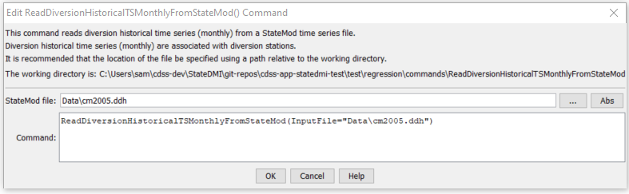

# StateDMI / Command / ReadDiversionHistoricalTSMonthlyFromStateMod #

* [Overview](#overview)
* [Command Editor](#command-editor)
* [Command Syntax](#command-syntax)
* [Examples](#examples)
* [Troubleshooting](#troubleshooting)
* [See Also](#see-also)

-------------------------

## Overview ##

The `ReadDiversionHistoricalTSMonthlyFromStateMod` command (for StateMod)
reads diversion historical time series (monthly).
This command is used when estimating average efficiencies and calculating demand time series.
All time series are read, whether or not they match the list of diversion stations.
Copies of the time series are NOT made for use as original data with the `Limit*ToRights` commands.

## Command Editor ##

The following dialog is used to edit the command and illustrates the command syntax.

**<p style="text-align: center;">

</p>**

**<p style="text-align: center;">
`ReadDiversionHistoricalTSMonthlyFromStateMod` Command Editor (<a href="../ReadDiversionHistoricalTSMonthlyFromStateMod.png">see also the full-size image</a>)
</p>**

## Command Syntax ##

The command syntax is as follows:

```text
ReadDiversionHistoricalTSMonthlyFromStateMod(Parameter="Value",...)
```
**<p style="text-align: center;">
Command Parameters
</p>**

| **Parameter**&nbsp;&nbsp;&nbsp;&nbsp;&nbsp;&nbsp;&nbsp;&nbsp;&nbsp;&nbsp;&nbsp;&nbsp; | **Description** | **Default**&nbsp;&nbsp;&nbsp;&nbsp;&nbsp;&nbsp;&nbsp;&nbsp;&nbsp;&nbsp; |
| --------------|-----------------|----------------- |
| `InputFile`<br>**required** | The name of the StateMod diversion historical time series (monthly) file to read. | None – must be specified. |

## Examples ##

See the [automated tests](https://github.com/OpenCDSS/cdss-app-statedmi-test/tree/master/test/regression/commands/ReadDiversionHistoricalTSMonthlyFromStateMod).

## Troubleshooting ##

## See Also ##

* [`ReadDiversionHistoricalTSMonthlyFromHydroBase`](../ReadDiversionHistoricalTSMonthlyFromHydroBase/ReadDiversionHistoricalTSMonthlyFromHydroBase.md) command
* [`WriteDiversionHistoricalTSMonthlyToStateMod`](../WriteDiversionHistoricalTSMonthlyToStateMod/WriteDiversionHistoricalTSMonthlyToStateMod.md) command
