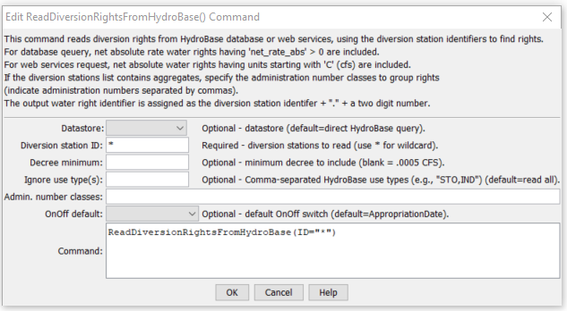

# StateDMI / Command / ReadDiversionRightsFromHydroBase #

* [Overview](#overview)
* [Command Editor](#command-editor)
* [Command Syntax](#command-syntax)
* [Examples](#examples)
* [Troubleshooting](#troubleshooting)
* [See Also](#see-also)

-------------------------

## Overview ##

The `ReadDiversionRightsFromHydroBase` command reads diversion net amount water rights from HydroBase,
for each diversion station that is defined.
The diversion rights can then be manipulated and output with other commands.
Within a diversion station, rights are sorted by administration number and order number.
In some cases, multiple rights for the diversion station may be listed, each with the same administration number.
This is because the order number is different; however, the order number is not listed in the StateMod output.
In such cases, the individual rights are retained to allow comparison with HydroBase.

If aggregating rights, the following steps occur (diversion systems use steps 1-2 and are then explicitly added):

1. Water rights for each part of the aggregate are read from HydroBase, reporting errors as necessary.
2. The rights are added to a list and are sorted by administration number.
This ensures that the cumulative list of rights is listed in order of administration number
(in particular, this step is important for diversion systems).
3. Water rights are defined for each class (see the `AdminNumClasses` parameter description below),
initializing the decree to zero.
4. For each class, the following sums are calculated:  `sum(decree*AdminNum)` and `sum(decree)`,
where the administration number is determined from the appropriation date derived from the original
HydroBase administration number (it will not have a remainder).
5. The final administration number for the class is determined (it will not have a
remainder):  `int(sum(decree*AdminNum)/sum(decree))`

Water rights that are less than the decree minimum are ignored.

## Command Editor ##

The following dialog is used to edit the command and illustrates the command syntax.

**<p style="text-align: center;">

</p>**

**<p style="text-align: center;">
`ReadDiversionRightsFromHydroBase` Command Editor (<a href="../ReadDiversionRightsFromHydroBase.png">see also the full-size image</a>)
</p>**

## Command Syntax ##

The command syntax is as follows:

```text
ReadDiversionRightsFromHydroBase(Parameter="Value",...)
```
**<p style="text-align: center;">
Command Parameters
</p>**

| **Parameter**&nbsp;&nbsp;&nbsp;&nbsp;&nbsp;&nbsp;&nbsp;&nbsp;&nbsp;&nbsp;&nbsp;&nbsp;&nbsp;&nbsp; | **Description** | **Default**&nbsp;&nbsp;&nbsp;&nbsp;&nbsp;&nbsp;&nbsp;&nbsp;&nbsp;&nbsp; |
| --------------|-----------------|----------------- |
| `DataStore` | A HydroBase database or HydroBase web services datastore, which is the source of the data. | Data will be read from the start-up HydroBase database. |
| `ID` | A single diversion station identifier to match or a pattern using wildcards (e.g., `20*`). | None – must be specified. |
| `DecreeMin` | The minimum decree to accept as a valid right. | `0.0` – read all rights. |
| `IgnoreUseType` | A comma-separated list of HydroBase water right use types to ignore (e.g., `STO,IND`), needed to prevent double counting of some rights. | Include all right types. |
| `AdminNumClasses` | A list of administration numbers, separated by spaces or commas, to define the breaks for aggregate water rights, for diversion aggregates.  For example, if the class breaks are `10000.00000`, `20000.00000`, and `99999.99999`, the first group will contain water rights with administration numbers <= `10000.00000`, the second will contain water rights with administration number > `10000.00000` and <= `20000.00000`, and the third will contain water rights with administration number > `20000.00000` and <= `99999.99999`. | If not specified, diversion aggregates will be treated as diversion systems, with all water rights explicitly included in output. |
| `OnOffDefault` | Indicates how to set the on/off switch for all water rights that are processed.  A value of `1` indicates that the right is on for the whole period.  If the value is `AppropriationDate`, the switch is set to the year corresponding to the appropriation date, indicating that the right will be turned on starting in the year.  Use set commands to reset the switch to other values. | `AppropriationDate` |

## Examples ##

See the [automated tests](https://github.com/OpenCDSS/cdss-app-statedmi-test/tree/master/test/regression/commands/ReadDiversionRightsFromHydroBase).

## Troubleshooting ##

## See Also ##

* [`SetDiversionAggregate`](../SetDiversionAggregate/SetDiversionAggregate.md) command
* [`SetDiversionAggregateFromList`](../SetDiversionAggregateFromList/SetDiversionAggregateFromList.md) command
* [`SetDiversionSystem`](../SetDiversionSystem/SetDiversionSystem.md) command
* [`SetDiversionSystemFromList`](../SetDiversionSystemFromList/SetDiversionSystemFromList.md) command
