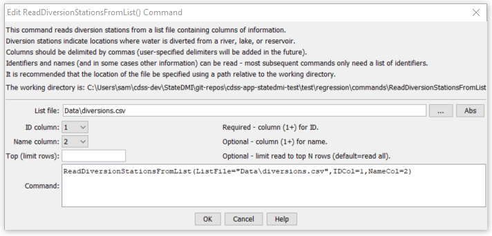

# StateDMI / Command / ReadDiversionStationsFromList #

* [Overview](#overview)
* [Command Editor](#command-editor)
* [Command Syntax](#command-syntax)
* [Examples](#examples)
* [Troubleshooting](#troubleshooting)
* [See Also](#see-also)

-------------------------

## Overview ##

The `ReadDiversionStationsFromList` command (for StateCU and StateMod)
reads a list of diversion stations from a delimited list file and defines diversion stations in memory.
The diversion stations can then be manipulated and output with other commands.

## Command Editor ##

The following dialog is used to edit the command and illustrates the command syntax.

**<p style="text-align: center;">

</p>**

**<p style="text-align: center;">
`ReadDiversionStationsFromList` Command Editor (<a href="../ReadDiversionStationsFromList.png">see also the full-size image</a>)
</p>**

## Command Syntax ##

The command syntax is as follows:

```text
ReadDiversionStationsFromList(Parameter="Value",...)
```
**<p style="text-align: center;">
Command Parameters
</p>**

| **Parameter**&nbsp;&nbsp;&nbsp;&nbsp;&nbsp;&nbsp;&nbsp;&nbsp;&nbsp;&nbsp;&nbsp;&nbsp; | **Description** | **Default**&nbsp;&nbsp;&nbsp;&nbsp;&nbsp;&nbsp;&nbsp;&nbsp;&nbsp;&nbsp; |
| --------------|-----------------|----------------- |
| `ListFile` | The name of the list file to be read. | None – must be specified. |
| `IDCol` | The column number (1+) containing the diversion station identifiers. | None – must be specified. |
| `NameCol` | The column number (1+) containing the diversion station names. | None – optional (name will be initialized to blank). |

## Examples ##

See the [automated tests](https://github.com/OpenCDSS/cdss-app-statedmi-test/tree/master/test/regression/commands/ReadDiversionStationsFromList).

At a minimum, the list file must contain a column with diversion station identifiers.
Lines starting with the # character are treated as comments.
If the first line’s values are surrounded by double quotes, the line is assumed to indicate column headings.

A sample list file is shown below:

```
# Diversions as list file
#
#
"ID","Latitude","County","HUC","Name"
200505,37.5,ALAMOSA,13010002,ALAMOSA D
200511,37.68,RIO GRANDE,13010001,ANACONDA D
200512,37.61,RIO GRANDE,13010002,ANDERSON D
200513,37.68,RIO GRANDE,13010002,ANNA RABER D
...
```

## Troubleshooting ##

[See the main troubleshooting documentation](../../troubleshooting/troubleshooting.md)

## See Also ##

* [`ReadDiversionStationsFromNetwork`](../ReadDiversionStationsFromNetwork/ReadDiversionStationsFromNetwork.md) command
* [`ReadDiversionStationsFromStateMod`](../ReadDiversionStationsFromStateMod/ReadDiversionStationsFromStateMod.md) command
* [`WriteDiversionStationsToStateMod`](../WriteDiversionStationsToStateMod/WriteDiversionStationsToStateMod.md) command
