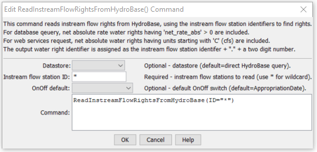

# StateDMI / Command / ReadInstreamFlowRightsFromHydroBase #

* [Overview](#overview)
* [Command Editor](#command-editor)
* [Command Syntax](#command-syntax)
* [Examples](#examples)
* [Troubleshooting](#troubleshooting)
* [See Also](#see-also)

-------------------------

## Overview ##

The `ReadInstreamFlowRightsFromHydroBase` command (for StateMod)
reads instream flow rights from HydroBase, for each instream flow station that is defined.
The instream flow rights can then be manipulated and output with other commands.

## Command Editor ##

The following dialog is used to edit the command and illustrates the command syntax.

**<p style="text-align: center;">

</p>**

**<p style="text-align: center;">
`ReadInstreamFlowRightsFromHydroBase` Command Editor (<a href="../ReadInstreamFlowRightsFromHydroBase.png">see also the full-size image</a>)
</p>**

## Command Syntax ##

The command syntax is as follows:

```text
ReadInstreamFlowRightsFromHydroBase(Parameter="Value",...)
```
**<p style="text-align: center;">
Command Parameters
</p>**

| **Parameter**&nbsp;&nbsp;&nbsp;&nbsp;&nbsp;&nbsp;&nbsp;&nbsp;&nbsp;&nbsp;&nbsp;&nbsp; | **Description** | **Default**&nbsp;&nbsp;&nbsp;&nbsp;&nbsp;&nbsp;&nbsp;&nbsp;&nbsp;&nbsp; |
| --------------|-----------------|----------------- |
| `ID` | A single instream flow station identifier to match or a pattern using wildcards (e.g., `20*`). | None – must be specified. |
| `OnOffDefault` | Indicates how to set the on/off switch for all water rights that are processed.  A value of `1` indicates that the right is on for the whole period.  If the value is AppropriationDate, the switch is set to the year corresponding to the appropriation date, indicating that the right will be turned on starting in the year.  Use set commands to reset the switch to other values. | `Appropriation` |
Date

## Examples ##

See the [automated tests](https://github.com/OpenCDSS/cdss-app-statedmi-test/tree/master/test/regression/commands/ReadInstreamFlowRightsFromHydroBase).

## Troubleshooting ##

## See Also ##

* [`ReadInstreamFlowRightsFromStateMod`](../ReadInstreamFlowRightsFromStateMod/ReadInstreamFlowRightsFromStateMod.md) command
* [`WriteInstreamFlowRightsToStateMod`](../WriteInstreamFlowRightsToStateMod/WriteInstreamFlowRightsToStateMod.md) command
