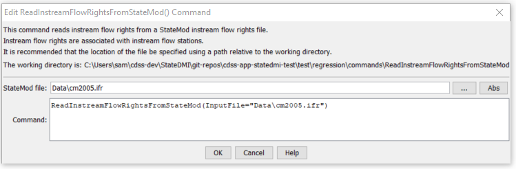

# StateDMI / Command / ReadInstreamFlowRightsFromStateMod #

* [Overview](#overview)
* [Command Editor](#command-editor)
* [Command Syntax](#command-syntax)
* [Examples](#examples)
* [Troubleshooting](#troubleshooting)
* [See Also](#see-also)

-------------------------

## Overview ##

The `ReadInstreamFlowRightsFromStateMod` command (for StateMod)
command reads instream flow rights from a StateMod instream flow rights file.
The instream flow rights can then be manipulated and output with other commands.

## Command Editor ##

The following dialog is used to edit the command and illustrates the command syntax.

**<p style="text-align: center;">

</p>**

**<p style="text-align: center;">
`ReadInstreamFlowRightsFromStateMod` Command Editor (<a href="../ReadInstreamFlowRightsFromStateMod.png">see also the full-size image</a>)
</p>**

## Command Syntax ##

The command syntax is as follows:

```text
ReadInstreamFlowRightsFromStateMod(Parameter="Value",...)
```
**<p style="text-align: center;">
Command Parameters
</p>**

| **Parameter**&nbsp;&nbsp;&nbsp;&nbsp;&nbsp;&nbsp;&nbsp;&nbsp;&nbsp;&nbsp;&nbsp;&nbsp; | **Description** | **Default**&nbsp;&nbsp;&nbsp;&nbsp;&nbsp;&nbsp;&nbsp;&nbsp;&nbsp;&nbsp; |
| --------------|-----------------|----------------- |
| `InputFile`<br>**required** | The name of the StateMod instream flow rights file to be read. | None – must be specified. |

## Examples ##

See the [automated tests](https://github.com/OpenCDSS/cdss-app-statedmi-test/tree/master/test/regression/commands/ReadInstreamFlowRightsFromStateMod).

## Troubleshooting ##

[See the main troubleshooting documentation](../../troubleshooting/troubleshooting.md)

## See Also ##

* [`ReadInstreamFlowRightsFromHydroBase`](../ReadInstreamFlowRightsFromHydroBase/ReadInstreamFlowRightsFromHydroBase.md) command
* [`WriteInstreamFlowRightsToStateMod`](../WriteInstreamFlowRightsToStateMod/WriteInstreamFlowRightsToStateMod.md) command
