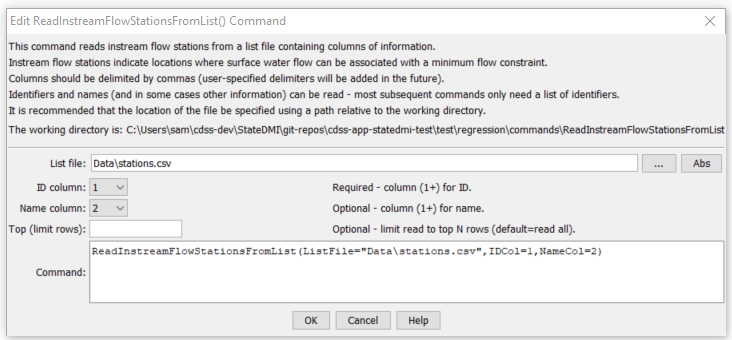

# StateDMI / Command / ReadInstreamFlowStationsFromList #

* [Overview](#overview)
* [Command Editor](#command-editor)
* [Command Syntax](#command-syntax)
* [Examples](#examples)
* [Troubleshooting](#troubleshooting)
* [See Also](#see-also)

-------------------------

## Overview ##

The `ReadInstreamFlowStationsFromList` command (for StateMod)
reads a list of instream flow stations from a delimited list file and defines instream flow stations in memory.
The instream flow stations can then be manipulated and output with other commands.

## Command Editor ##

The following dialog is used to edit the command and illustrates the command syntax.

**<p style="text-align: center;">

</p>**

**<p style="text-align: center;">
`ReadInstreamFlowStationsFromList` Command Editor (<a href="../ReadInstreamFlowStationsFromList.png">see also the full-size image</a>)
</p>**

## Command Syntax ##

The command syntax is as follows:

```text
ReadInstreamFlowStationsFromList(Parameter="Value",...)
```
**<p style="text-align: center;">
Command Parameters
</p>**

| **Parameter**&nbsp;&nbsp;&nbsp;&nbsp;&nbsp;&nbsp;&nbsp;&nbsp;&nbsp;&nbsp;&nbsp;&nbsp; | **Description** | **Default**&nbsp;&nbsp;&nbsp;&nbsp;&nbsp;&nbsp;&nbsp;&nbsp;&nbsp;&nbsp; |
| --------------|-----------------|----------------- |
| `ListFile`<br>**required** | The name of the list file to be read. | None – must be specified. |
| `IDCol`<br>**required** | The column number (1+) containing the stream gage station identifiers. | None – must be specified. |
| `NameCol` | The column number (1+) containing the stream gage station names. | None – optional (name will be initialized to blank). |

## Examples ##

See the [automated tests](https://github.com/OpenCDSS/cdss-app-statedmi-test/tree/master/test/regression/commands/ReadInstreamFlowStationsFromList).

At a minimum, the list file must contain a column with instream flow station identifiers.
Lines starting with the # character are treated as comments.
If the first line’s values are surrounded by double quotes, the line is assumed to indicate column headings.

A sample list file is shown below:

```
# Stream gage stations as a list file
#
"ID”,"Name"
IFS1,”INSTREAM FLOW REACH 1”
IFS2,”INSTREAM FLOW REACH 2”
```

## Troubleshooting ##

[See the main troubleshooting documentation](../../troubleshooting/troubleshooting.md)

## See Also ##

* [`ReadInstreamFlowStationsFromNetwork`](../ReadInstreamFlowStationsFromNetwork/ReadInstreamFlowStationsFromNetwork.md) command
* [`ReadInstreamFlowStationsFromStateMod`](../ReadInstreamFlowStationsFromStateMod/ReadInstreamFlowStationsFromStateMod.md) command
* [`WriteInstreamFlowStationsToStateMod`](../WriteInstreamFlowStationsToStateMod/WriteInstreamFlowStationsToStateMod.md) command
