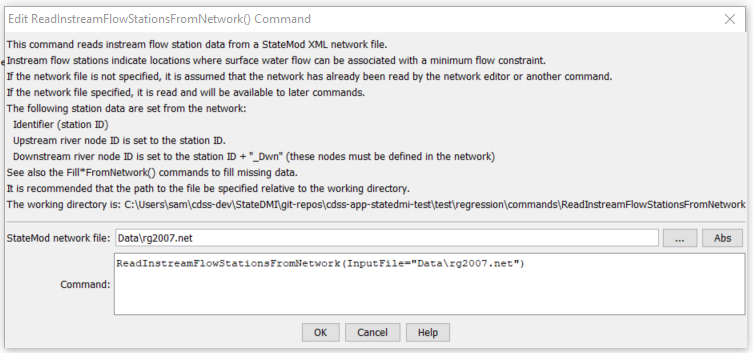

# StateDMI / Command / ReadInstreamFlowStationsFromNetwork #

* [Overview](#overview)
* [Command Editor](#command-editor)
* [Command Syntax](#command-syntax)
* [Examples](#examples)
* [Troubleshooting](#troubleshooting)
* [See Also](#see-also)

-------------------------

## Overview ##

The `ReadInstreamFlowStationsFromNetwork` command for (StateMod)
reads a list of instream flow stations from a StateMod network file (XML or old Makenet)
and defines instream flow stations in memory.
The instream flow stations can then be manipulated and output with other commands.
Instream flow stations are actually modeled as a reach defined by upstream and downstream nodes.
Both nodes must be included in the network but the instream flow station file has a single record for each reach.

## Command Editor ##

The following dialog is used to edit the command and illustrates the command syntax.

**<p style="text-align: center;">

</p>**

**<p style="text-align: center;">
`ReadInstreamFlowStationsFromNetwork` Command Editor (<a href="../ReadInstreamFlowStationsFromNetwork.png">see also the full-size image</a>)
</p>**

## Command Syntax ##

The command syntax is as follows:

```text
ReadInstreamFlowStationsFromNetwork(Parameter="Value",...)
```
**<p style="text-align: center;">
Command Parameters
</p>**

| **Parameter**&nbsp;&nbsp;&nbsp;&nbsp;&nbsp;&nbsp;&nbsp;&nbsp;&nbsp;&nbsp;&nbsp;&nbsp; | **Description** | **Default**&nbsp;&nbsp;&nbsp;&nbsp;&nbsp;&nbsp;&nbsp;&nbsp;&nbsp;&nbsp; |
| --------------|-----------------|----------------- |
| `InputFile`<br>**required** | The name of the network file to be read. | None – must be specified. |

## Examples ##

See the [automated tests](https://github.com/OpenCDSS/cdss-app-statedmi-test/tree/master/test/regression/commands/ReadInstreamFlowStationsFromNetwork).

## Troubleshooting ##

## See Also ##

* [`ReadInstreamFlowStationsFromList`](../ReadInstreamFlowStationsFromList/ReadInstreamFlowStationsFromList.md) command
* [`ReadInstreamFlowStationsFromStateMod`](../ReadInstreamFlowStationsFromStateMod/ReadInstreamFlowStationsFromStateMod.md) command
* [`WriteInstreamFlowStationsToStateMod`](../WriteInstreamFlowStationsToStateMod/WriteInstreamFlowStationsToStateMod.md) command
