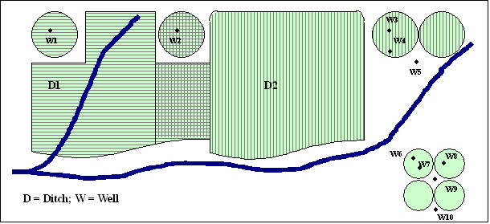

# StateDMI / Command / ReadIrrigationPracticeTSFromHydroBase #

* [Overview](#overview)
* [Command Editor](#command-editor)
* [Command Syntax](#command-syntax)
* [Examples](#examples)
* [Troubleshooting](#troubleshooting)
* [See Also](#see-also)

-------------------------

## Overview ##

The `ReadIrrigationPracticeTSFromHydroBase` command (for StateCU) reads parcel acreage data from HydroBase
and sets the irrigation practice acreage time series (yearly) information for CU locations.
Only years with data in HydroBase are processed.
Values for other years must be estimated using other commands
(see the [`FillIrrigationPracticeTSInterpolate`](../FillIrrigationPracticeTSInterpolate/FillIrrigationPracticeTSInterpolate.md) and
[`FillIrrigationPracticeTSRepeat`](../FillIrrigationPracticeTSRepeat/FillIrrigationPracticeTSRepeat.md) commands).
This command should be executed before other commands that estimate or set irrigation practice acreage time series.

The following figure illustrates possible water supply for parcels.

**<p style="text-align: center;">

</p>**

**<p style="text-align: center;">
Example Supply for Parcels (<a href="../ParcelSupplyDiagram.png">see also the full-size image</a>)
</p>**

In this example, two ditches (`D1` and `D2`,
each represented with different hatching) provide surface water supply to the indicated parcels.
In some cases, only one ditch provides supply.
Between the ditches, both supply water to shared parcels.
Wells can supplement surface water supply (parcels above the river)
or can be the sole supplier of water (lower right) and wells do not need to be
physically located on a parcel to provide supply to the parcel.
For StateCU, well-only lands are identified by CU locations that are defined by:

* a collection (aggregate/system) of parcels - **this approach is being phased is throughout CDSS**
* a collection (aggregate/system) of wells specified by WDIDs or well permit receipts - **this older approach
is currrently only used in the Rio Grande**

For StateMod, well-only lands are well stations that do not have a related diversion station.
In both cases, lands irrigated by surface water are identified with
ditch identifiers and parcels are associated with the ditches in HydroBase.
Typically, well-only lands are grouped and multiple wells provide supply to the collection of parcels.
Processing logic is different for ditch and well-only lands only in how the list of parcels is obtained.

The steps used to process irrigation practice time series are described below.
Note that “CU location” refers to the StateCU model identifier
(which can be a collection of wells) and “well” refers to a hole in the
ground that has physical characteristics, water rights, and/or well permits.
Loop through each CU location that matches the ID pattern and perform the following:
For each year being processed (specified by the Year parameter or by default all available data in HydroBase), perform the following:

1. Initialize all irrigation practice acreage time series to zero.
Consequently, if no data are found in a year,
an “observation” of zero acreage will occur.  Any previous data are reset.
2. Get the list of parcels associated with the location
(note that in a given year there may be zero or more parcels associated with a location):
	1. If the location is a groundwater only location,
	get the list of parcels from the aggregate/system definitions.
	2. If the location is a ditch that is supplemented by groundwater
	(assumed as possible because the StateCU CU Location data does not indicate whether
	a location has groundwater supply and all may – one purpose of the IPY file is to indicate groundwater supply over time):
		1. If the ditch is explicit (no aggregate/system information has been
		provided for the location), get the list of parcels associated with the single ditch.
		2. If the ditch is an aggregate/system, get the list of parcels associated with
		each part of the aggregate/system and form one list of parcels.
3. Read the parcel data using the parcel identifiers.
	1. Query HydroBase to get the parcel data, using the year, division, and parcel identifier.
	2. Acreage not in HydroBase is appended to the parcel list.i
	This acreage is supplied by [`SetIrrigationPracticeTS`](../SetIrrigationPracticeTS/SetIrrigationPracticeTS.md) and
	[`SetIrrigationPracticeTSFromList`](../SetIrrigationPracticeTSFromList/SetIrrigationPracticeTSFromList.md)
	commands with the ProcessWhen=WithParcels parameter.
	These commands must be specified before the
	[`ReadIrrigationPracticeTSFromHydroBase`](../ReadIrrigationPracticeTSFromHydroBase/ReadIrrigationPracticeTSFromHydroBase.md) command.
	For the sake of processing, user-supplied acreage is treated as one parcel for the specified year.
4.	Process the parcels for the location:
	1. If the parcel was associated with a ditch,
	the parcel area is multiplied by the ditch service area percent
	irrigated value (actually a fraction in HydroBase),
	reflecting the fact that only a portion of the parcel area is associated with the location.
	2. The appropriate irrigation practice acreage time series are incremented.
	Total acreage is always incremented.  For IPY acreage purposes,
	SPRINKLER and DRIP irrigation methods are treated as SPRINKLER (high efficiency)
	and all other irrigation methods as FLOOD (low efficiency).
	A parcel is considered to have groundwater supply if there is at least one well
	associated with the parcel for the specific year
	(use supplied data must specify whether the supply is ground or surface water).
	The combination of irrigation method and whether ground/surface supply
	indicates the acreage time series that are incremented.
	If a location does not have groundwater supply,
	it has surface supply only and the surface water acreage values are incremented.
	3. The total groundwater acres are set to the sum of the acres for SPRINKLER and FLOOD.
	The total surface water acres are set to the sum of the acres for SPRINKLER and FLOOD.

## Command Editor ##

The following dialog is used to edit the command and illustrates the command syntax.

**<p style="text-align: center;">

</p>**

**<p style="text-align: center;">
`ReadIrrigationPracticeTSFromHydroBase` Command Editor (<a href="../ReadIrrigationPracticeTSFromHydroBase.png">see also the full-size image</a>)
</p>**

## Command Syntax ##

The command syntax is as follows:

```text
ReadIrrigationPracticeTSFromHydroBase(Parameter="Value",...)
```
**<p style="text-align: center;">
Command Parameters
</p>**

| **Parameter**&nbsp;&nbsp;&nbsp;&nbsp;&nbsp;&nbsp;&nbsp;&nbsp;&nbsp;&nbsp;&nbsp;&nbsp; | **Description** | **Default**&nbsp;&nbsp;&nbsp;&nbsp;&nbsp;&nbsp;&nbsp;&nbsp;&nbsp;&nbsp; |
| --------------|-----------------|----------------- |
| `ID` <br>**required** | A single CU location identifier to match or a pattern using wildcards (e.g., `20*`). | None – must be specified. |
| `Div` <br>**required** | A water division to use for parcel data, needed to determine relationships between diversion stations/parcels/wells and for well aggregate/systems. | None – must be specified. |
| `Year` | A calendar year to use for parcel data, needed to determine relationships between diversion stations/parcels/wells and for well aggregate/systems.  Separate multiple years by commas. | All years in HydroBase will be processed. |

## Examples ##

See the [automated tests](https://github.com/OpenCDSS/cdss-app-statedmi-test/tree/master/test/regression/commands/ReadIrrigationPracticeTSFromHydroBase).

The following command file illustrates how to process the irrigation practice time series file where groundwater supply is not used:

```
# Step 1 - Set output period and read CU locations from structure file
SetOutputPeriod(OutputStart="1950",OutputEnd="2006")
ReadCULocationsFromStateCU(InputFile="..\StateCU\cm2006.str")
# Step 2 - Read SW aggregates
SetDiversionSystemFromList(ListFile="colorado_divsys.csv",IDCol=1,NameCol=2,PartIDsCol=3,
  PartsListedHow=InRow)
SetDiversionAggregateFromList(ListFile="colorado_agg.csv",IDCol=1,NameCol=2,PartIDsCol=3,
  PartsListedHow=InRow)
# Step 3 - Create form for *.ipy file
CreateIrrigationPracticeTSForCULocations(ID="*")
# Step 5 - set max flood and surface water efficiencies and GWmode - NOT in HydroBase
# Set Max SW Eff = 1.0
SetIrrigationPracticeTS(ID="*",SurfaceDelEffMax=1.0,FloodAppEffMax=.60,
  SprinklerAppEffMax=.80,PumpingMax=0,GWMode=2)
SetIrrigationPracticeTSFromList(ListFile="cmstrlist.csv",ID="*",SetStart=1950,
  SetEnd=2006,IDCol="1",SurfaceDelEffMaxCol="7",FloodAppEffMaxCol="8",SprinklerAppEffMaxCol="9")
# Step 6 - Read category acreage from HydroBase
ReadIrrigationPracticeTSFromHydroBase(ID="*",Year="1993,2000",Div="5")
# Step 8 - Read total acreage from *.cds file and Set total for *.ipy file
ReadCropPatternTSFromStateCU(InputFile="..\StateCU\cm2006.cds")
SetIrrigationPracticeTSTotalAcreageToCropPatternTSTotalAcreage(ID="*")
# Step 9 - Fill all land use acreage
# Fill groundwater acreage first
# Fill surface water sprinkler and flood 1950-2006
# Fill ground water sprinkler and flood 1950-2006
# Step 9a - estimate total GW and total SW
FillIrrigationPracticeTSRepeat(ID="*",DataType="CropArea-GroundWater",FillStart="1950",FillEnd="1993",FillDirection="Backward")
FillIrrigationPracticeTSRepeat(ID="*",DataType="CropArea-GroundWater",FillStart="1993",FillEnd="1999",FillDirection="Forward")
FillIrrigationPracticeTSRepeat(ID="*",DataType="CropArea-GroundWater",FillStart="2000",FillEnd="2006",FillDirection="Forward")
# Step 9b - fill remaining irrigation method values
FillIrrigationPracticeTSRepeat(ID="*",DataType="CropArea-SurfaceWaterOnlySprinkler",
  FillStart="1950",FillEnd="1993",FillDirection="Backward")
FillIrrigationPracticeTSRepeat(ID="*",DataType="CropArea-SurfaceWaterOnlySprinkler",FillStart="1993",
  FillEnd="1999",FillDirection="Forward")
FillIrrigationPracticeTSRepeat(ID="*",DataType="CropArea-SurfaceWaterOnlySprinkler",FillStart="2000",
  FillEnd="2006",FillDirection="Forward")
FillIrrigationPracticeTSRepeat(ID="*",DataType="CropArea-GroundWaterSprinkler",FillStart="1950",
  FillEnd="1993",FillDirection="Backward")
FillIrrigationPracticeTSRepeat(ID="*",DataType="CropArea-GroundWaterSprinkler",FillStart="1993",
  FillEnd="1999",FillDirection="Forward")
FillIrrigationPracticeTSRepeat(ID="*",DataType="CropArea-GroundWaterSprinkler",FillStart="2000",
  FillEnd="2006",FillDirection="Forward")
# Step 10 - Write final ipy file
WriteIrrigationPracticeTSToStateCU(OutputFile="..\StateCU\cm2006.ipy")
# Check the results
CheckIrrigationPracticeTS(ID="*")
WriteCheckFile(OutputFile="cm2006.ipy.StateDMI.check.html")
```

The following command file illustrates how to process the irrigation practice time series file where groundwater supply is used:

```
#
# Sp2008L_DDH.StateDMI
# _____________________________________________________________________________
#
# StartLog(LogFile="SP_IPY.log")
SetOutputPeriod(OutputStart="01/1950",OutputEnd="12/2006")
# Step 1 - Read CU Locations from list
#
ReadCULocationsFromList(ListFile="..\Sp2008L_StructList.csv",IDCol=1)
#
# Step 2 - Read SW aggregates, GW aggregates, and divsystems
#
SetDiversionAggregateFromList(ListFile="..\Sp2008L_SWAgg.csv",IDCol=1,
  NameCol=2,PartIDsCol=3,PartsListedHow=InColumn)
SetDiversionSystemFromList(ListFile="..\Sp2008L_DivSys_CDS.csv",IDCol=1,
  NameCol=2,PartIDsCol=3,PartsListedHow=InRow)
#
SetWellSystemFromList(ListFile="..\SP_GWAgg_1956.csv",Year=1956,Div=1,
  PartType=Parcel,IDCol=1,PartIDsCol=2,PartsListedHow=InColumn)
SetWellSystemFromList(ListFile="..\SP_GWAgg_1976.csv",Year=1976,Div=1,
  PartType=Parcel,IDCol=1,PartIDsCol=2,PartsListedHow=InColumn)
SetWellSystemFromList(ListFile="..\SP_GWAgg_1987.csv",Year=1987,Div=1,
  PartType=Parcel,IDCol=1,PartIDsCol=2,PartsListedHow=InColumn)
SetWellSystemFromList(ListFile="..\SP_GWAgg_2001.csv",Year=2001,Div=1,
  PartType=Parcel,IDCol=1,PartIDsCol=2,PartsListedHow=InColumn)
SetWellSystemFromList(ListFile="..\SP_GWAgg_2005.csv",Year=2005,Div=1,
  PartType=Parcel,IDCol=1,PartIDsCol=2,PartsListedHow=InColumn)
#
# Step 3 - Create form for *.ipy file
CreateIrrigationPracticeTSForCULocations(ID="*")
#
# Step 4 - Set conveyance efficiencies from file for key and sw aggregate structures - NOT in HydroBase
SetIrrigationPracticeTSFromList(ListFile="Sp2008L_Eff.csv",ID="*",
  SetStart=1950,SetEnd=2006,IDCol="1",SurfaceDelEffMaxCol="3")
#
# Step 5 - set max flood and surface water efficiencies and GWmode - NOT in HydroBase
SetIrrigationPracticeTS(ID="*",SetStart=1950,SetEnd=2006,FloodAppEffMax=.6,SprinklerAppEffMax=.8,GWMode=2)
#
# Step 6 - Read well rights file and Set Max pumping (use merged *.wer file)
ReadWellRightsFromStateMod(InputFile="..\Wells\Sp2008L.wer")
SetIrrigationPracticeTSPumpingMaxUsingWellRights(ID="*",IncludeSurfaceWaterSupply=True,
  IncludeGroundwaterOnlySupply="True",NumberOfDaysInMonth=30.4)
# Step 7 - Read category acreage from HydroBase
ReadIrrigationPracticeTSFromHydroBase(ID="*",Div="1")
#
# Step 8 - Read total acreage from *.cds file and Set total for *.ipy file
ReadCropPatternTSFromStateCU(InputFile="Sp2008L.cds")
SetIrrigationPracticeTSTotalAcreageToCropPatternTSTotalAcreage(ID="*")
#
# Step 9 - Estimate 1950 ground water acreage based on active wells as defined in the non-merged *.wer file
#
ReadWellRightsFromStateMod(InputFile="..\Wells\Sp2008L_NotMerged.wer",Append=False)
FillIrrigationPracticeTSAcreageUsingWellRights(ID="*",IncludeSurfaceWaterSupply=True,
  IncludeGroundwaterOnlySupply="True",FillStart=1950,FillEnd=1955,ParcelYear=1956)
#
# Step 10 - Fill Interpolate Acreage Type (SW and GW) 1956-2006
# Step 11a - estimate total GW and total SW
FillIrrigationPracticeTSInterpolate(ID="*",DataType="CropArea-GroundWater",FillStart="1956",FillEnd="1976")
FillIrrigationPracticeTSInterpolate(ID="*",DataType="CropArea-GroundWater",FillStart="1976",FillEnd="1987")
FillIrrigationPracticeTSInterpolate(ID="*",DataType="CropArea-GroundWater",FillStart="1987",FillEnd="2001")
FillIrrigationPracticeTSInterpolate(ID="*",DataType="CropArea-GroundWater",FillStart="2001",FillEnd="2005")
FillIrrigationPracticeTSRepeat(ID="*",DataType="CropArea-GroundWater",FillStart="2005",FillEnd="2006",FillDirection="Forward")
#
# Step 11b - set sprinkler to zero in early period
SetIrrigationPracticeTS(ID="*",SetStart=1950,SetEnd=1969,AcresSWSprinkler=0,AcresGWSprinkler=0)
#
# Step 11c - fill remaining irrigation method values
FillIrrigationPracticeTSInterpolate(ID="*",DataType="CropArea-SurfaceWaterOnlySprinkler",FillStart="1969",FillEnd="1976")
FillIrrigationPracticeTSInterpolate(ID="*",DataType="CropArea-SurfaceWaterOnlySprinkler",FillStart="1976",FillEnd="1987")
FillIrrigationPracticeTSInterpolate(ID="*",DataType="CropArea-SurfaceWaterOnlySprinkler",FillStart="1987",FillEnd="2001")
FillIrrigationPracticeTSInterpolate(ID="*",DataType="CropArea-SurfaceWaterOnlySprinkler",FillStart="2001",FillEnd="2005")
FillIrrigationPracticeTSRepeat(ID="*",DataType="CropArea-SurfaceWaterOnlySprinkler",FillStart="2005",FillEnd="2006",FillDirection="Forward")
FillIrrigationPracticeTSInterpolate(ID="*",DataType="CropArea-GroundWaterSprinkler",FillStart="1969",FillEnd="1976")
FillIrrigationPracticeTSInterpolate(ID="*",DataType="CropArea-GroundWaterSprinkler",FillStart="1976",FillEnd="1987")
FillIrrigationPracticeTSInterpolate(ID="*",DataType="CropArea-GroundWaterSprinkler",FillStart="1987",FillEnd="2001")
FillIrrigationPracticeTSInterpolate(ID="*",DataType="CropArea-GroundWaterSprinkler",FillStart="2001",FillEnd="2005")
FillIrrigationPracticeTSRepeat(ID="*",DataType="CropArea-GroundWaterSprinkler",FillStart="2005",FillEnd="2006",FillDirection="Forward")
#
# Step 12 - Set Acreage = 0 for structures that are in diversion systems, so acreage is not double accounted
SetIrrigationPracticeTS(ID="0100503_D",SetStart=1950,SetEnd=2006,AcresSWFlood=0,AcresSWSprinkler=0,
  AcresGWFlood=0,AcresGWSprinkler=0,PumpingMax=0,AcresTotal=0)
SetIrrigationPracticeTS(ID="0100507_D",SetStart=1950,SetEnd=2006,AcresSWFlood=0,AcresSWSprinkler=0,
  AcresGWFlood=0,AcresGWSprinkler=0,PumpingMax=0,AcresTotal=0)
SetIrrigationPracticeTS(ID="0100687",SetStart=1950,SetEnd=2006,AcresSWFlood=0,AcresSWSprinkler=0,
  AcresGWFlood=0,AcresGWSprinkler=0,PumpingMax=0,AcresTotal=0)
#
SetIrrigationPracticeTS(ID="0200834",SetStart=1950,SetEnd=2006,AcresSWFlood=0,AcresSWSprinkler=0,
  AcresGWFlood=0,AcresGWSprinkler=0,PumpingMax=0,AcresTotal=0)
#
SetIrrigationPracticeTS(ID="6400511_D",SetStart=1950,SetEnd=2006,AcresSWFlood=0,AcresSWSprinkler=0,
  AcresGWFlood=0,AcresGWSprinkler=0,PumpingMax=0,AcresTotal=0)
#
# Step 13 - Set Acreage = 0,  1950-2006
SetIrrigationPracticeTS(ID="0100501",SetStart=1950,SetEnd=2006,AcresSWFlood=0,AcresSWSprinkler=0,
  AcresGWFlood=0,AcresGWSprinkler=0,PumpingMax=0,AcresTotal=0)
SetIrrigationPracticeTS(ID="0100513",SetStart=1950,SetEnd=2006,AcresSWFlood=0,AcresSWSprinkler=0,
  AcresGWFlood=0,AcresGWSprinkler=0,PumpingMax=0,AcresTotal=0)
SetIrrigationPracticeTS(ID="0100829",SetStart=1950,SetEnd=2006,AcresSWFlood=0,AcresSWSprinkler=0,
  AcresGWFlood=0,AcresGWSprinkler=0,PumpingMax=0,AcresTotal=0)
#
SetIrrigationPracticeTS(ID="6400519",SetStart=1950,SetEnd=2006,AcresSWFlood=0,AcresSWSprinkler=0,
  AcresGWFlood=0,AcresGWSprinkler=0,PumpingMax=0,AcresTotal=0)
#
# Step 14 - Write final ipy file
#
WriteIrrigationPracticeTSToStateCU(OutputFile="Sp2008L.ipy",WriteHow=OverwriteFile)
WriteIrrigationPracticeTSToStateCU(OutputFile="..\StateCU\Historic\Sp2008L.ipy",WriteHow=OverwriteFile)
WriteIrrigationPracticeTSToStateCU(OutputFile="..\StateMod\Historic\Sp2008L.ipy",WriteHow=OverwriteFile)
```

## Troubleshooting ##

## See Also ##

* [`FillIrrigationPracticeTSInterpolate`](../FillIrrigationPracticeTSInterpolate/FillIrrigationPracticeTSInterpolate.md) command
* [`FillIrrigationPracticeTSRepeat`](../FillIrrigationPracticeTSRepeat/FillIrrigationPracticeTSRepeat.md) command
