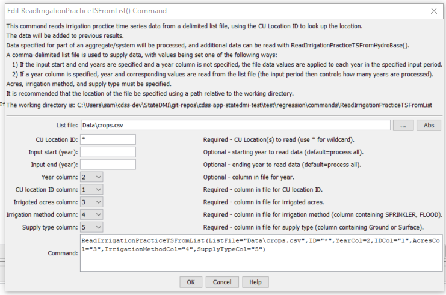

# StateDMI / Command / ReadIrrigationPracticeTSFromList #

* [Overview](#overview)
* [Command Editor](#command-editor)
* [Command Syntax](#command-syntax)
* [Examples](#examples)
* [Troubleshooting](#troubleshooting)
* [See Also](#see-also)

-------------------------

## Overview ##

The `ReadIrrigationPracticeTSFromList` command (for StateCU)
reads irrigation practice time series data for existing CU Locations by reading information from a delimited file.
New locations are not added and the information is added to existing locations.
HydroBase may not contain all irrigated lands data.
For example, additional lands may have been identified after HydroBase was populated or
acreage must be set for a model identifier that is not a
structure WDID in HydroBase (e.g., out of state lands).
In this case, the command can be used to provide additional data to supplement HydroBase.

## Command Editor ##

The following dialog is used to edit the command and illustrates the command syntax.

**<p style="text-align: center;">

</p>**

**<p style="text-align: center;">
`ReadIrrigationPracticeTSFromList` Command Editor (<a href="../ReadIrrigationPracticeTSFromList.png">see also the full-size image</a>)
</p>**

## Command Syntax ##

The command syntax is as follows:

```text
ReadIrrigationPracticeTSFromList(Parameter="Value",...)
```
**<p style="text-align: center;">
Command Parameters
</p>**

| **Parameter**&nbsp;&nbsp;&nbsp;&nbsp;&nbsp;&nbsp;&nbsp;&nbsp;&nbsp;&nbsp;&nbsp;&nbsp; | **Description** | **Default**&nbsp;&nbsp;&nbsp;&nbsp;&nbsp;&nbsp;&nbsp;&nbsp;&nbsp;&nbsp; |
| --------------|-----------------|----------------- |
| `ListFile` | Path to the delimited list file to read. | None – must be specified. |
| `ID` | A single CU location identifier to match or a pattern using wildcards (e.g., `20*`). | None – must be specified. |
| `InputStart` | The first year to read from the file. | If not specified, all years are read from the file. |
| `InputEnd` | The last year to read from the file. | If not specified, all years are read from the file. |
| `YearCol` | The column number (1+) containing the year for data. | The file values are applied to each year in the data set. |
| `IDCol` | The column number (1+) containing the CU Location identifiers.  These values are matched against CU Location identifiers in the existing irrigation practice data. | None – must be specified. |
| `AcresCol` | The column number (1+) containing the crop area. | If not specified, the previous data values will remain. |
| `IrrigationMethodCol` | The column number (1+) containing the irrigation method, consistent with HydroBase (e.g., `SPRINKLER`, `FLOOD`). | If not specified, the previous data values will remain. |
| `SupplyTypeCol` | The column number (1+) containing the supply type (Surface or Ground). | If not specified, the previous data values will remain. |

## Examples ##

See the [automated tests](https://github.com/OpenCDSS/cdss-app-statedmi-test/tree/master/test/regression/commands/ReadIrrigationPracticeTSFromList).

Data file lines starting with the `#` character are treated as comments.
If the first line’s values are surrounded by double quotes, the line is assumed to indicate column headings.
An example list file for specifying acreage data (not in HydroBase) is shown below.
Currently, supplemental acreage data can have only a single irrigation method and supply type,
to support irrigation practice time series processing.
Therefore, break supplemental acreage into multiple “parcels” if necessary.

```
# The following data provide acreage for structures that did not have GIS data
# and consequently no data in HydroBase.  The data are specific to 1998 and are
# used to set the CDS and IPY acres.  The crop is used to provide CDS data.  The
# irrigation method and source are used to provide IPY data.
"ID","Crop","Acres","IrrigationMethod","SupplySource"
200500,1998,GRASS_PASTURE,0,Flood,Surface
200506,1998,GRASS_PASTURE,100,Flood,Surface
200507,1998,GRASS_PASTURE,50,Flood,Surface
200508,1998,GRASS_PASTURE,40,Flood,Surface
200522,1998,GRASS_PASTURE,40,Flood,Surface
200523,1998,GRASS_PASTURE,50,Flood,Surface
200526,1998,GRASS_PASTURE,40,Flood,Surface
200529,1998,GRASS_PASTURE,5,Flood,Surface
...etc...
```

## Troubleshooting ##

## See Also ##

* [`ReadIrrigationPracticeTSFromHydroBase`](../ReadIrrigationPracticeTSFromHydroBase/ReadIrrigationPracticeTSFromHydroBase.md) command
* [`ReadIrrigationPracticeTSFromStateCU`](../ReadIrrigationPracticeTSFromStateCU/ReadIrrigationPracticeTSFromStateCU.md) command
* [`WriteIrrigationPracticeTSToStateCU`](../WriteIrrigationPracticeTSToStateCU/WriteIrrigationPracticeTSToStateCU.md) command
