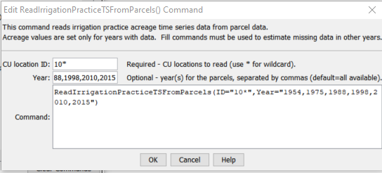

# StateDMI / Command / ReadIrrigationPracticeTSFromParcels #

* [Overview](#overview)
	+ [Processing Logic](#processing-logic)
* [Command Editor](#command-editor)
* [Command Syntax](#command-syntax)
* [Examples](#examples)
* [Troubleshooting](#troubleshooting)
* [See Also](#see-also)

-------------------------

## Overview ##

**Need to complete this documentation.**

**This command is being phased in as of StateDMI 5.x and replaces the
[`ReadIrrigationPracticeTSFromHydroBase`](../ReadIrrigationPracticeTSFromHydroBase/ReadIrrigationPracticeTSFromHydroBase.md) command.**

## Processing Logic ##

## Command Editor ##

The following dialog is used to edit the command and illustrates the command syntax.

**<p style="text-align: center;">

</p>**

**<p style="text-align: center;">
`ReadIrrigationPracticeTSFromParcels` Command Editor (<a href="../ReadIrrigationPracticeTSFromParcels.png">see also the full-size image</a>)
</p>**

## Command Syntax ##

The command syntax is as follows:

```text
ReadIrrigationPracticeTSFromParcels(Parameter="Value",...)
```
**<p style="text-align: center;">
Command Parameters
</p>**

| **Parameter**&nbsp;&nbsp;&nbsp;&nbsp;&nbsp;&nbsp;&nbsp;&nbsp;&nbsp;&nbsp;&nbsp;&nbsp; | **Description** | **Default**&nbsp;&nbsp;&nbsp;&nbsp;&nbsp;&nbsp;&nbsp;&nbsp;&nbsp;&nbsp; |
| --------------|-----------------|----------------- |
| `ID` <br>**required** | A single CU Location identifier to match or a pattern using wildcards (e.g., `20*`). | None – must be specified. |
| `InputStart` | Starting year to read data. | All available data will be read. |
| `InputEnd` | Ending year to read data. | All available data will be read. |

## Examples ##

See the [automated tests](https://github.com/OpenCDSS/cdss-app-statedmi-test/tree/master/test/regression/commands/ReadIrrigationPracticeTSFromParcels).

The following command file illustrates how to create an irrigation practice time series file:

```
```

## Troubleshooting ##

## See Also ##

* [`FillIrrigationPracticeTSInterpolate`](../FillIrrigationPracticeTSInterpolate/FillIrrigationPracticeTSInterpolate.md) command
* [`FillIrrigationPracticeTSRepeat`](../FillIrrigationPracticeTSRepeat/FillIrrigationPracticeTSRepeat.md) command
* [`ReadIrrigationPracticeTSFromList`](../ReadIrrigationPracticeTSFromList/ReadIrrigationPracticeTSFromList.md) command
* [`ReadIrrigationPracticeTSFromHydroBase`](../ReadIrrigationPracticeTSFromHydroBase/ReadIrrigationPracticeTSFromHydroBase.md) command
* [`ReadIrrigationPracticeTSFromStateCU`](../ReadIrrigationPracticeTSFromStateCU/ReadIrrigationPracticeTSFromStateCU.md) command
* [`ReadParcelsFromHydroBase`](../ReadParcelsFromHydroBase/ReadParcelsFromHydroBase.md) command
* [`WriteIrrigationPracticeTSToStateCU`](../WriteIrrigationPracticeTSToStateCU/WriteIrrigationPracticeTSToStateCU.md) command
