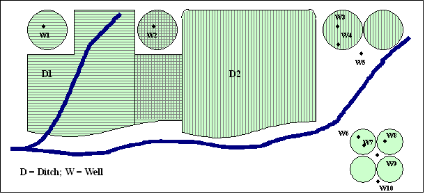

# StateDMI / Command / ReadIrrigationPracticeTSFromParcels #

* [Overview](#overview)
	+ [Processing Logic](#processing-logic)
* [Command Editor](#command-editor)
* [Command Syntax](#command-syntax)
* [Examples](#examples)
* [Troubleshooting](#troubleshooting)
* [See Also](#see-also)

-------------------------

## Overview ##

The `ReadIrrigationPracticeTSFromParcels` command (for StateCU) reads parcel irrigated acreage
data from parcel data that have been previously read with
[`ReadParcelsFromHydroBase`](../ReadParcelsFromHydroBase/ReadParcelsFromHydroBase.md)
and sets the irrigation practice acreage time series (yearly) information for CU locations.
Only years with data in parcels are processed.
Values for other years must be estimated using other commands
(see the [`FillIrrigationPracticeTSInterpolate`](../FillIrrigationPracticeTSInterpolate/FillIrrigationPracticeTSInterpolate.md) and
[`FillIrrigationPracticeTSRepeat`](../FillIrrigationPracticeTSRepeat/FillIrrigationPracticeTSRepeat.md) commands).
This command should be executed before other commands that estimate or set irrigation practice acreage time series.

The [`SetIrrigationPracticeTSTotalAcreageToCropPatternTSTotalAcreage`](../SetIrrigationPracticeTSTotalAcreageToCropPatternTSTotalAcreage/SetIrrigationPracticeTSTotalAcreageToCropPatternTSTotalAcreage.md)
command can be used to set irrigation practice time series total area for the full period
to ensure that fill commands have a total area for calculations for the full period.

The following figure illustrates possible water supply for parcels.

**<p style="text-align: center;">

</p>**

**<p style="text-align: center;">
Example Supply for Parcels (<a href="../ParcelSupplyDiagram.png">see also the full-size image</a>)
</p>**

In this example, two ditches (`D1` and `D2`,
each represented with different hatching) provide surface water supply to the indicated parcels.
In some cases, only one ditch provides supply.
Both ditches supply water to shared parcels.
Wells can supplement surface water supply (parcels above the river)
or can be the sole supplier of water (lower right).
Wells do not need to be physically located on a parcel to provide supply to the parcel.
For StateCU, groundwater-only (well-only) lands are identified by CU locations that are defined by:

* a collection (aggregate/system) of wells specified by WDIDs or well permit receipts -
**this approach is being phased in throughout CDSS**
* a collection (aggregate/system) of parcels - **this older approach
is currrently only used in the Rio Grande**

For StateCU and StateMod, groundwater-only lands are well stations that do not have a related diversion station.
In both cases, lands irrigated by surface water are identified with
ditch identifiers and parcels are associated with the ditches in HydroBase.
Typically, well-only lands are grouped and multiple wells provide supply to the collection of parcels.
Processing logic is different for ditch and well-only lands only in how the list of parcels is obtained.

### Processing Logic ###

The steps used to process irrigation practice time series are described below.
“CU location” refers to the StateCU model identifier
(which can be a collection of wells) and “well” refers to a hole in the
ground that has physical characteristics, water rights, and/or well permits.

The following logic is repeated twice.
The first iteration determines the model node/parcel/supply relationships,
which is necessary to properly calculate the parcel fractions due to number of supplies.
The second iteration assigns area to the time series.

Each CU location that matches the `ID` pattern is processed for each year being processed
(specified by the `Year` parameter or by default all available data in parcel data):

1. Initialize all irrigation practice acreage time series to missing values.
Consequently, if no data are found in a year,
an “observation” of missing acreage will occur.  Any previous data are reset.
Missing values can be filled with subsequent commands.
2. Get the list of parcels associated with the location.
Parcels should have been read in a previous step using the
[`ReadParcelsFromHydroBase`](../ReadParcelsFromHydroBase/ReadParcelsFromHydroBase.md) command.
3. Process each supply associated with the parcel:
	1. Total acreage is set using similar logic as
	the [`ReadCropPatternTSFromParcels`](../ReadCropPatternTSFromParcels/ReadCropPatternTSFromParcels.md) command:
		1. Any parcel/supply associated with well supply that is not included in the data set is ignored.
		2. If the parcel is associated with a ditch that supplies the location,
		the parcel area is multiplied by (1/number of ditches) and the total is incremented.
		3. Else if the parcel has groundwater supply that is associated with the location,
		it must be groundwater-only
		and the parcel area is multipled by (1/number of wells) and the total is incremented.
	2. Specific irrigation practice acreage time series are incremented.
		1. Any parcel/supply associated with well supply that is not included in the data set is ignored.
		2. `SPRINKLER` and `DRIP` irrigation methods are treated as `SPRINKLER` (high efficiency)
		and all other irrigation methods as `FLOOD` (low efficiency).
		3. A parcel is considered to have groundwater supply if there is at least one well
		associated with the parcel for the specific year.
		The incremental area associated with the groundwater supply is the parcel
		area multipled by (1/number of wells).
		Additionally, if the well is commingled with surface supply (D&W location),
		the area is multipled by (1/number of ditches that match the model node,
		either a single ditch or ditch in a collection list).
		The calculated area is incremented to `SPRINKLER` or `FLOOD` for groundwater supply.
		4. If no groundwater supply is associated with the parcel,
		the area is calculated as the parcel area multipled by (1/number of ditches) and is incremented
		to `SPRINKLER` or `FLOOD` for surface water supply.
	3. The total groundwater acres are set to the sum of the acres for `SPRINKLER` and `FLOOD`.
	4. The total surface water acres are set to the sum of the acres for `SPRINKLER` and `FLOOD`.

## Command Editor ##

The following dialog is used to edit the command and illustrates the command syntax.

**<p style="text-align: center;">

</p>**

**<p style="text-align: center;">
`ReadIrrigationPracticeTSFromParcels` Command Editor (<a href="../ReadIrrigationPracticeTSFromParcels.png">see also the full-size image</a>)
</p>**

## Command Syntax ##

The command syntax is as follows:

```text
ReadIrrigationPracticeTSFromParcels(Parameter="Value",...)
```
**<p style="text-align: center;">
Command Parameters
</p>**

| **Parameter**&nbsp;&nbsp;&nbsp;&nbsp;&nbsp;&nbsp;&nbsp;&nbsp;&nbsp;&nbsp;&nbsp;&nbsp; | **Description** | **Default**&nbsp;&nbsp;&nbsp;&nbsp;&nbsp;&nbsp;&nbsp;&nbsp;&nbsp;&nbsp; |
| --------------|-----------------|----------------- |
| `ID` <br>**required** | A single CU location identifier to match or a pattern using wildcards (e.g., `20*`). | None – must be specified. |
| `Year` | Calendar year's of irrigated lands data to use for parcel data.  Separate multiple years by commas. | All years in parcel data read by [`ReadParcelsFromHydroBase`](../ReadParcelsFromHydroBase/ReadParcelsFromHydroBase.md) and related commands will be processed. |

## Examples ##

See the [automated tests](https://github.com/OpenCDSS/cdss-app-statedmi-test/tree/master/test/regression/commands/ReadIrrigationPracticeTSFromParcels).

The following command file illustrates how to process the irrigation practice time series file where groundwater supply is used,
in this case for Arkansas basin:

```
StartLog(LogFile="Ark2020_IPY_Rev.STATEDMI.log")
# StateDMI command file to develop an IPY File for ArkDSS
# Ark2020.ipy
#@require datastore HydroBase = 20200720
#
# Step 1 - Set output period and read CU locations from structure file
SetOutputPeriod(OutputStart="1950",OutputEnd="2018")
ReadCULocationsFromStateCU(InputFile="..\StateCU\Ark2020_CROP.str")
#
# Step 2 - Read Diversion System, Multi-Systems, and GW aggregates
SetDiversionSystemFromList(ListFile="2020_08_18_Ark2020_DivSys_Acres.txt",IDCol="1",NameCol="2",PartIDsCol="3",PartsListedHow=InRow,PartIDsColMax="12",IfNotFound=Warn)
SetDiversionSystemFromList(ListFile="2020_08_18_Ark2020_MultiStr_DDM.txt",IDCol="1",NameCol="2",PartIDsCol="3",PartsListedHow=InRow,PartIDsColMax="7",IfNotFound=Warn)
SetWellAggregateFromList(ListFile="2020_04_06_Ark2020_GWAgg_StateCU.txt",PartType=Well,IDCol="1",PartIDsCol="2",PartIDTypeColumn="3",PartsListedHow=InColumn,WellReceiptWaterDistrictMap="0457406:1,3648199:65,0429583:2")
#
# Step 2.1 - Read parcel data, which is used by the following commands
ReadParcelsFromHydroBase(ID="*",ExcludeYears="2013,2014")
#
# Check the parcel data for issues
CheckParcels(ID="*",AreaPrecision=1)
#
# Step 3 - Create form for ipy file
CreateIrrigationPracticeTSForCULocations(ID="*")
#
# Step 4 - set max flood and surface water efficiencies and GWmode
SetIrrigationPracticeTS(ID="*",SetStart=1950,SetEnd=2018,FloodAppEffMax=.6,SprinklerAppEffMax=.8,PumpingMax=10000,GWMode=2)
#
# Step 5 - Set conveyane and Irrigation effeciencies from file for all structures
SetIrrigationPracticeTSFromList(ListFile="Ark2020_IPY_AllSTR_Irrig_Eff.lst",ID="*",IDCol="1",FloodAppEffMaxCol="2",SprinklerAppEffMaxCol="3")
SetIrrigationPracticeTSFromList(ListFile="Ark2020_IPY_HIModel_Irrig_Eff.lst",ID="*",YearCol=1,IDCol="2",SprinklerAppEffMaxCol="3")
SetIrrigationPracticeTSFromList(ListFile="Ark2020_AllSTR_CanalEff.lst",ID="*",IDCol="1",SurfaceDelEffMaxCol="2")
#
# Step 6 - Set Irrigation Practice for Drip Irrigated Parcels
SetIrrigationPracticeTSFromList(ListFile="Ark2020_DripIrrig_Eff.lst",ID="*",YearCol=1,IDCol="2",SprinklerAppEffMaxCol="3")
#
# Step 8 - Read category acreage from HydroBase
ReadIrrigationPracticeTSFromParcels(ID="10*",Year="1954,1975,1988,1998,2010,2015")
ReadIrrigationPracticeTSFromParcels(ID="11*",Year="1954,1975,1988,1998,2010,2015")
ReadIrrigationPracticeTSFromParcels(ID="12*",Year="1954,1975,1988,1998,2010,2015")
ReadIrrigationPracticeTSFromParcels(ID="13*",Year="1954,1975,1988,1998,2010,2015")
ReadIrrigationPracticeTSFromParcels(ID="14*",Year="1954,1975,1988,1998,2010,2015")
ReadIrrigationPracticeTSFromParcels(ID="15*",Year="1954,1975,1988,1998,2010,2015")
ReadIrrigationPracticeTSFromParcels(ID="16*",Year="1954,1975,1988,1998,2010,2015")
ReadIrrigationPracticeTSFromParcels(ID="17*",Year="1954,1975,1988,1998,2010,2015")
ReadIrrigationPracticeTSFromParcels(ID="18*",Year="1954,1975,1988,1998,2010,2015")
ReadIrrigationPracticeTSFromParcels(ID="19*",Year="1954,1975,1988,1998,2010,2015")
ReadIrrigationPracticeTSFromParcels(ID="66*",Year="1954,1975,1988,1998,2010,2015")
ReadIrrigationPracticeTSFromParcels(ID="67*",Year="1954,1975,1988,1998,2010,2015")
ReadIrrigationPracticeTSFromParcels(ID="79*",Year="1954,1975,1988,1998,2010,2015")
#
# Step 9 - Read acreage for GW Aggregates with problem wells/receipts
SetIrrigationPracticeTSFromList(ListFile="Ark2020_IPY_GWAgg_Acreage_Set.txt",ID="*",SetStart=1950,SetEnd=2018,YearCol=1,IDCol="2",AcresSWFloodCol="3",AcresSWSprinklerCol="4",AcresGWFloodCol="7",AcresGWSprinklerCol="8",AcresTotalCol="9",RecalculateTotal=True)
#
# Step 11 - Set Irrigation Practice and Acreage for HI Model Area for 1950-2018 and set PRWCD acreage for 1999-2009, 2011-2012
SetIrrigationPracticeTSFromList(ListFile="Ark2020_IPY_HIModel_08312020.lst",ID="*",SetStart=1950,SetEnd=2018,YearCol=1,IDCol="2",AcresSWFloodCol="3",AcresSWSprinklerCol="4",AcresGWFloodCol="5",AcresGWSprinklerCol="6",AcresTotalCol="7",RecalculateTotal=True)
SetIrrigationPracticeTSFromList(ListFile="Ark2020_IPY_PRWCD_Acreage_08312020.lst",ID="*",SetStart=2006,SetEnd=2012,YearCol=1,IDCol="2",AcresSWFloodCol="3",AcresSWSprinklerCol="4",AcresGWFloodCol="5",AcresGWSprinklerCol="6",AcresTotalCol="7",RecalculateTotal=True)
#
# Step 12 - Read total acreage from *.cds file and set total for *.ipy file
# - previously created *.cds file has total area for all years
# - this allows filling to adjust parts, if necessary, during the following fill steps
# - checks occur to compare CDS and IPY totals to ensure consistency
# - the parcel report file for CDS and IPY processing should agree except for SET/FILL notes
ReadCropPatternTSFromStateCU(InputFile="..\StateCU\Ark2020_SAM_Rev.cds",Tolerance=1.0)
# The following has been used in the past.
# An alternate approach would be to fill IPY total acreage read from above commands.
# Then CDS acreage could be read after all processing as a cross check.
SetIrrigationPracticeTSTotalAcreageToCropPatternTSTotalAcreage(ID="*")
#
# Step 13 - Fill Interpolate Acreage
FillIrrigationPracticeTSRepeat(ID="*",DataType="CropArea-GroundWater",FillStart="1950",FillEnd="1954",FillDirection="Backward")
FillIrrigationPracticeTSInterpolate(ID="*",DataType="CropArea-GroundWater",FillStart="1954",FillEnd="1975")
FillIrrigationPracticeTSInterpolate(ID="*",DataType="CropArea-GroundWater",FillStart="1975",FillEnd="1988")
FillIrrigationPracticeTSInterpolate(ID="*",DataType="CropArea-GroundWater",FillStart="1988",FillEnd="1998")
FillIrrigationPracticeTSInterpolate(ID="*",DataType="CropArea-GroundWater",FillStart="1998",FillEnd="2010")
FillIrrigationPracticeTSInterpolate(ID="*",DataType="CropArea-GroundWater",FillStart="2010",FillEnd="2015")
FillIrrigationPracticeTSRepeat(ID="*",DataType="CropArea-GroundWater",FillStart="2015",FillEnd="2018",FillDirection="Forward")
#
# # Step 14b - set sprinkler to zero in early period
SetIrrigationPracticeTS(ID="*",SetStart=1950,SetEnd=1969,AcresSWSprinkler=0,AcresGWSprinkler=0)
# # Step 14c - fill remaining irrigation method values
FillIrrigationPracticeTSInterpolate(ID="*",DataType="CropArea-SurfaceWaterOnlySprinkler",FillStart="1969",FillEnd="1975")
FillIrrigationPracticeTSInterpolate(ID="*",DataType="CropArea-SurfaceWaterOnlySprinkler",FillStart="1975",FillEnd="1988")
FillIrrigationPracticeTSInterpolate(ID="*",DataType="CropArea-SurfaceWaterOnlySprinkler",FillStart="1988",FillEnd="1998")
FillIrrigationPracticeTSInterpolate(ID="*",DataType="CropArea-SurfaceWaterOnlySprinkler",FillStart="1998",FillEnd="2010")
FillIrrigationPracticeTSInterpolate(ID="*",DataType="CropArea-SurfaceWaterOnlySprinkler",FillStart="2010",FillEnd="2015")
FillIrrigationPracticeTSRepeat(ID="*",DataType="CropArea-SurfaceWaterOnlySprinkler",FillStart="2015",FillEnd="2018",FillDirection="Forward")
FillIrrigationPracticeTSInterpolate(ID="*",DataType="CropArea-GroundWaterSprinkler",FillStart="1969",FillEnd="1975")
FillIrrigationPracticeTSInterpolate(ID="*",DataType="CropArea-GroundWaterSprinkler",FillStart="1975",FillEnd="1988")
FillIrrigationPracticeTSInterpolate(ID="*",DataType="CropArea-GroundWaterSprinkler",FillStart="1988",FillEnd="1998")
FillIrrigationPracticeTSInterpolate(ID="*",DataType="CropArea-GroundWaterSprinkler",FillStart="1998",FillEnd="2010")
FillIrrigationPracticeTSInterpolate(ID="*",DataType="CropArea-GroundWaterSprinkler",FillStart="2010",FillEnd="2015")
FillIrrigationPracticeTSRepeat(ID="*",DataType="CropArea-GroundWaterSprinkler",FillStart="2015",FillEnd="2018",FillDirection="Forward")
#
FillIrrigationPracticeTSRepeat(ID="*",DataType="CropArea-SurfaceWaterOnlyFlood",FillStart="1950",FillEnd="1954",FillDirection="Backward")
FillIrrigationPracticeTSInterpolate(ID="*",DataType="CropArea-SurfaceWaterOnlyFlood",FillStart="1954",FillEnd="1975")
FillIrrigationPracticeTSInterpolate(ID="*",DataType="CropArea-SurfaceWaterOnlyFlood",FillStart="1975",FillEnd="1988")
FillIrrigationPracticeTSInterpolate(ID="*",DataType="CropArea-SurfaceWaterOnlyFlood",FillStart="1988",FillEnd="1998")
FillIrrigationPracticeTSInterpolate(ID="*",DataType="CropArea-SurfaceWaterOnlyFlood",FillStart="1998",FillEnd="2010")
FillIrrigationPracticeTSInterpolate(ID="*",DataType="CropArea-SurfaceWaterOnlyFlood",FillStart="2010",FillEnd="2015")
FillIrrigationPracticeTSRepeat(ID="*",DataType="CropArea-SurfaceWaterOnlyFlood",FillStart="2015",FillEnd="2018",FillDirection="Forward")
#
# Step 15 - Write final ipy file
WriteIrrigationPracticeTSToStateCU(OutputFile="..\StateCU\Ark2020_SAM_Rev.ipy")
#
# Write parcels after processing IPY, for verification.
# - will indicate whether set commands are used
WriteParcelsToFile(OutputFile="Ark2020_IPY_Rev.StateDMI.model-parcel-supply-after-ipy.txt",Verbose=True)
```

## Troubleshooting ##

* Warnings are generated to ensure that irrigated area data are consistent.
The warnings should not be ignored.
If warnings exist, confirm that input data are correct.

## See Also ##

* [`CheckParcels`](../CheckParcels/CheckParcels.md) command
* [`FillIrrigationPracticeTSInterpolate`](../FillIrrigationPracticeTSInterpolate/FillIrrigationPracticeTSInterpolate.md) command
* [`FillIrrigationPracticeTSRepeat`](../FillIrrigationPracticeTSRepeat/FillIrrigationPracticeTSRepeat.md) command
* [`ReadCropPatternTSFromParcels`](../ReadCropPatternTSFromParcels/ReadCropPatternTSFromParcels.md) command
* [`ReadIrrigationPracticeTSFromList`](../ReadIrrigationPracticeTSFromList/ReadIrrigationPracticeTSFromList.md) command
* [`ReadIrrigationPracticeTSFromStateCU`](../ReadIrrigationPracticeTSFromStateCU/ReadIrrigationPracticeTSFromStateCU.md) command
* [`ReadParcelsFromHydroBase`](../ReadParcelsFromHydroBase/ReadParcelsFromHydroBase.md) command
* [`SetIrrigationPracticeTSTotalAcreageToCropPatternTSTotalAcreage`](../SetIrrigationPracticeTSTotalAcreageToCropPatternTSTotalAcreage/SetIrrigationPracticeTSTotalAcreageToCropPatternTSTotalAcreage.md) command
* [`WriteIrrigationPracticeTSToStateCU`](../WriteIrrigationPracticeTSToStateCU/WriteIrrigationPracticeTSToStateCU.md) command
