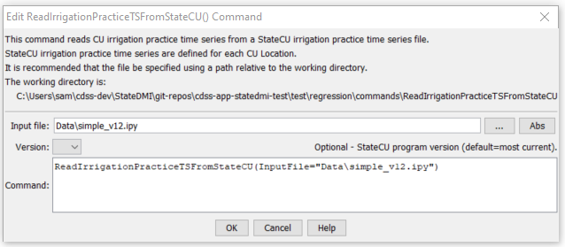

# StateDMI / Command / ReadIrrigationPracticeTSFromStateCU #

* [Overview](#overview)
* [Command Editor](#command-editor)
* [Command Syntax](#command-syntax)
* [Examples](#examples)
* [Troubleshooting](#troubleshooting)
* [See Also](#see-also)

-------------------------

## Overview ##

The `ReadIrrigationPracticeTSFromStateCU` command (for StateCU)
reads irrigation practice time series data from a StateCU irrigation
practice time series file and defines the data in memory.
The irrigation practice time series can then be manipulated and output with other commands.
This command can be used to adjust an existing irrigation practice file.
See also the TSTool software, which can be used to read, manipulate, and view irrigation practice time series.

## Command Editor ##

The following dialog is used to edit the command and illustrates the command syntax.

**<p style="text-align: center;">

</p>**

**<p style="text-align: center;">
`ReadIrrigationPracticeTSFromStateCU` Command Editor (<a href="../ReadIrrigationPracticeTSFromStateCU.png">see also the full-size image</a>)
</p>**

## Command Syntax ##

The command syntax is as follows:

```text
ReadIrrigationPracticeTSFromStateCU(Parameter="Value",...)
```
**<p style="text-align: center;">
Command Parameters
</p>**

| **Parameter**&nbsp;&nbsp;&nbsp;&nbsp;&nbsp;&nbsp;&nbsp;&nbsp;&nbsp;&nbsp;&nbsp;&nbsp; | **Description** | **Default**&nbsp;&nbsp;&nbsp;&nbsp;&nbsp;&nbsp;&nbsp;&nbsp;&nbsp;&nbsp; |
| --------------|-----------------|----------------- |
| `InputFile`<br>**required** | The name of the file to read, surrounded by double quotes. | None – must be specified. |
| `Version` | The StateCU version number, to allow backward compatibility with file formats from an earlier StateCU version. | Use the most current known format. |

## Examples ##

See the [automated tests](https://github.com/OpenCDSS/cdss-app-statedmi-test/tree/master/test/regression/commands/ReadIrrigationPracticeTSFromStateCU).

## Troubleshooting ##

## See Also ##

* [`ReadIrrigationPracticeTSFromHydroBase`](../ReadIrrigationPracticeTSFromHydroBase/ReadIrrigationPracticeTSFromHydroBase.md) command
* [`ReadIrrigationPracticeTSFromList`](../ReadIrrigationPracticeTSFromList/ReadIrrigationPracticeTSFromList.md) command
* [`WriteIrrigationPracticeTSToStateCU`](../WriteIrrigationPracticeTSToStateCU/WriteIrrigationPracticeTSToStateCU.md) command
