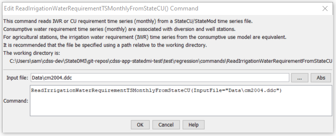

# StateDMI / Command / ReadIrrigationWaterRequirementTSMonthlyFromStateCU #

* [Overview](#overview)
* [Command Editor](#command-editor)
* [Command Syntax](#command-syntax)
* [Examples](#examples)
* [Troubleshooting](#troubleshooting)
* [See Also](#see-also)

-------------------------

## Overview ##

The `ReadIrrigationWaterRequirementTSMonthlyFromStateCU` command (for StateMod)
reads irrigation water requirement time series data from a StateCU
irrigation water requirement time series file and defines the data in memory.
Currently this command is meant to read the IWR time series for use in
estimating average efficiencies and demands for StateMod – it is not
supported in StateCU commands (e.g., to read and modify the time series file).
All time series are read, whether or not they match the list of diversion stations.

## Command Editor ##

The following dialog is used to edit the command and illustrates the command syntax.

**<p style="text-align: center;">

</p>**

**<p style="text-align: center;">
`ReadIrrigationWaterRequirementTSMonthlyFromStateCU` Command Editor (<a href="../ReadIrrigationWaterRequirementTSMonthlyFromStateCU.png">see also the full-size image</a>)
</p>**

## Command Syntax ##

The command syntax is as follows:

```text
ReadIrrigationWaterRequirementTSMonthlyFromStateCU(Parameter="Value",...)
```
**<p style="text-align: center;">
Command Parameters
</p>**

| **Parameter**&nbsp;&nbsp;&nbsp;&nbsp;&nbsp;&nbsp;&nbsp;&nbsp;&nbsp;&nbsp;&nbsp;&nbsp; | **Description** | **Default**&nbsp;&nbsp;&nbsp;&nbsp;&nbsp;&nbsp;&nbsp;&nbsp;&nbsp;&nbsp; |
| --------------|-----------------|----------------- |
| `InputFile`<br>**required** | The name of the StateCU irrigation water requirement file (StateMod time series format) to read. | None – must be specified. |

## Examples ##

See the [automated tests](https://github.com/OpenCDSS/cdss-app-statedmi-test/tree/master/test/regression/commands/ReadIrrigationWaterRequirementTSMonthlyFromStateCU).

## Troubleshooting ##

## See Also ##
