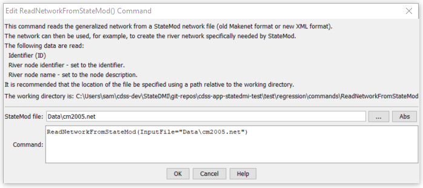

# StateDMI / Command / ReadNetworkFromStateMod #

* [Overview](#overview)
* [Command Editor](#command-editor)
* [Command Syntax](#command-syntax)
* [Examples](#examples)
* [Troubleshooting](#troubleshooting)
* [See Also](#see-also)

-------------------------

## Overview ##

The `ReadNetworkFromStateMod` command (for StateMod)
reads the generalized network from a StateMod XML network file.
The network can then be manipulated and utilized by other commands.
Normally the generalized network is edited interactively in StateDMI
(or StateMod GUI) and is used to generate lists of stations, for further processing.
However, this command can be used to read the network and allow
manipulation based on river upstream/downstream connectivity.
See also commands like
[`ReadDiversionStationsFromNetwork`](../ReadDiversionStationsFromNetwork/ReadDiversionStationsFromNetwork.md),
which read a subset of the network, to facilitate creation of specific model data files.

## Command Editor ##

The following dialog is used to edit the command and illustrates the command syntax.

**<p style="text-align: center;">

</p>**

**<p style="text-align: center;">
`ReadNetworkFromStateMod` Command Editor (<a href="../ReadNetworkFromStateMod.png">see also the full-size image</a>)
</p>**

## Command Syntax ##

The command syntax is as follows:

```text
ReadNetworkFromStateMod(Parameter="Value",...)
```
**<p style="text-align: center;">
Command Parameters
</p>**

| **Parameter**&nbsp;&nbsp;&nbsp;&nbsp;&nbsp;&nbsp;&nbsp;&nbsp;&nbsp;&nbsp;&nbsp;&nbsp; | **Description** | **Default**&nbsp;&nbsp;&nbsp;&nbsp;&nbsp;&nbsp;&nbsp;&nbsp;&nbsp;&nbsp; |
| --------------|-----------------|----------------- |
| `InputFile`<br>**required** | The name of the StateMod XML network file to read. | None – must be specified. |

## Examples ##

See the [automated tests](https://github.com/OpenCDSS/cdss-app-statedmi-test/tree/master/test/regression/commands/ReadNetworkFromStateMod).

## Troubleshooting ##

## See Also ##

* [`ReadDiversionStationsFromNetwork`](../ReadDiversionStationsFromNetwork/ReadDiversionStationsFromNetwork.md) command
* [`WriteNetworkToStateMod`](../WriteNetworkToStateMod/WriteNetworkToStateMod.md) command
