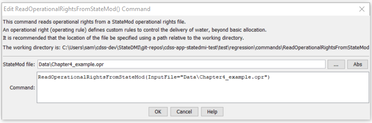

# StateDMI / Command / ReadOperationalRightsFromStateMod #

* [Overview](#overview)
* [Command Editor](#command-editor)
* [Command Syntax](#command-syntax)
* [Examples](#examples)
* [Troubleshooting](#troubleshooting)
* [See Also](#see-also)

-------------------------

## Overview ##

The `ReadOperationalRightsFromStateMod` command (for StateMod)
reads a list of operational rights from a StateMod operational
rights file and defines operational rights in memory.
The rights can then be manipulated and output with other commands.
Comments immediately prior to a right’s data records are associated with the
right and will be output when the rights are written with a
[`WriteOperationalRightsToStateMod`](../WriteOperationalRightsToStateMod/WriteOperationalRightsToStateMod.md) command.

## Command Editor ##

The following dialog is used to edit the command and illustrates the command syntax.

**<p style="text-align: center;">

</p>**

**<p style="text-align: center;">
`ReadOperationalRightsFromStateMod` Command Editor (<a href="../ReadOperationalRightsFromStateMod.png">see also the full-size image</a>)
</p>**

## Command Syntax ##

The command syntax is as follows:

```text
ReadOperationalRightsFromStateMod(Parameter="Value",...)
```
**<p style="text-align: center;">
Command Parameters
</p>**

| **Parameter**&nbsp;&nbsp;&nbsp;&nbsp;&nbsp;&nbsp;&nbsp;&nbsp;&nbsp;&nbsp;&nbsp;&nbsp; | **Description** | **Default**&nbsp;&nbsp;&nbsp;&nbsp;&nbsp;&nbsp;&nbsp;&nbsp;&nbsp;&nbsp; |
| --------------|-----------------|----------------- |
| `InputFile`<br>**required** | The name of the StateMod operational rights file to read. | None – must be specified. |

## Examples ##

See the [automated tests](https://github.com/OpenCDSS/cdss-app-statedmi-test/tree/master/test/regression/commands/ReadOperationalRightsFromStateMod).

## Troubleshooting ##

[See the main troubleshooting documentation](../../troubleshooting/troubleshooting.md)

## See Also ##

* [`WriteOperationalRightsToStateMod`](../WriteOperationalRightsToStateMod/WriteOperationalRightsToStateMod.md) command
