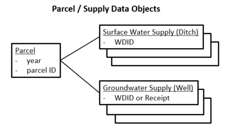
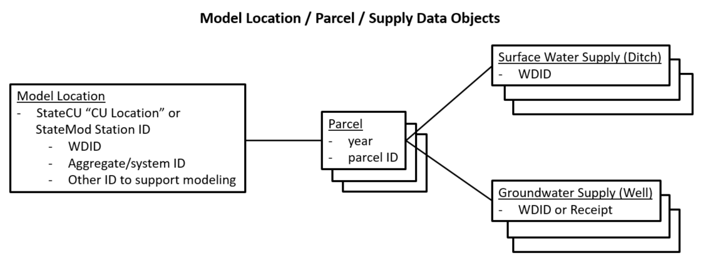
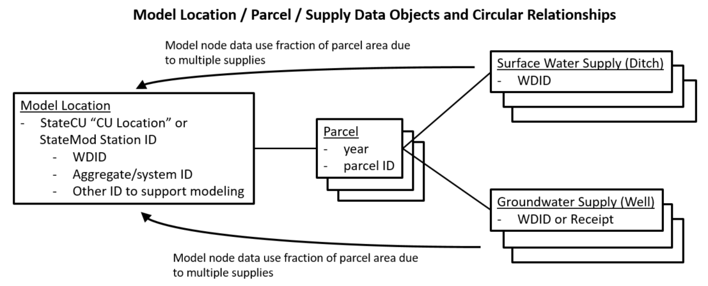
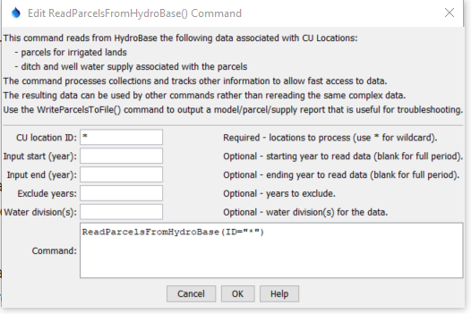

# StateDMI / Command / ReadParcelsFromHydroBase #

* [Overview](#overview)
	+ [Model / Parcel / Supply Data](#model-parcel-supply-data)
	+ [Processing Logic](#processing-logic)
	+ [Additional Technical Considerations](#additional-technical-considerations)
* [Command Editor](#command-editor)
* [Command Syntax](#command-syntax)
* [Examples](#examples)
* [Troubleshooting](#troubleshooting)
* [See Also](#see-also)

-------------------------

## Overview ##

The `ReadParcelsFromHydroBase` command (for StateCU and StateMod) reads parcels and related supply data from HydroBase
and creates data objects in memory that provide data to other commands,
in particular commands with `Parcel` in the name.
This "data map" design provides consistency, increases software performance, allows for data quality control,
and minimizes the need for redundant logic in other commands, specifically:

* [`ReadCropPatternTSFromParcels`](../ReadCropPatternTSFromParcels/ReadCropPatternTSFromParcels.md)
* [`ReadIrrigationPracticeTSFromParcels`](../ReadIrrigationPracticeTSFromParcels/ReadIrrigationPracticeTSFromParcels.md)
* [`ReadWellRightsFromHydroBase`](../ReadWellRightsFromHydroBase/ReadWellRightsFromHydroBase.md)

### Model / Parcel / Supply Data ###

Irrigated lands data are digitized using geographic information system (GIS) software,
resulting in a spatial data layer for each major basin for a year.
The following image illustrates the basic data objects, which rely on the unique identifiers shown to enforce relationships.
Ditches are identified using a water district identifier (WDID).
Wells are identified using a WDID if the well has a water right or other administrative data,
or a well permit receipt identifier if WDID is not available.
Modelers should typically use WDID for wells if it is available, although receipt can be.

**<p style="text-align: center;">

</p>**

**<p style="text-align: center;">
Parcel and Supply Data Objects (<a href="../parcel-supply-objects.png">see also the full-size image</a>)
</p>**

The above data objects from GIS and HydroBase do not including modeling constructs such as model identifier,
collections of structures (aggregates, systems), etc.
The parcel and supply data are loaded into HydroBase and relationships are defined
to connect to other information such as structures (ditches and wells), and well physical data.
StateDMI software keeps a list of all individual parcels that are part of the dataset,
with associated supply information, similar to the original GIS data.
Only one copy of each unique year/parcel exists in this list.

The addition of model constructs is represented in the following figure and indicates how
parcels are associated with model locations.

**<p style="text-align: center;">

</p>**

**<p style="text-align: center;">
Model, Parcel, and Supply Data Objects (<a href="../model-parcel-supply-objects.png">see also the full-size image</a>)
</p>**

Model locations can be a single diversion (single ditch), a diversion system/aggregate that includes multiple ditches,
or a well system/aggregate (one or more wells).
Currently single wells are not supported and must be defined as a list of 1 well in an aggregate/system.
Model locations that are diversions may result in wells automatically being added as supply
because diversions relate to parcels, which relate to wells.
Parcels can be served by supplies that are in more than one model location.
For example, a parcel may be supplied by a D&W model node that includes a ditch,
and a WEL model node with groundwater-only.
Therefore it is necessary to store the relationship between supply and model location, as shown in the following figure,
in order to properly make decisions during data processing.

**<p style="text-align: center;">

</p>**

**<p style="text-align: center;">
Model, Parcel, and Supply Data Objects with full Relationships (<a href="../model-parcel-supply-objects2.png">see also the full-size image</a>)
</p>**

Care must be taken to avoid double-counting irrigated area in the
[`ReadCropPatternTSFromParcels`](../ReadCropPatternTSFromParcels/ReadCropPatternTSFromParcels.md) and
[`ReadIrrigationPracticeTSFromParcels`](../ReadIrrigationPracticeTSFromParcels/ReadIrrigationPracticeTSFromParcels.md)
commands, which would inflate consumptive use and water demand estimates.
To account for this, the supplies that are associated with a parcel are handled as follows:

* The parcel's fractional area irrigated by each surface water supply ditch is 1/(number of ditches).
* The parcel's fractional area irrigated by each groundwater supply well is 1/(number of wells).
* For wells associated with a ditch in a D&W model node (where wells are automatically determined for
involved parcels), the parcel's fractional area irrigated by each groundwater supply well is
1/(number of ditches)/(number of wells).  This is the product of the previous case's two fractions.
This area calculation impacts irrigation practice time series
but not crop pattern time series (because only parcels with surface water supply are included for D&W nodes).

Consequently, when calculating irrigated area such as for crop pattern time series (`*.cds` file)
and irrigation practice time series (`*.ipy`), the supplies for the parcel can be processed and acreage summed
as necessary, such as by crop type, irrigation method, and whether surface or groundwater supply.

The following is a summary of data objects used by StateDMI to process parcel-related data:

1. A list of all parcels in the dataset, each of which is uniquely identified by year and parcel identifier.
2. For each parcel, a list of supplies identified by ditch (WDID) or well identifier (WDID or receipt).
	1. Because StateDMI processes model data, each supply's identifier also allows a reference to
	the model location that includes the supply (next item).
3. A list of model locations (StateCU locations or StateMod stations),
each of which has a list of the parcels associated with the location.
	1. The list of ditches and wells for each location is defined by the model dataset.
	2. The list of ditches and wells determines the associated parcels (from above).

Therefore, relationships are circular and provide a cross-reference between data objects.
The above data are used when processing specific model data files and logic is implemented
to ensure that irrigated land is counted only once, regardless of overlapping parcel/supply relationships.
Model data files are organized by model location and therefore processing logic typically loops through
the list of model locations and accesses other data objects as needed.

### Processing Logic ###

Processing logic uses internal objects defined in the previous section
to ensure that the acreage for a parcel is only counted once for consumptive use calculations.
Wells can provide supplemental supply to ditches (commingled supplies),
and the acreage in this case is only assigned to the ditch.

The following summarizes the processing logic for each model location (StateCU Location) that is processed.
Within each top-level step, processing is limited to years in the entire dataset that have parcel data
in the requested period (this ensures that locations that don't have irrigated lands in each
year with irrigated lands data will have values set to zero).

1. If the CU Location is not a collection (is a single diversion structure),
for example corresponding to a StateMod `DIV` or `D&W` node:
	1. Read "parcel use" data (HydroBase `vw_CDSS_ParcelUseTSStructureToParcel` view)
	for the single structure, which provides the following data:
		* calendar year
		* crop type
		* total acres for the crop type
		* irrigation method
		* structure information
	2. For parcels that are returned, add a parcel record to the data model for each unique year and parcel ID,
	if not already added.
	3. For each structure associated with the parcel, add a surface water supply record for the parcel.
	4. Read "well to parcel" data (Hydrobase `vw_CDSS_WellsWellToParcel view`)
	to determine if the parcel is associated with wells and for each well,
	add a groundwater supply to the parcel.
2. If the CU Location is a collection and the collection part type is `Ditch`,
for example corresponding to a StateMod `DIV` or `D&W` node that is an aggregate or system:
	1. For each structure in the collection, run the process as described above for a single
	diversion part in the collection, which adds parcels and related water supply if not already added.
3. If the CU Location is a collection and the collection part type is `Well`,
for example corresponding to a StateMod `WEL` node for groundwater only model node
specified as an aggregate or system:
	1. For each well in the collection, read data from the HydroBase `vw_CDSS_WellsWellToParcel` view,
	which returns the list of parcels associated with the well and associated well.
	The well identifier can be either a structure WDID or well permit receipt.
	2. For parcels that are returned, add a parcel record to the data model for each unique year and parcel ID,
	if not already added.
	3. For each parcel read "parcel use" data (HydroBase `vw_CDSS_ParcelUseTSStructureToParcel` view)
	and add a surface supply for the parcel, if not already added.
	This is necessary in order to account for surface water supplies for ditches that
	are not included in the dataset.
	4. Add a groundwater water supply record to the parcel for the well.
4. If the CU Location is a collection and the collection part type is `Parcel`:
	1. This case was implemented for
	[`ReadCropPatternTSFromHydroBase`](../ReadCropPatternTSFromHydroBase/ReadCropPatternTSFromHydroBase.md) and
	[`ReadIrrigationPracticeTSFromHydroBase`](../ReadIrrigationPracticeTSFromHydroBase/ReadIrrigationPracticeTSFromHydroBase.md).
	2. This case is not currently handled for this command but would be similar to the previous case
	except that parcel/well relationships would be queried using the parcel identifier.
5. Else, the input is not understood and a warning is generated.

## Additional Technical Considerations ##

The following are additional technical considerations related to parcel data processing:

1. When processing a groundwater-only model node, parcels are determined for wells in the collection
(for aggregate or system).  However, the command currently does not re-query all wells associated with a parcel.
This can leave out well supplies that irrigate the parcel and are
omitted from the dataset (are not in WEL or D&W model node).
Consequently, the fractions computed for distributing parcel will be larger than if
all wells are considered (including those not in the dataset).
The logic may be changed in the future.
2. For processing step 3.c above, the internal data management uses an optimized data structure to look up parcel/ditch data.
The logic currently requires that the water district is specified when retrieving parcel data.
The water district is currently determined from the well being processed
(assuming the well and its parcel are in the same water district).
The command also compares the well water district with digits 2-3 of the parcel ID,
which is set to water district in recent irrigated lands.
The logic may be changed in the future.

## Command Editor ##

The following dialog is used to edit the command and illustrates the command syntax.

**<p style="text-align: center;">

</p>**

**<p style="text-align: center;">
`ReadParcelsFromHydroBase` Command Editor (<a href="../ReadParcelsFromHydroBase.png">see also the full-size image</a>)
</p>**

## Command Syntax ##

The command syntax is as follows:

```text
ReadParcelsFromHydroBase(Parameter="Value",...)
```
**<p style="text-align: center;">
Command Parameters
</p>**

| **Parameter**&nbsp;&nbsp;&nbsp;&nbsp;&nbsp;&nbsp;&nbsp;&nbsp;&nbsp;&nbsp;&nbsp;&nbsp; | **Description** | **Default**&nbsp;&nbsp;&nbsp;&nbsp;&nbsp;&nbsp;&nbsp;&nbsp;&nbsp;&nbsp; |
| --------------|-----------------|----------------- |
| `ID` <br>**required** | A single CU Location identifier to match or a pattern using wildcards (e.g., `20*`). | None – must be specified. |
| `InputStart` | Starting year to read data. | All available parcel data will be read. |
| `InputEnd` | Ending year to read data. | All available parcel data will be read. |
| `Div` | Water divisions to process, separated by commas.  Specifying this will increase performance slightly but the default behavior simplifies input. | Determine divisions based on location identifiers that match the format of water district identifiers (WDIDs) . |

## Examples ##

See the [automated tests](https://github.com/OpenCDSS/cdss-app-statedmi-test/tree/master/test/regression/commands/ReadParcelsFromHydroBase).

## Troubleshooting ##

The following are troubleshooting suggestions based on experience.

| **Error Example** | **Suggestion** |
| -- | -- |
| `CU location "10_GW104 part ID "1005163" has HydroBase vw_CDSS_ParcelUseTS (as ditch) and vw_CDSS_WellsWellToParcel (as well) data records.`| Possible causes include:<ul><li>The original supply source for the parcel was coded as a ditch and a well, where only one should be used.</li></ul> |
| `Error getting well/parcel data for year 2017, receipt=9078680 (java.lang.IllegalArgumentException: The water district (-1) is invalid. Must be 1+).` | Possible causes include trying to use a well receipt that cannot be found:<ul><li>Water districts for all locations in the dataset are used to determine water districts to query to optimize performance.  If a well is in a water district outside of this list of water districts, the [`SetWellAggregateFromList`](../SetWellAggregateFromList/SetWellAggregateFromList.md) and [`SetWellAggregate`](../SetWellAggregate/SetWellAggregate.md) commands `WellReceiptWaterDistrictMap` parameter can be used to add additional water districts to process.</li><li>If the above does not resolve the issue, the well identifier have an error and is not in HydroBase</li></ul>  |

## See Also ##

* [`CheckParcels`](../CheckParcels/CheckParcels.md) command
* [`ReadCropPatternTSFromParcels`](../ReadCropPatternTSFromParcels/ReadCropPatternTSFromParcels.md) command
* [`ReadIrrigationPracticeTSFromParcels`](../ReadIrrigationPracticeTSFromParcels/ReadIrrigationPracticeTSFromParcels.md) command
* [`WriteParcelsToFile`](../WriteParcelsToFile/WriteParcelsToFile.md) command
