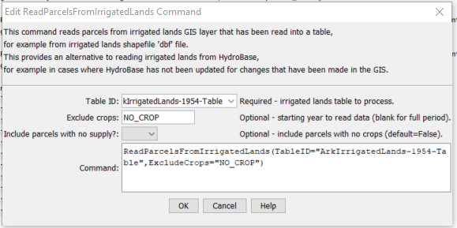

# StateDMI / Command / ReadParcelsFromIrrigatedLands #

* [Overview](#overview)
* [Command Editor](#command-editor)
* [Command Syntax](#command-syntax)
* [Examples](#examples)
* [Troubleshooting](#troubleshooting)
* [See Also](#see-also)

-------------------------

## Overview ##

The `ReadParcelsFromIrrigatedLands` command (for StateCU and StateMod) reads parcels and related supply
data from tables corresponding to spatial data layer attribute tables for irrigated lands.
Tables for each layer are typically read from the `dbf` file distributed with shapefile,
using the [`ReadTableFromDBF`](../ReadTableFromDBF/ReadTableFromDBF.md) command.

See the [Examples](#examples) section for an example command file.
This command is currently used for troubleshooting irrigated lands data errors.
Use the [`ReadParcelsFromHydroBase`](../ReadParcelsFromHydroBase/ReadParcelsFromHydroBase.md) command to process model data.

It may be possible to use this command to provide irrigated lands data for modeling when data are not available in HydroBase.
However, the focus is currently to use the command for troubleshooting.

Some error checks are implemented in the command.
See also the [`CheckIrrigatedLands`](../CheckIrrigatedLands/CheckIrrigatedLands.md) command.

Use the [`WriteParcelsToFile`](../WriteParcelsToFile/WriteParcelsToFile.md) command to review the results of processing, including errors.

## Command Editor ##

The following dialog is used to edit the command and illustrates the command syntax.

**<p style="text-align: center;">

</p>**

**<p style="text-align: center;">
`ReadParcelsFromIrrigatedLands` Command Editor (<a href="../ReadParcelsFromIrrigatedLands.png">see also the full-size image</a>)
</p>**

## Command Syntax ##

The command syntax is as follows:

```text
ReadParcelsFromIrrigatedLands(Parameter="Value",...)
```
**<p style="text-align: center;">
Command Parameters
</p>**

| **Parameter**&nbsp;&nbsp;&nbsp;&nbsp;&nbsp;&nbsp;&nbsp;&nbsp;&nbsp;&nbsp;&nbsp;&nbsp;&nbsp;&nbsp;&nbsp;&nbsp;&nbsp;&nbsp;&nbsp;&nbsp;&nbsp;&nbsp;&nbsp;&nbsp;&nbsp;&nbsp;&nbsp;&nbsp;&nbsp;&nbsp;&nbsp;&nbsp;&nbsp;&nbsp;&nbsp;&nbsp;&nbsp;&nbsp; | **Description** | **Default**&nbsp;&nbsp;&nbsp;&nbsp;&nbsp;&nbsp;&nbsp;&nbsp;&nbsp;&nbsp; |
| --------------|-----------------|----------------- |
| `TableID` <br>**required** | The identifier for the table to process, corresponding to standard CDSS irrigated lands layer attributes table.  Can be specified with `${Property}`. | None – must be specified. |
| `ExcludeCrops` | A list of crop types to exclude, separated by commas. For example, exclude parcels that have crop `NO_CROP`. | All crop types will be read. |
| `IncludeParcelsWithNoSupply` | Indicate whether to include parcels that have no supply. Specifying as `True` may result in a large number of parcels being included that are not found in HydroBase and therefore difficult to compare. | `False` |

## Examples ##

See the [automated tests](https://github.com/OpenCDSS/cdss-app-statedmi-test/tree/master/test/regression/commands/ReadParcelsIrrigatedLands).

The following command file illustrates how to read and check parcels from irrigated lands
using `dbf` files that are distributed with spatial data layer shapefiles.

```
StartLog(LogFile="Ark2020_CheckIrrigatedLands.statedmi.log")
#
# Check original irrigated lands data:
# - SW WDID is ditch and not well
# - GW WDID is a well and not ditch
# - Data not found in HydroBase
# - Redundant supply assignment
ReadTableFromDBF(TableID="ArkIrrigatedLands-1954-Table",InputFile="Div2_Irrig_1954.dbf",DoubleColumns="ACRES",IntegerColumns="CAL_YEAR,PARCEL_ID,DIV,DISTRICT,MASTER_ID")
CheckIrrigatedLands(TableID="ArkIrrigatedLands-1954-Table",ExcludeCrops="NO_CROP")
# ReadTableFromDataStore(DataStore="HydroBase",Sql="select * from vw_CDSS_Wells where receipt = '9078935'",TableID="wells")
#
ReadTableFromDBF(TableID="ArkIrrigatedLands-1975-Table",InputFile="Div2_Irrig_1975.dbf",DoubleColumns="ACRES",IntegerColumns="CAL_YEAR,PARCEL_ID,DIV,DISTRICT,MASTER_ID")
CheckIrrigatedLands(TableID="ArkIrrigatedLands-1975-Table",ExcludeCrops="NO_CROP")
#
ReadTableFromDBF(TableID="ArkIrrigatedLands-1988-Table",InputFile="Div2_Irrig_1988.dbf",DoubleColumns="ACRES",IntegerColumns="CAL_YEAR,PARCEL_ID,DIV,DISTRICT,MASTER_ID")
CheckIrrigatedLands(TableID="ArkIrrigatedLands-1988-Table",ExcludeCrops="NO_CROP")
#
ReadTableFromDBF(TableID="ArkIrrigatedLands-1998-Table",InputFile="Div2_Irrig_1998.dbf",DoubleColumns="ACRES",IntegerColumns="CAL_YEAR,PARCEL_ID,DIV,DISTRICT,MASTER_ID")
CheckIrrigatedLands(TableID="ArkIrrigatedLands-1998-Table",ExcludeCrops="NO_CROP")
#
ReadTableFromDBF(TableID="ArkIrrigatedLands-2010-Table",InputFile="Div2_Irrig_2010.dbf",DoubleColumns="ACRES",IntegerColumns="CAL_YEAR,PARCEL_ID,DIV,DISTRICT,MASTER_ID")
CheckIrrigatedLands(TableID="ArkIrrigatedLands-2010-Table",ExcludeCrops="NO_CROP")
#
ReadTableFromDBF(TableID="ArkIrrigatedLands-2013-Table",InputFile="Div2_Irrig_2013.dbf",DoubleColumns="ACRES",IntegerColumns="CAL_YEAR,PARCEL_ID,DIV,DISTRICT,MASTER_ID")
CheckIrrigatedLands(TableID="ArkIrrigatedLands-2013-Table",ExcludeCrops="NO_CROP")
#
ReadTableFromDBF(TableID="ArkIrrigatedLands-2014-Table",InputFile="Div2_Irrig_2014.dbf",DoubleColumns="ACRES",IntegerColumns="CAL_YEAR,PARCEL_ID,DIV,DISTRICT,MASTER_ID")
CheckIrrigatedLands(TableID="ArkIrrigatedLands-2014-Table",ExcludeCrops="NO_CROP")
#
ReadTableFromDBF(TableID="ArkIrrigatedLands-2015-Table",InputFile="Div2_Irrig_2015.dbf",DoubleColumns="ACRES",IntegerColumns="CAL_YEAR,PARCEL_ID,DIV,DISTRICT,MASTER_ID")
CheckIrrigatedLands(TableID="ArkIrrigatedLands-2015-Table",ExcludeCrops="NO_CROP")
# ReadTableFromDataStore(DataStore="HydroBase",Sql="select * from vw_CDSS_Wells where receipt = '9071994'",TableID="wells")
#
ReadTableFromDBF(TableID="ArkIrrigatedLands-2016-Table",InputFile="Div2_Irrig_2016.dbf",DoubleColumns="ACRES",IntegerColumns="CAL_YEAR,PARCEL_ID,DIV,DISTRICT,MASTER_ID")
CheckIrrigatedLands(TableID="ArkIrrigatedLands-2016-Table",ExcludeCrops="NO_CROP")
#
ReadTableFromDBF(TableID="ArkIrrigatedLands-2017-Table",InputFile="Div2_Irrig_2017.dbf",DoubleColumns="ACRES",IntegerColumns="CAL_YEAR,PARCEL_ID,DIV,DISTRICT,MASTER_ID")
CheckIrrigatedLands(TableID="ArkIrrigatedLands-2017-Table",ExcludeCrops="NO_CROP")
#
ReadTableFromDBF(TableID="ArkIrrigatedLands-2018-Table",InputFile="Div2_Irrig_2018.dbf",DoubleColumns="ACRES",IntegerColumns="CAL_YEAR,PARCEL_ID,DIV,DISTRICT,MASTER_ID")
CheckIrrigatedLands(TableID="ArkIrrigatedLands-2018-Table",ExcludeCrops="NO_CROP")
#
# Read parcels from the tables.
ReadParcelsFromIrrigatedLands(TableID="ArkIrrigatedLands-1954-Table",ExcludeCrops="NO_CROP")
ReadParcelsFromIrrigatedLands(TableID="ArkIrrigatedLands-1975-Table",ExcludeCrops="NO_CROP")
ReadParcelsFromIrrigatedLands(TableID="ArkIrrigatedLands-1988-Table",ExcludeCrops="NO_CROP")
ReadParcelsFromIrrigatedLands(TableID="ArkIrrigatedLands-1998-Table",ExcludeCrops="NO_CROP")
ReadParcelsFromIrrigatedLands(TableID="ArkIrrigatedLands-2010-Table",ExcludeCrops="NO_CROP")
ReadParcelsFromIrrigatedLands(TableID="ArkIrrigatedLands-2013-Table",ExcludeCrops="NO_CROP")
ReadParcelsFromIrrigatedLands(TableID="ArkIrrigatedLands-2014-Table",ExcludeCrops="NO_CROP")
ReadParcelsFromIrrigatedLands(TableID="ArkIrrigatedLands-2015-Table",ExcludeCrops="NO_CROP")
ReadParcelsFromIrrigatedLands(TableID="ArkIrrigatedLands-2016-Table",ExcludeCrops="NO_CROP")
ReadParcelsFromIrrigatedLands(TableID="ArkIrrigatedLands-2017-Table",ExcludeCrops="NO_CROP")
ReadParcelsFromIrrigatedLands(TableID="ArkIrrigatedLands-2018-Table",ExcludeCrops="NO_CROP")
#
# Output the ParcelSupply report to confirm that parcels have been read OK
WriteParcelsToFile(OutputFile="Ark2020_CheckIrrigationLands.statedmi.parcel-supply.txt",FileFormat=ParcelSupply)
```

## Troubleshooting ##

## See Also ##

* [`CheckIrrigatedLands`](../CheckIrrigatedLands/CheckIrrigatedLands.md) command
* [`CheckParcels`](../CheckParcels/CheckParcels.md) command
* [`ReadCropPatternTSFromParcels`](../ReadCropPatternTSFromParcels/ReadCropPatternTSFromParcels.md) command
* [`ReadIrrigationPracticeTSFromParcels`](../ReadIrrigationPracticeTSFromParcels/ReadIrrigationPracticeTSFromParcels.md) command
* [`ReadParcelsFromHydroBase`](../ReadParcelsFromHydroBase/ReadParcelsFromHydroBase.md) command
* [`WriteParcelsToFile`](../WriteParcelsToFile/WriteParcelsToFile.md) command
