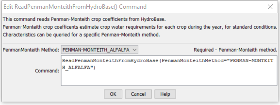

# StateDMI / Command / ReadPenmanMonteithFromHydroBase #

* [Overview](#overview)
* [Command Editor](#command-editor)
* [Command Syntax](#command-syntax)
* [Examples](#examples)
* [Troubleshooting](#troubleshooting)
* [See Also](#see-also)

-------------------------

## Overview ##

The `ReadPenmanMonteithFromHydroBase` command (for StateCU)
command reads a list of Penman-Monteith crop coefficients from the HydroBase database.
The crop coefficients can then be manipulated and output with other commands.

## Command Editor ##

The following dialog is used to edit the command and illustrates the command syntax.

**<p style="text-align: center;">

</p>**

**<p style="text-align: center;">
`ReadPenmanMonteithFromHydroBase` Command Editor (<a href="../ReadPenmanMonteithFromHydroBase.png">see also the full-size image</a>)
</p>**

## Command Syntax ##

The command syntax is as follows:

```text
ReadPenmanMonteithFromHydroBase(Parameter="Value",...)
```
**<p style="text-align: center;">
Command Parameters
</p>**

| **Parameter**&nbsp;&nbsp;&nbsp;&nbsp;&nbsp;&nbsp;&nbsp;&nbsp;&nbsp;&nbsp;&nbsp;&nbsp;&nbsp;&nbsp;&nbsp;&nbsp;&nbsp;&nbsp;&nbsp;&nbsp;&nbsp;&nbsp;&nbsp;&nbsp; | **Description** | **Default**&nbsp;&nbsp;&nbsp;&nbsp;&nbsp;&nbsp;&nbsp;&nbsp;&nbsp;&nbsp; |
| --------------|-----------------|----------------- |
|`PenmanMonteithMethod`<br>**required** | The Penman-Monteith method that is defined in HydroBase for the crop type and its coefficients. | None – must be specified. |

The crop type (e.g., `ALFALFA`) is used as the unique identifier.
Any previous crop coefficients objects will be added to (or replaced if identifiers match).

The PenmanMonteithMethod parameter corresponds to a value in HydroBase and allows variations on crop characteristics to be defined.
In general the ASCE standardized coefficients are used.

## Examples ##

See the [automated tests](https://github.com/OpenCDSS/cdss-app-statedmi-test/tree/master/test/regression/commands/ReadPenmanMonteithFromHydroBase).

The following example command file illustrates how to read Penman-Monteith coefficients from HydroBase,
sort the data, create a StateCU file, and check the results:

```
StartLog(LogFile="Crops_KPM.StateDMI.log")
#
# StateDMI commands to create the Penman-Monteith crop coefficients file
#
# Step 1 - read data from HydroBase
#
# Read the general ASCE standardized coefficients
ReadPenmanMonteithFromHydroBase(PenmanMonteithMethod="PENMAN-MONTEITH_ALFALFA")
#
# Step 3 - write the file
#
SortPenmanMonteith(Order=Ascending)
WritePenmanMonteithToStateCU(OutputFile="rg2007.kpm")
#
# Check the results
#
CheckPenmanMonteith(ID="*")
WriteCheckFile(OutputFile="Crops_KPM.StateDMI.check.html")
```

## Troubleshooting ##

[See the main troubleshooting documentation](../../troubleshooting/troubleshooting.md)

## See Also ##

* [`ReadPenmanMonteithFromStateCU`](../ReadPenmanMonteithFromStateCU/ReadPenmanMonteithFromStateCU) command
* [`WritePenmanMonteithToStateCU`](../WritePenmanMonteithToStateCU/WritePenmanMonteithToStateCU) command
