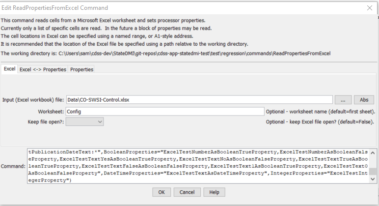

# StateDMI / Command / ReadPropertiesFromExcel #

* [Overview](#overview)
* [Command Editor](#command-editor)
* [Command Syntax](#command-syntax)
* [Examples](#examples)
* [Troubleshooting](#troubleshooting)
* [See Also](#see-also)

-------------------------

## Overview ##

The `ReadPropertiesFromExcel` command reads cells from a Microsoft Excel
worksheet and sets processor properties.
This is useful when Excel is used to configure an analysis.
The properties can be used directly by StateDMI for commands that
support `${Property}` notation or can be used to expand a template command file.
Property object types are determined from Excel cell type/format unless the type
is specified with command parameters.
If issues arise, check the Excel cell type and format.

StateDMI uses the [Apache POI software](http://poi.apache.org) to read/write the Excel file
and consequently functionality is constrained by the features of that software package.
Check the StateDMI ***Help / About*** menu for information on the POI version.

## Command Editor ##

The following dialog is used to edit the command and illustrates the syntax of the command.
<a href="../ReadPropertiesFromExcel.png">See also the full-size image.</a>

**<p style="text-align: center;">

</p>**

**<p style="text-align: center;">
`ReadPropertiesFromExcel` Command Editor for Excel Parameters
</p>**

The following dialog is used to edit the command and illustrates the syntax of the command for Excel to properties map.
<a href="../ReadPropertiesFromExcel_Map.png">See also the full-size image.</a>

**<p style="text-align: center;">

</p>**

**<p style="text-align: center;">
`ReadPropertiesFromExcel` Command Editor for Excel to Properties Map Parameter
</p>**

The following dialog is used to edit the command and illustrates the syntax of the command for properties parameters.
<a href="../ReadPropertiesFromExcel_Properties.png">See also the full-size image.</a>

**<p style="text-align: center;">

</p>**

**<p style="text-align: center;">
`ReadPropertiesFromExcel` Command Editor for Properties Parameters
</p>**

## Command Syntax ##

The command syntax is as follows:

```text
ReadPropertiesFromExcel(Parameter="Value",...)
```
**<p style="text-align: center;">
Command Parameters
</p>**

|**Parameter**&nbsp;&nbsp;&nbsp;&nbsp;&nbsp;&nbsp;&nbsp;&nbsp;&nbsp;&nbsp;&nbsp;&nbsp;&nbsp;&nbsp;&nbsp;&nbsp;&nbsp;&nbsp;&nbsp;&nbsp;&nbsp;|**Description**|**Default**&nbsp;&nbsp;&nbsp;&nbsp;&nbsp;&nbsp;&nbsp;&nbsp;&nbsp;&nbsp;&nbsp;&nbsp;&nbsp;&nbsp;&nbsp;&nbsp;&nbsp;&nbsp;&nbsp;&nbsp;&nbsp;&nbsp;&nbsp;&nbsp;&nbsp;&nbsp;&nbsp;|
|--------------|-----------------|-----------------|
|`InputFile`<br>**required**|The name of the Excel workbook file (`*.xls` or `*.xlsx`) to read, as an absolute path or relative to the command file location.|None – must be specified.|
|`Worksheet`|The name of the worksheet in the workbook to read.|Read the first worksheet.|
|`KeepOpen`|Indicate whether to keep the Excel file open (`True`) or close after creating (`False`).  Keeping the file open can increase performance because later commands will not need to reread the workbook.|`False`|
|`PropertyCellMap`<br>**required**|Indicate how to map property names to Excel addresses.  The format of the parameter is:<br>`PropertyName1:ExcelAddress1,`<br>`PropertyName2:ExcelAddress2,...`<br>where the Excel addresses can be specified using `A1` notation, named range, or `*` to use a named range that matches the property name.  The property names cannot be repeated.|None – must be specified.|
|`BooleanProperties`|A list of property names to be defined as Boolean objects.|Determine from Excel cell type and format.|
|`DateTimeProperties`|A list of property names to be defined as date/time objects.|Determine from Excel cell type and format.|
|`IntegerProperties`|A list of property names to be defined as integer objects.|Determine from Excel cell type and format.|

## Examples ##

See the [automated tests](https://github.com/OpenCDSS/cdss-app-statedmi-test/tree/master/test/regression/commands/ReadPropertiesFromExcel).

## Troubleshooting ##

## See Also ##

* [`SetProperty`](../SetProperty/SetProperty) command
