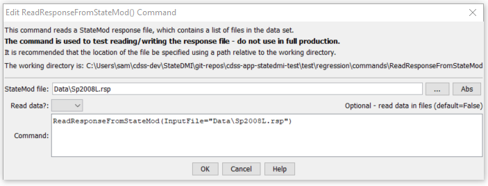

# StateDMI / Command / ReadResponseFromStateMod #

* [Overview](#overview)
* [Command Editor](#command-editor)
* [Command Syntax](#command-syntax)
* [Examples](#examples)
* [Troubleshooting](#troubleshooting)
* [See Also](#see-also)

-------------------------

## Overview ##

The `ReadResponseFromStateMod` command (for StateMod)
reads a StateMod response file, which contains the list of files in a data set.
The primary purpose of this command currently is to facilitate software testing of reading and writing the response file;
however, in the future the functionality may be enhanced.
The response file can be written using the
[`WriteResponseToStateMod`](../WriteResponseToStateMod/WriteResponseToStateMod) command.

## Command Editor ##

The following dialog is used to edit the command and illustrates the command syntax.

**<p style="text-align: center;">

</p>**

**<p style="text-align: center;">
`ReadResponseFromStateMod` Command Editor (<a href="../ReadResponseFromStateMod.png">see also the full-size image</a>)
</p>**

## Command Syntax ##

The command syntax is as follows:

```text
ReadResponseFromStateMod(Parameter="Value",...)
```
**<p style="text-align: center;">
Command Parameters
</p>**

| **Parameter**&nbsp;&nbsp;&nbsp;&nbsp;&nbsp;&nbsp;&nbsp;&nbsp;&nbsp;&nbsp;&nbsp;&nbsp; | **Description** | **Default**&nbsp;&nbsp;&nbsp;&nbsp;&nbsp;&nbsp;&nbsp;&nbsp;&nbsp;&nbsp; |
| --------------|-----------------|----------------- |
| `InputFile`<br>**required** | The name of the StateMod response file to read. | None – must be specified. |


## Examples ##

See the [automated tests](https://github.com/OpenCDSS/cdss-app-statedmi-test/tree/master/test/regression/commands/ReadResponseFromStateMod).

## Troubleshooting ##

## See Also ##

* [`WriteResponseToStateMod`](../WriteResponseToStateMod/WriteResponseToStateMod) command
