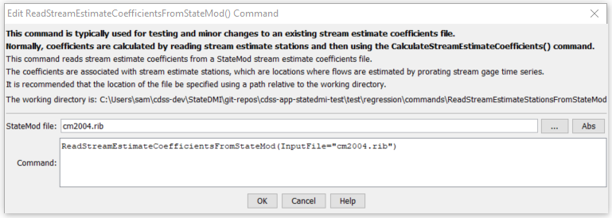

# StateDMI / Command / ReadStreamEstimateCoefficientsFromStateMod #

* [Overview](#overview)
* [Command Editor](#command-editor)
* [Command Syntax](#command-syntax)
* [Examples](#examples)
* [Troubleshooting](#troubleshooting)
* [See Also](#see-also)

-------------------------

## Overview ##

The `ReadStreamEstimateCoefficientsFromStateMod` command (for StateMod)
reads stream estimate coefficients from a StateMod stream estimate coefficients file.
This information is associated with stream estimate stations using the station identifier as the lookup.
Stream estimate coefficients define how streamflow is estimated at ungaged locations (stream estimate stations).
The stream estimate coefficients that are read can be manipulated and output with other commands.

## Command Editor ##

The following dialog is used to edit the command and illustrates the command syntax.

**<p style="text-align: center;">

</p>**

**<p style="text-align: center;">
`ReadStreamEstimateCoefficientsFromStateMod` Command Editor (<a href="../ReadStreamEstimateCoefficientsFromStateMod.png">see also the full-size image</a>)
</p>**

## Command Syntax ##

The command syntax is as follows:

```text
ReadStreamEstimateCoefficientsFromStateMod(Parameter="Value",...)
```
**<p style="text-align: center;">
Command Parameters
</p>**

| **Parameter**&nbsp;&nbsp;&nbsp;&nbsp;&nbsp;&nbsp;&nbsp;&nbsp;&nbsp;&nbsp;&nbsp;&nbsp; | **Description** | **Default**&nbsp;&nbsp;&nbsp;&nbsp;&nbsp;&nbsp;&nbsp;&nbsp;&nbsp;&nbsp; |
| --------------|-----------------|----------------- |
| `InputFile`<br>**required** | The name of the StateMod stream estimate coefficients file to be read. | None – must be specified. |

## Examples ##

See the [automated tests](https://github.com/OpenCDSS/cdss-app-statedmi-test/tree/master/test/regression/commands/ReadStreamEstimateCoefficientsFromStateMod).

## Troubleshooting ##

[See the main troubleshooting documentation](../../troubleshooting/troubleshooting.md)

## See Also ##

* [`WriteStreamEstimateCoefficientsToStateMod`](../WriteStreamEstimateCoefficientsToStateMod/WriteStreamEstimateCoefficientsToStateMod.md) command
