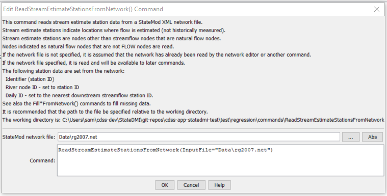

# StateDMI / Command / ReadStreamEstimateStationsFromNetwork #

* [Overview](#overview)
* [Command Editor](#command-editor)
* [Command Syntax](#command-syntax)
* [Examples](#examples)
* [Troubleshooting](#troubleshooting)
* [See Also](#see-also)

-------------------------

## Overview ##

The `ReadStreamEstimateStationsFromNetwork` command (for StateMod)
reads a list of stream estimate stations from a StateMod network file (XML or Makenet) and defines stream estimate stations in memory.
Stream estimate stations are stations not of type `FLOW` but which are indicated as natural flow nodes in the network.
The default output order is that of the stream network, upstream to downstream.
The StateMod model requires that the stream gage station file be in the same order as the river network file.
The stream estimate stations that are read can be manipulated and output with other commands.

## Command Editor ##

The following dialog is used to edit the command and illustrates the command syntax.

**<p style="text-align: center;">

</p>**

**<p style="text-align: center;">
`ReadStreamEstimateStationsFromNetwork` Command Editor (<a href="../ReadStreamEstimateStationsFromNetwork.png">see also the full-size image</a>)
</p>**

## Command Syntax ##

The command syntax is as follows:

```text
ReadStreamEstimateStationsFromNetwork(Parameter="Value",...)
```
**<p style="text-align: center;">
Command Parameters
</p>**

| **Parameter**&nbsp;&nbsp;&nbsp;&nbsp;&nbsp;&nbsp;&nbsp;&nbsp;&nbsp;&nbsp;&nbsp;&nbsp; | **Description** | **Default**&nbsp;&nbsp;&nbsp;&nbsp;&nbsp;&nbsp;&nbsp;&nbsp;&nbsp;&nbsp; |
| --------------|-----------------|----------------- |
| `InputFile`<br>**required** | The name of the network file to be read. | Use the network that has previously been read with other commands. |

## Examples ##

See the [automated tests](https://github.com/OpenCDSS/cdss-app-statedmi-test/tree/master/test/regression/commands/ReadStreamEstimateStationsFromNetwork).

## Troubleshooting ##

[See the main troubleshooting documentation](../../troubleshooting/troubleshooting.md)

## See Also ##

* [`ReadStreamEstimateStationsFromList`](../ReadStreamEstimateStationsFromList/ReadStreamEstimateStationsFromList.md) command
* [`ReadStreamEstimateStationsFromStateMod`](../ReadStreamEstimateStationsFromStateMod/ReadStreamEstimateStationsFromStateMod.md) command
* [`WriteStreamEstimateStationsToStateMod`](../WriteStreamEstimateStationsToStateMod/WriteStreamEstimateStationsToStateMod.md) command
