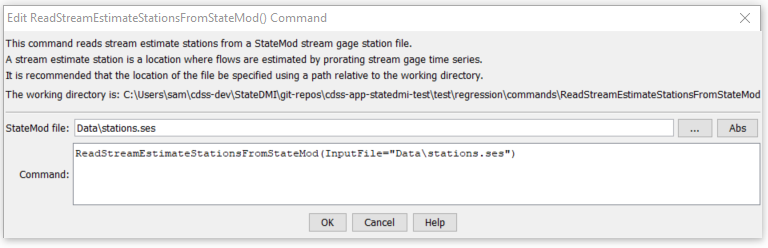

# StateDMI / Command / ReadStreamEstimateStationsFromStateMod #

* [Overview](#overview)
* [Command Editor](#command-editor)
* [Command Syntax](#command-syntax)
* [Examples](#examples)
* [Troubleshooting](#troubleshooting)
* [See Also](#see-also)

-------------------------

## Overview ##

The `ReadStreamEstimateStationsFromStateMod` command (for StateMod)
reads a list of stream estimate stations from a StateMod stream estimate
stations file and defines stream estimate stations in memory.
The stream estimate stations can then be manipulated and output with other commands.

## Command Editor ##

The following dialog is used to edit the command and illustrates the command syntax.

**<p style="text-align: center;">

</p>**

**<p style="text-align: center;">
`ReadStreamEstimateStationsFromStateMod` Command Editor (<a href="../ReadStreamEstimateStationsFromStateMod.png">see also the full-size image</a>)
</p>**

## Command Syntax ##

The command syntax is as follows:

```text
ReadStreamEstimateStationsFromStateMod(Parameter="Value",...)
```
**<p style="text-align: center;">
Command Parameters
</p>**

| **Parameter**&nbsp;&nbsp;&nbsp;&nbsp;&nbsp;&nbsp;&nbsp;&nbsp;&nbsp;&nbsp;&nbsp;&nbsp; | **Description** | **Default**&nbsp;&nbsp;&nbsp;&nbsp;&nbsp;&nbsp;&nbsp;&nbsp;&nbsp;&nbsp; |
| --------------|-----------------|----------------- |
| `InputFile`<br>**required** | The name of the StateMod stream estimate stations file to be read. | None – must be specified. |

## Examples ##

See the [automated tests](https://github.com/OpenCDSS/cdss-app-statedmi-test/tree/master/test/regression/commands/ReadStreamEstimateStationsFromStateMod).

## Troubleshooting ##

## See Also ##

* [`ReadStreamEstimateStationsFromList`](../ReadStreamEstimateStationsFromList/ReadStreamEstimateStationsFromList.md) command
* [`ReadStreamEstimateStationsFromNetwork`](../ReadStreamEstimateStationsFromNetwork/ReadStreamEstimateStationsFromNetwork.md) command
* [`WriteStreamEstimateStationsToStateMod`](../WriteStreamEstimateStationsToStateMod/WriteStreamEstimateStationsToStateMod.md) command
