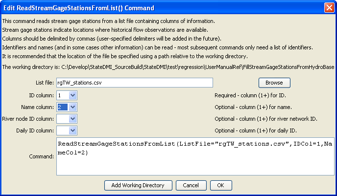

# StateDMI / Command / ReadStreamGageStationsFromList #

* [Overview](#overview)
* [Command Editor](#command-editor)
* [Command Syntax](#command-syntax)
* [Examples](#examples)
* [Troubleshooting](#troubleshooting)
* [See Also](#see-also)

-------------------------

## Overview ##

The `ReadStreamGageStationsFromList` command (for StateMod)
reads a list of stream gage stations from a delimited list file and defines stream gage stations in memory.
The stream gage stations can then be manipulated and output with other commands.

## Command Editor ##

The following dialog is used to edit the command and illustrates the command syntax.

**<p style="text-align: center;">

</p>**

**<p style="text-align: center;">
`ReadStreamGageStationsFromList` Command Editor (<a href="../ReadStreamGageStationsFromList.png">see also the full-size image</a>)
</p>**

## Command Syntax ##

The command syntax is as follows:

```text
ReadStreamGageStationsFromList(Parameter="Value",...)
```
**<p style="text-align: center;">
Command Parameters
</p>**

| **Parameter**&nbsp;&nbsp;&nbsp;&nbsp;&nbsp;&nbsp;&nbsp;&nbsp;&nbsp;&nbsp;&nbsp;&nbsp; | **Description** | **Default**&nbsp;&nbsp;&nbsp;&nbsp;&nbsp;&nbsp;&nbsp;&nbsp;&nbsp;&nbsp; |
| --------------|-----------------|----------------- |
| `ListFile`<br>**required** | The name of the list file to be read. | None – must be specified. |
| `IDCol`<br>**required** | The column number (1+) containing the stream gage station identifiers. | None – must be specified. |
| `NameCol` | The column number (1+) containing the stream gage station names. | If not specified, set to blank. |
| `RiverNodeIDCol` | The column number (1+) containing the river node identifier. | If not specified, set to blank. |
| `DailyIDCol` | The column number (1+) containing the daily identifier (for estimating time series). | If not specified, set to blank. |

## Examples ##

See the [automated tests](https://github.com/OpenCDSS/cdss-app-statedmi-test/tree/master/test/regression/commands/ReadStreamGageStationsFromList).

At a minimum, the list file must contain a column with stream gage station identifiers.
Lines starting with the `#` character are treated as comments.
If the first line’s values are surrounded by double quotes, the line is assumed to indicate column headings.

A sample list file is shown below:

```
# Stream gage stations as a list file
#
"ID”,"Name"
08213500,”RIO GRANDE RIVER AT THIRTY MILE BRIDGE NEAR CREEDE”
08214500,”NORTH CLEAR CREEK BELOW CONTINENTAL RESERVOIR”
...
```

## Troubleshooting ##

## See Also ##

* [`ReadStreamGageStationsFromNetwork`](../ReadStreamGageStationsFromNetwork/ReadStreamGageStationsFromNetwork.md) command
* [`ReadStreamGageStationsFromStateMod`](../ReadStreamGageStationsFromStateMod/ReadStreamGageStationsFromStateMod.md) command
* [`WriteStreamGageStationsToStateMod`](../WriteStreamGageStationsToStateMod/WriteStreamGageStationsToStateMod.md) command
