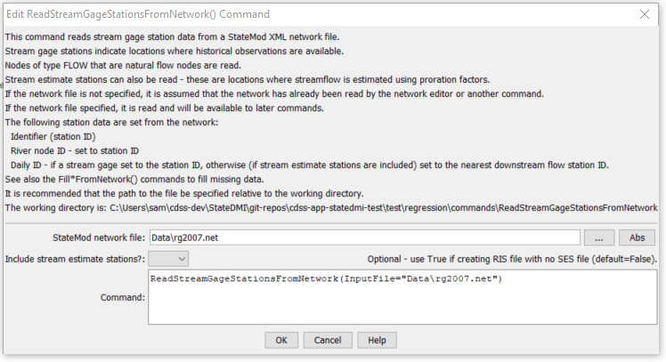

# StateDMI / Command / ReadStreamGageStationsFromNetwork #

* [Overview](#overview)
* [Command Editor](#command-editor)
* [Command Syntax](#command-syntax)
* [Examples](#examples)
* [Troubleshooting](#troubleshooting)
* [See Also](#see-also)

-------------------------

## Overview ##

The `ReadStreamGageStationsFromNetwork` command (for StateMod)
reads a list of stream gage stations from a StateMod network file (XML or Makenet) and defines stream gage stations in memory.
The stream gage stations can then be manipulated and output with other commands.
The default output order is that of the stream network, upstream to downstream.
The StateMod model requires that the stream gage station file be in the same order as the river network file.

Stream gages in the network are those defined as node type `FLOW` that are natural flow nodes.
Stream gages that are included in the network but which are not identified as
natural flow nodes are omitted from the stream gage station file – these nodes are typically
treated as `OTHER` nodes in the network and will be included in the river network file but not other station files.

If stream estimate stations are also included in processing,
all nodes identified as natural flow nodes are processed.  See also the
[`ReadStreamEstimateStationsFromNetwork`](../ReadStreamEstimateStationsFromNetwork/ReadStreamEstimateStationsFromNetwork.md) command.

## Command Editor ##

The following dialog is used to edit the command and illustrates the command syntax.

**<p style="text-align: center;">

</p>**

**<p style="text-align: center;">
`ReadStreamGageStationsFromNetwork` Command Editor (<a href="../ReadStreamGageStationsFromNetwork.png">see also the full-size image</a>)
</p>**

## Command Syntax ##

The command syntax is as follows:

```text
ReadStreamGageStationsFromNetwork(Parameter="Value",...)
```
**<p style="text-align: center;">
Command Parameters
</p>**

| **Parameter**&nbsp;&nbsp;&nbsp;&nbsp;&nbsp;&nbsp;&nbsp;&nbsp;&nbsp;&nbsp;&nbsp;&nbsp;&nbsp;&nbsp;&nbsp;&nbsp;&nbsp;&nbsp;&nbsp;&nbsp;&nbsp;&nbsp;&nbsp;&nbsp;&nbsp;&nbsp;&nbsp;&nbsp;&nbsp;&nbsp;&nbsp;&nbsp;&nbsp;&nbsp;&nbsp;&nbsp;&nbsp;&nbsp;&nbsp;&nbsp;&nbsp;&nbsp;&nbsp;&nbsp; | **Description** | **Default**&nbsp;&nbsp;&nbsp;&nbsp;&nbsp;&nbsp;&nbsp;&nbsp;&nbsp;&nbsp; |
| --------------|-----------------|----------------- |
| `InputFile` | The name of the network file to be read. | Use the network that has been previously read. |
| `IncludeStreamEstimateStations` | Indicate whether stream estimate stations should also be included.  If False, only stream gage stations will be read.  If `True`, stream gage and estimate stations will be read and will be treated as stream gage stations (separate stream gage and stream estimate station files are being evaluated but traditionally have been saved to the `*ris` file). | `False` |

## Examples ##

See the [automated tests](https://github.com/OpenCDSS/cdss-app-statedmi-test/tree/master/test/regression/commands/ReadStreamGageStationsFromNetwork).

The following example command file illustrates the commands used to read stream gage stations from the network and create a StateMod file:

```
StartLog(LogFile="ris.commands.StateDMI.log")
# ris.commands.StateDMI
#
# StateDMI command file to create streamflow station file for the Colorado River
#
#  Step 1 - read streamgages and baseflows ids from the network file
#
ReadStreamGageStationsFromNetwork(InputFile="..\Network\cm2005.net",IncludeStreamEstimateStations="True")
#
#  Step 2 - read baseflow nodes names from HydroBase,
#           fill in missing names from the network file
#
FillStreamGageStationsFromHydroBase(ID="*",NameFormat=StationName,CheckStructures=True)
FillStreamGageStationsFromNetwork(ID="*",NameFormat="StationName")
#
#  Step 3 - set streamgage station to use to disaggregate monthly baseflows to daily
#
#  add set daily pattern gages for WD 36
SetStreamGageStation(ID="36*",DailyID="09047500",IfNotFound=Warn)
...many similar commands omitted...
#
#  Step 4 - create streamflow station file
#
WriteStreamGageStationsToStateMod(OutputFile="..\StateMod\cm2005.ris")
#
# Check the results
CheckStreamGageStations(ID="*")
WriteCheckFile(OutputFile="ris.commands.StateDMI.check.html")
```

## Troubleshooting ##

## See Also ##

* [`ReadStreamEstimateStationsFromNetwork`](../ReadStreamEstimateStationsFromNetwork/ReadStreamEstimateStationsFromNetwork.md) command
* [`ReadStreamGageStationsFromList`](../ReadStreamGageStationsFromList/ReadStreamGageStationsFromList.md) command
* [`ReadStreamGageStationsFromStateMod`](../ReadStreamGageStationsFromStateMod/ReadStreamGageStationsFromStateMod.md) command
* [`WriteStreamGageStationsToStateMod`](../WriteStreamGageStationsToStateMod/WriteStreamGageStationsToStateMod.md) command
