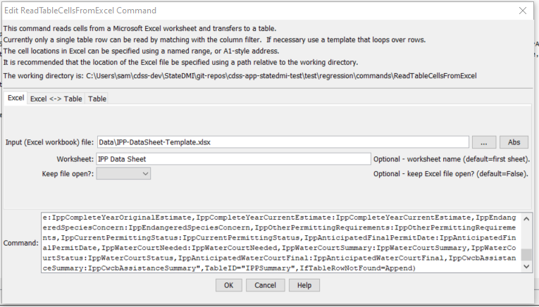

# StateDMI / Command / ReadTableCellsFromExcel #

* [Overview](#overview)
* [Command Editor](#command-editor)
* [Command Syntax](#command-syntax)
* [Examples](#examples)
* [Troubleshooting](#troubleshooting)
* [See Also](#see-also)

-------------------------

## Overview ##

The `ReadTableCellsFromExcel` command reads cells from a Microsoft Excel
worksheet and transfers them into a table row.
Currently a single table row can receive the output.
The command is designed to extract values from named ranges in the Excel file,
for example to harvest data from a data-entry form.
Use this command in a template to iterate through rows in a table matched with separate Excel files.

StateDMI uses the [Apache POI software](http://poi.apache.org) to read/write
the Excel file and consequently functionality is constrained by the features of that software package.

## Command Editor ##

The following dialog is used to edit the command and illustrates the syntax of the command showing Excel file parameters.
<a href="../ReadTableCellsFromExcel_Excel.png">See also the full-size image.</a>

**<p style="text-align: center;">

</p>**

**<p style="text-align: center;">
`ReadTableCellsFromExcel` Command Editor Showing Excel File Parameters
</p>**

The following dialog is used to edit the command and illustrates the syntax of the command showing Excel cell map parameters.
<a href="../ReadTableCellsFromExcel_Map.png">See also the full-size image.</a>

**<p style="text-align: center;">

</p>**

**<p style="text-align: center;">
`ReadTableCellsFromExcel` Command Editor Showing Excel Cell Map Parameters
</p>**

The following dialog is used to edit the command and illustrates the syntax of the command showing table parameters.
<a href="../ReadTableCellsFromExcel_Table.png">See also the full-size image.</a>

**<p style="text-align: center;">

</p>**

**<p style="text-align: center;">
`ReadTableCellsFromExcel` Command Editor Showing Table Parameters
</p>**

## Command Syntax ##

The command syntax is as follows:

```text
ReadTableCellsFromExcel(Parameter="Value",...)
```
**<p style="text-align: center;">
Command Parameters
</p>**

|**Parameter**&nbsp;&nbsp;&nbsp;&nbsp;&nbsp;&nbsp;&nbsp;&nbsp;&nbsp;&nbsp;&nbsp;&nbsp;&nbsp;&nbsp;&nbsp;&nbsp;&nbsp;&nbsp;&nbsp;&nbsp;&nbsp;&nbsp;&nbsp;&nbsp;&nbsp;|**Description**|**Default**&nbsp;&nbsp;&nbsp;&nbsp;&nbsp;&nbsp;&nbsp;&nbsp;&nbsp;&nbsp;&nbsp;&nbsp;&nbsp;&nbsp;&nbsp;&nbsp;&nbsp;&nbsp;&nbsp;&nbsp;&nbsp;&nbsp;&nbsp;&nbsp;&nbsp;&nbsp;&nbsp;|
|--------------|-----------------|-----------------|
|`InputFile`<br>**required**|The name of the Excel workbook file (`*.xls` or `*.xlsx`) to read, as an absolute path or relative to the command file location.|None – must be specified.|
|`Worksheet`|The name of the worksheet in the workbook to read.|Read the first worksheet.|
|`KeepOpen`|Indicate whether to keep the Excel file open (`True`) or close after creating (`False`).  Keeping the file open will increase performance because later commands will not need to reread the workbook.  Make sure to close the file in the last command that writes to the Excel file.|`False`|
|`ColumnCellMap`<br>**required**|Indicate how to map table column names to Excel addresses.  The format of the parameter is:<br>`ColumnName1:ExcelAddress1,`<br>`ColumnName2:ExcelAddress2,...`<br>where the Excel addresses can be specified using `A1` notation, or named range.  **The column names cannot be repeated**.|None – must be specified.|
|`TableID`|Identifier for table to be updated.	None – must be specified.
|`ColumnIncludeFilters`|Indicate table column names and pattern to use to include rows, in order to match a single row for output.  The format of the parameter is:<br>`ColumnName1:Pattern1,`<br>`ColumnName2:Pattern2,...`<br>where patterns can contain `*` to match a substring.  For example, if used with a template to loop through table rows, use to match a unique identifier value in a column.|Include all rows (which will generate an error if the number of rows is not equal to one)|
|`IfTableRowNotFound`|Indicate the action if the row is not found for the transfer, one of:<ul><li>`Append` – append a new row to the table</li><li>`Ignore` – ignore the data</li><li>`Warn` – generate a warning</li><li>`Fail` – generate a failure</li></ul>|`Warn`|

## Examples ##

See the [automated tests](https://github.com/OpenCDSS/cdss-app-statedmi-test/tree/master/test/regression/commands/ReadTableCellsFromExcel).

## Troubleshooting ##

## See Also ##

* [`NewExcelWorkbook`](../NewExcelWorkbook/NewExcelWorkbook) command
