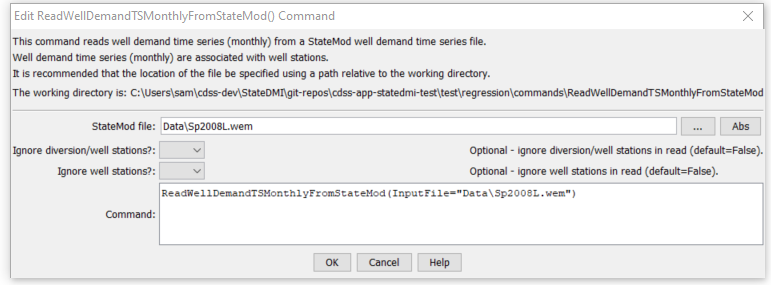

# StateDMI / Command / ReadWellDemandTSMonthlyFromStateMod #

* [Overview](#overview)
* [Command Editor](#command-editor)
* [Command Syntax](#command-syntax)
* [Examples](#examples)
* [Troubleshooting](#troubleshooting)
* [See Also](#see-also)

-------------------------

## Overview ##

The `ReadWellDemandTSMonthlyFromStateMod` command (for StateMod) reads a list of well demand time series
(monthly) from a StateMod monthly time series file.
The file does not need to be a demand file (e.g., it could be a historical pumping file);
however, once read with this command, the data will need to be processed with demand commands.

The StateMod well stations file contains stations for which only groundwater supply
is available and stations for which groundwater supply supplements surface water supply of a
diversion station (in this case the well station data includes the diversion station identifier).
Parameters are available in this command to read all demand time
series or only demands for some well stations,
to allow flexibility in demand data processing.
By default, all time series are read and are processed, whether they correspond to well stations or not.

## Command Editor ##

The following dialog is used to edit the command and illustrates the command syntax.

**<p style="text-align: center;">

</p>**

**<p style="text-align: center;">
`ReadWellDemandTSMonthlyFromStateMod` Command Editor (<a href="../ReadWellDemandTSMonthlyFromStateMod.png">see also the full-size image</a>)
</p>**

## Command Syntax ##

The command syntax is as follows:

```text
ReadWellDemandTSMonthlyFromStateMod(Parameter="Value",...)
```
**<p style="text-align: center;">
Command Parameters
</p>**

| **Parameter**&nbsp;&nbsp;&nbsp;&nbsp;&nbsp;&nbsp;&nbsp;&nbsp;&nbsp;&nbsp;&nbsp;&nbsp; | **Description** | **Default**&nbsp;&nbsp;&nbsp;&nbsp;&nbsp;&nbsp;&nbsp;&nbsp;&nbsp;&nbsp; |
| --------------|-----------------|----------------- |
| `InputFile` | The name of the StateMod monthly time series file to read. | None – must be specified. |
| `IgnoreWells` | Indicate whether the well nodes should be ignored.  These are locations where only well supply is used.  This requires that well stations have been read and the “associated diversion” values are set. | `False` |
| `IgnoreDWs` | Indicate whether the D&W nodes should be ignored.  These are locations where well supply supplements surface water (diversion) supply.  This requires that well stations have been read and the “associated diversion” values are set. | `False ` |

## Examples ##

See the [automated tests](https://github.com/OpenCDSS/cdss-app-statedmi-test/tree/master/test/regression/commands/ReadWellDemandTSMonthlyFromStateMod).

## Troubleshooting ##

[See the main troubleshooting documentation](../../troubleshooting/troubleshooting.md)

## See Also ##

* [`WriteWellDemandTSMonthlyToStateMod`](../WriteWellDemandTSMonthlyToStateMod/WriteWellDemandTSMonthlyToStateMod.md) command
